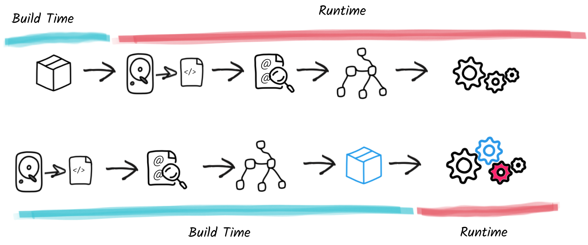
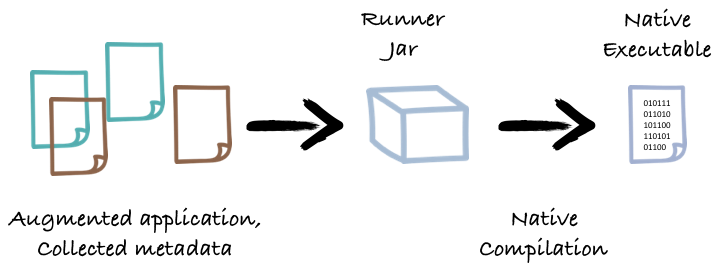

# What’s Quarkus?

Java was born more than 25 years ago. The world 25 years ago was quite different. The software industry has gone through several revolutions over these two decades. Java has always been able to reinvent itself to stay relevant.

But a new revolution is happening. While for years, most applications were running on huge machines, with lots of CPU and memory, they are now running on the Cloud, in constrained environments, in containers, where the resources are shared. Density is the new optimization: crank as many mini-apps (or microservices) as possible per node. And scale by adding more instances of an app instead of a more powerful single instance.

The Java ergonomics, designed 20 years ago, do not fit well in this new environment. Java applications were designed to run 24/7 for months, even years. The JIT is optimizing the execution over time; the GC manages the memory efficiently…​But all these features have a cost, and the memory required to run Java applications and startup times are showstoppers when you deploy 20 or 50 microservices instead of one application. The issue is not the JVM itself; it’s also the Java ecosystem that needs to be reinvented.

That’s where Quarkus, and other projects, enter the game. Quarkus uses a build time principle. During the build of the application, tasks that usually happen at runtime are executed at build time.

Thus, when the application runs, everything has been pre-computed, and all the annotation scanning, XML parsing, and so on won’t be executed anymore. It has two direct benefits: startup time (a lot faster) and memory consumption (a lot lower).

So, as depicted in the figure above, Quarkus does bring an infrastructure for frameworks to embrace build time metadata discovery (like annotations), replace proxies with generated classes, pre-configure most frameworks, and handle dependency injection at build time.

Also, during the build, Quarkus detects which class needs to be accessed by reflection at runtime, boots framework at build time to record the result, and generally offers a lot of GraalVM optimization for free (or cheap at least). Indeed, thanks to all this metadata, Quarkus can configure native compilers such as the GraalVM compiler to generate a native executable for your Java application. Thanks to an aggressive dead-code elimination, the final executable is smaller, faster to start, and uses a ridiculously small amount of memory.

## References

* <https://quarkus.io>

* <https://code.quarkus.io>

* <https://quarkus.io/quarkus-workshops/super-heroes>

* <https://github.com/cescoffier/quarkus-todo-app>

* <https://github.com/agoncal/baking-microservice-pie>
