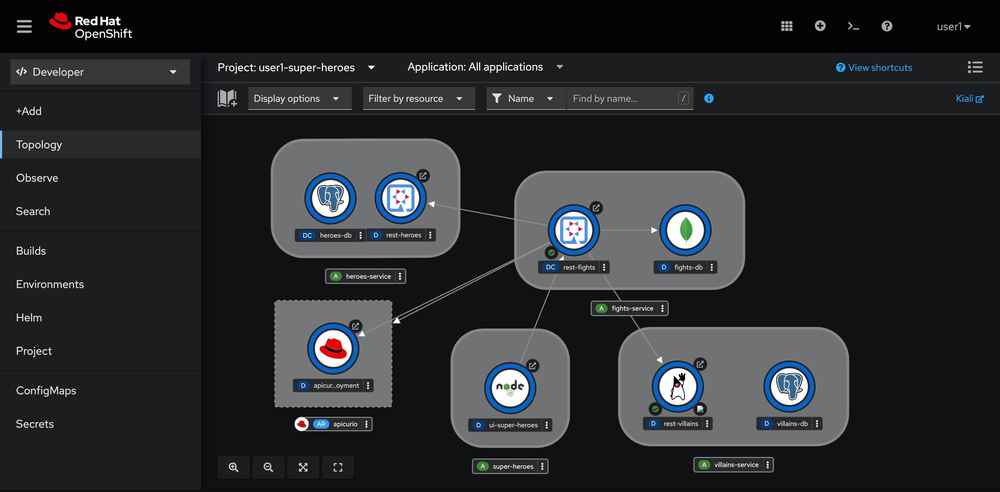

# Beautify The Topology View

Until now you've deployed most of microservices except the **Statustics** and its UI services. By the way, the interesting lab was deploying the **Fight** microservice that at the end you can see the visual connectors (arrow lines) in the Topoligy view. That's cool, isn't it?



The visual connectors don't represent actual network connections among services nor impact the services communication neither when we add connectors to or remove them from the entities.

The visual connectors just provide better understanding of application overview architecture and relationship of services in the application. Technically, it's just `app.openshift.io/connects-to` annotation elements. See [Well-Known Labels, Annotations and Taints](https://kubernetes.io/docs/reference/labels-annotations-taints/) for more details about annotations.

However, in Topology view right now, the diagram is not yet completed and we can make it looks better. Let's do it!

## Annotate Hero and Villain microeservices

1. Open Web Terminal then run following command:

    ```sh
    oc annotate deployment rest-heroes app.openshift.io/connects-to='heroes-db'
    oc annotate deployment rest-villains app.openshift.io/connects-to='villains-db'
    ```

2. You should see the visual connectors from **rest-heroes** to **heroes-db**, and **rest-vllains** to **villains-db**.

## Label Villain to display correct icon

Similar to the annotations, label can also be added to workload to provide some metadata for the workload. OpenShift web console read `app.openshift.io/runtime` label value to determine what icon should be display for a particular entity in topology view. Let' change the icon of Villain service to display the correct icon.

1. Open Web Terminal then run following command:

    ```sh
    oc label deployment rest-villians app.openshift.io/runtime='quarkus'
    ```

2. You should see the icon of **rest-villians** entity get changed from Java mascot (Duke) to Quarkus icon.

## What have you learnt?

1. How to add annotation to workload using `oc annotation` command.

2. How to add visual connector to workload with the `app.openshift.io/connects-to` annotation.

3. How to label workload using `oc` command.

4. How to change entity icon in topology view with `app.openshift.io/runtime` label.
