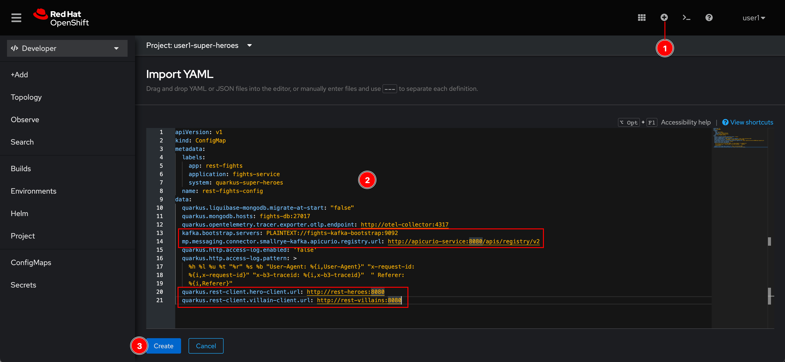
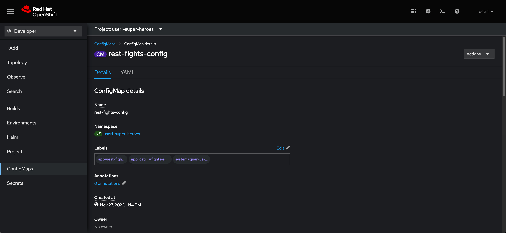
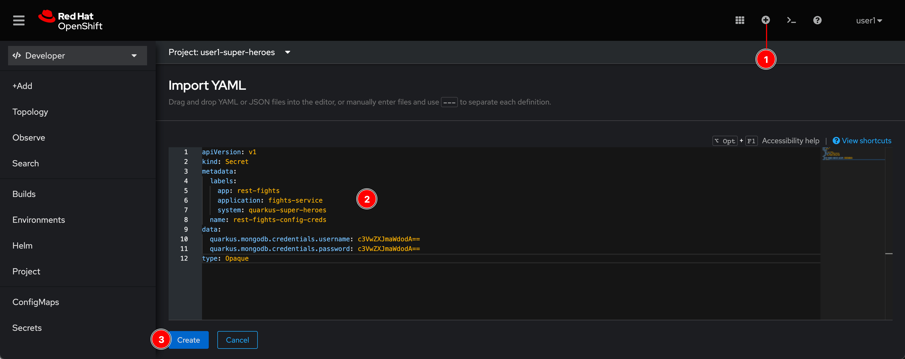
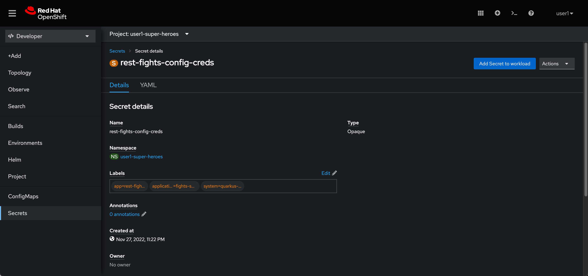
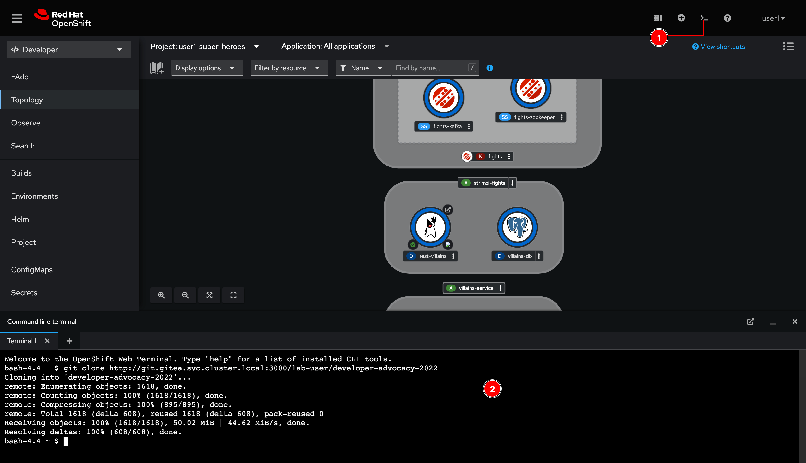
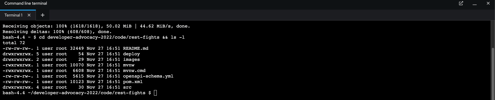
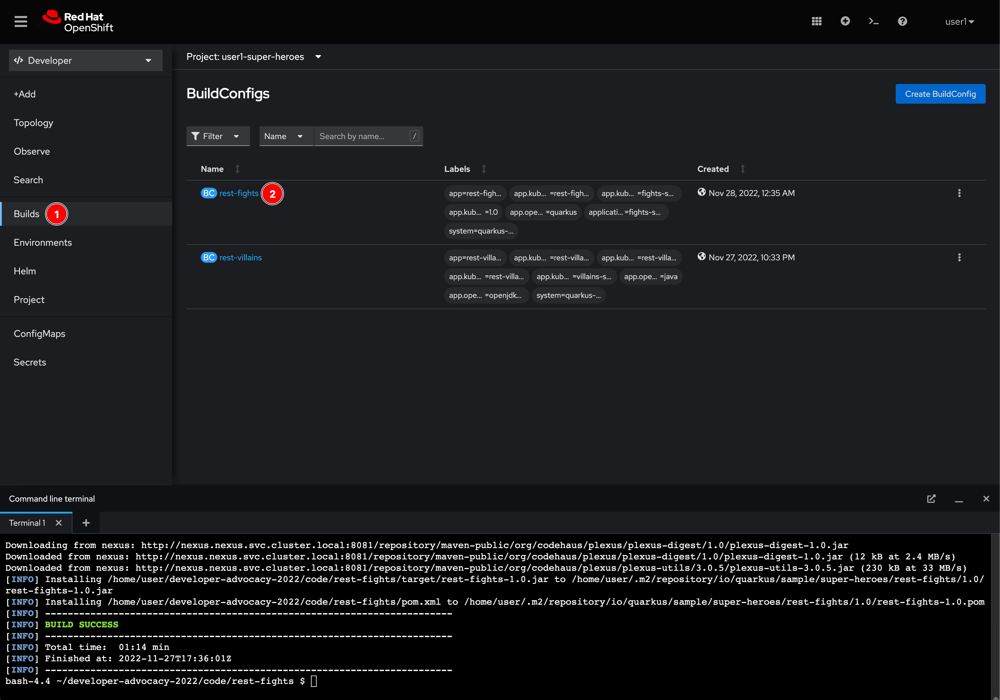
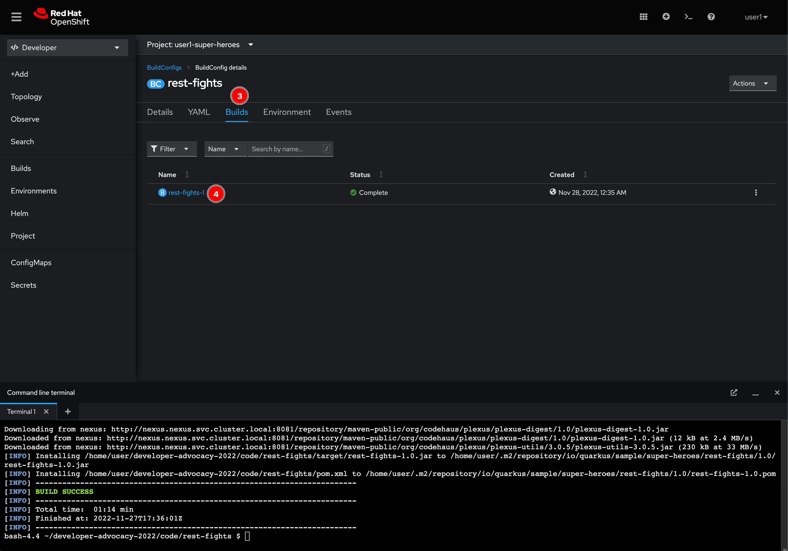
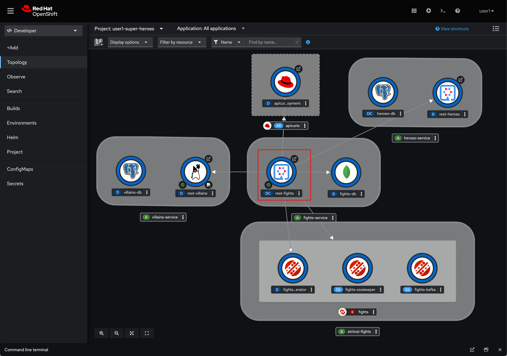

# Fight Microservice

<!-- ## Create a ConfigMap object to store application configurations

1. Click on  icon located at top right corner of web console.

2. Copy this YAML snippet to the editor and click **Create** button. Notice that application configurations contains other Service endpoints so Fight microservice can connect to other services.

   _YAML snippet:_

   ```yaml
   apiVersion: v1
   kind: ConfigMap
   metadata:
     labels:
       app: rest-fights
       application: fights-service
       system: quarkus-super-heroes
     name: rest-fights-config
   data:
     quarkus.liquibase-mongodb.migrate-at-start: "false"
     quarkus.mongodb.hosts: fights-db:27017
     quarkus.opentelemetry.tracer.exporter.otlp.endpoint: http://otel-collector:4317
     kafka.bootstrap.servers: PLAINTEXT://fights-kafka-bootstrap:9092
     mp.messaging.connector.smallrye-kafka.apicurio.registry.url: http://   apicurio-service:8080/apis/registry/v2
     quarkus.http.access-log.enabled: 'false'
     quarkus.http.access-log.pattern: >
       %h %l %u %t "%r" %s %b "User-Agent: %{i,User-Agent}" "x-request-id:
       %{i,x-request-id}" "x-b3-traceid: %{i,x-b3-traceid}"  " Referer:
       %{i,Referer}"
     quarkus.rest-client.hero-client.url: http://rest-heroes:8080
     quarkus.rest-client.villain-client.url: http://rest-villains:8080
   ```

   

3. A **rest-fights-config** ConfigMap object should be created.

   

## Create a Secret object to store the secret configurations

1. Click on  icon located at top right corner of web console.

2. Copy this YAML snippet to the editor and click **Create** button.

   _YAML snippet:_

   ```yaml
   apiVersion: v1
   kind: Secret
   metadata:
     labels:
       app: rest-fights
       application: fights-service
       system: quarkus-super-heroes
     name: rest-fights-config-creds
   data:
     quarkus.mongodb.credentials.username: c3VwZXJmaWdodA==
     quarkus.mongodb.credentials.password: c3VwZXJmaWdodA==
   type: Opaque
   ```

   

3. A **rest-fights-config-creds** Secret object should be created.

    -->

## Deploy application using Quarkus Maven plugin

1. Open the Web Terminal. Then run this command to clone Git repository to local.

    ```sh
    git clone https://gitlab.com/chatapazar/developer-advocacy-2024.git
    ```

    Notice that the URL is internal DNS! Yes, there is a Git server (Gitea) running in the same cluster but different project.

   

2. Run this command to go into the **Fight** microservice project directory.

    ```sh
    cd developer-advocacy-2024/code/rest-fights && ls -l
    ```

   

3. Run this command to build and deploy microservice to OpenShift cluster.

   ```sh
    ./mvnw install \
    -DskipTests \
    -Dquarkus.container-image.group=$(oc project --short) \
    -Dquarkus.profile=openshift-17 \
    -Dquarkus.kubernetes.deploy=true
   ```

    Yes!, you don't have to write Dockerfile, build container image, push the image to container registry e.g. Docker Hub, Quay.io, then deploy the container image to OpenShift cluster step by step. With one command you can get all of these done! Thank you Quarkus ecosystem :pray:

4. Wait until the build success. Then go to **Builds** menu, you should see a new **rest-fights** BuildConfigs for OpenShift Build (Binary).

    What happens behind the scene is that when you run Maven build in local, Quarkus Maven plugin (plus a bunch of configurations) talks to OpenShift to create required resources for your service i.e. ConfigMap, Secret, Deployment etc. including the BuildConfigs as well. When code build in local is done, the plugin will upload artefacts a.k.a binaries e.g. jar, war, libraries to OpenShift and after that the OpenShift Build kicks off the container image build and deploy.

    Click on the **rest-fights** BuildConfigs to see build logs.

   

5. Go to **Builds** tab, you should see the build task.

   

6. Now go back to **Topology** menu. You'll be more surprised. The microservice has been deployed as well as visual connectors (arrow lines) by just using Maven command. This is the magic of Quarkus!

   

## Tip in Quarkus 

1. From latest view in Topology, you can see link from res-fights to another pods.
    
2. Quarkus can make auto generate annotation to topology view by add config to properties of quarkus, see example below
   
   ```properties
   ...
   # OpenShift
   %openshift.quarkus.config.profile.parent=prod
   %openshift.quarkus.kubernetes.deployment-target=openshift
   %openshift.quarkus.container-image.builder=openshift
   %openshift-17.quarkus.config.profile.parent=prod
   %openshift-17.quarkus.kubernetes.deployment-target=openshift
   %openshift-17.quarkus.container-image.builder=openshift
   %openshift-17.quarkus.docker.dockerfile-jvm-path=${paths.dockerfile.jvm-17}
   %openshift-17.quarkus.openshift.jvm-dockerfile=${paths.dockerfile.jvm-17}
   %openshift-17.quarkus.openshift.base-jvm-image=${paths.base-image.jvm-17}
   quarkus.openshift.base-jvm-image=${paths.base-image.jvm-11}
   quarkus.openshift.base-native-image=${paths.base-image.native}
   quarkus.openshift.part-of=${quarkus.kubernetes.part-of}
   quarkus.openshift.route.expose=true
   quarkus.openshift.annotations."app.openshift.io/connects-to"=fights-db,fights-kafka,apicurio,rest-villains,rest-heroes,otel-collector
   quarkus.openshift.env.configmaps=${quarkus.kubernetes.env.configmaps}
   quarkus.openshift.env.secrets=${quarkus.kubernetes.env.secrets}
   quarkus.openshift.labels.app=${quarkus.kubernetes.labels.app}
   quarkus.openshift.labels.application=${quarkus.kubernetes.labels.application}
   quarkus.openshift.labels.system=${quarkus.kubernetes.labels.system}
   quarkus.openshift.ports."http".container-port=8080
   quarkus.openshift.ports."http".host-port=8080
   ...
   ```

   or view in [application.properties](https://gitlab.com/chatapazar/developer-advocacy-2024/-/raw/main/code/rest-fights/src/main/resources/application.properties?ref_type=heads)


## What have you learnt?

1. How to deploy microservice using Maven command.

2. Magic of Quarkus framework! (well, you didn't learn anything but you saw it, right? :laughing:)

3. How to check OpenShift Build logs.
