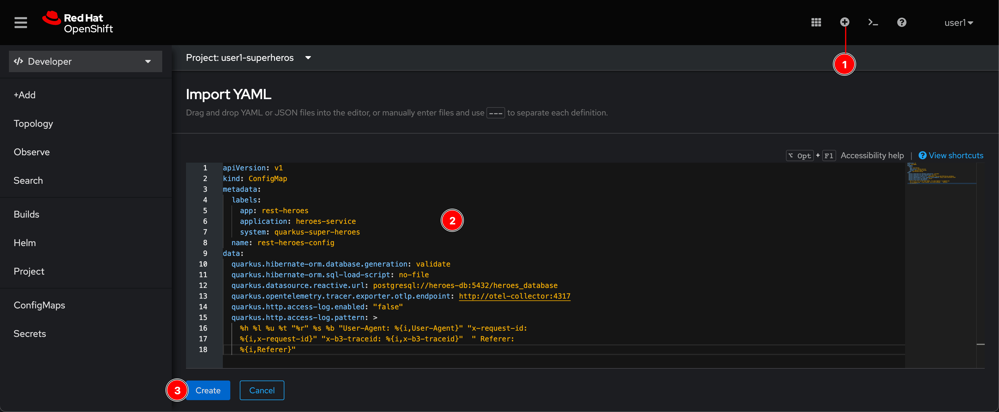
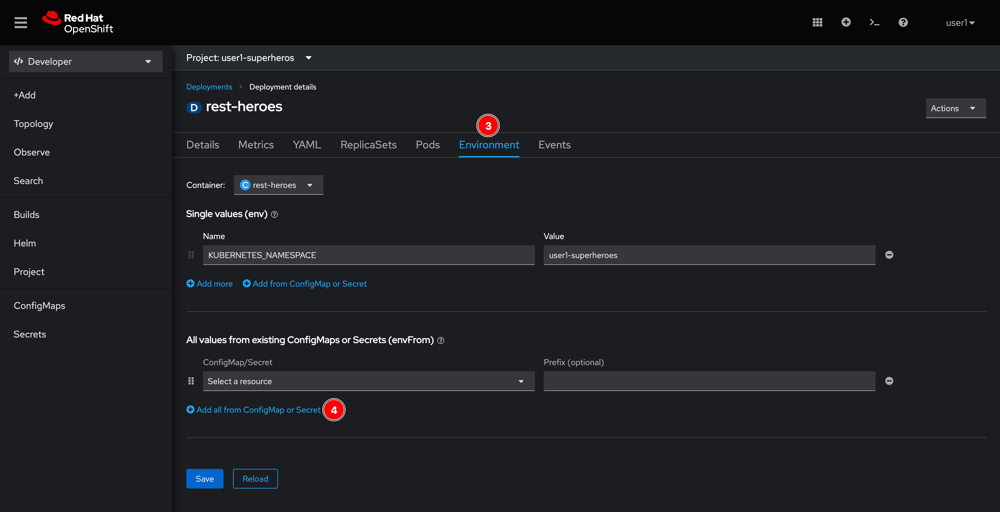

# Hero Microservice

## Create a ConfigMap object to store application configurations

1. Click on  icon located at top right corner of web console.

2. Copy this YAML snippet to the editor and click **Create** button.

   _YAML snippet:_

   ```yaml
   apiVersion: v1
   kind: ConfigMap
   metadata:
     labels:
       app: rest-heroes
       application: heroes-service
       system: quarkus-super-heroes
     name: rest-heroes-config
   data:
     quarkus.hibernate-orm.database.generation: validate
     quarkus.hibernate-orm.sql-load-script: no-file
     quarkus.datasource.reactive.url: postgresql://heroes-db:5432/heroes_database
     quarkus.opentelemetry.tracer.exporter.otlp.endpoint: http://otel-collector:4317
     quarkus.http.access-log.enabled: "false"
     quarkus.http.access-log.pattern: >
       %h %l %u %t "%r" %s %b "User-Agent: %{i,User-Agent}" "x-request-id:
       %{i,x-request-id}" "x-b3-traceid: %{i,x-b3-traceid}"  " Referer:
       %{i,Referer}"
   ```

   

3. A **rest-heroes-config** ConfigMap object should be created.

   

## Create a Secret object to store the secret configurations

1. Click on  icon located at top right corner of web console.

2. Copy this YAML snippet to the editor and click **Create** button.

   _YAML snippet:_

   ```yaml
   apiVersion: v1
   kind: Secret
   metadata:
     labels:
       app: rest-heroes
       application: heroes-service
       system: quarkus-super-heroes
     name: rest-heroes-config-creds
   data:
     quarkus.datasource.username: c3VwZXJtYW4=
     quarkus.datasource.password: c3VwZXJtYW4=
   type: Opaque
   ```

   

3. A **rest-heroes-config-creds** Secret object should be created.

   

## Review Source Code of Heroes Microservice

1. git url of Heroes Microservice --> https://github.com/quarkusio/quarkus-super-heroes/tree/main/rest-heroes

2. heroes rest web service --> https://github.com/quarkusio/quarkus-super-heroes/blob/main/rest-heroes/src/main/java/io/quarkus/sample/superheroes/hero/rest/HeroResource.java

3. heroes microservice configuration --> https://github.com/quarkusio/quarkus-super-heroes/blob/main/rest-heroes/src/main/resources/application.yml

## Deploy application with existing container image

1. Go to **Topology** menu, right click on view area then select **Add to Project -> Container Image** menu.

   

2. Enter following inputs:

   - **Image name from external registry:** `quay.io/asuksunt/rest-heroes:1.0`
   - **Runtime icon:** `quarkus`
   - **Application:** `heroes-service`
   - **Name:** `rest-heroes`

   

3. Scroll down to the bottom of the page, select **8080** option for **Target port**, uncheck the **Create a route** checkbox, and then click **Health checks** link.

   

4. Click **Add Readiness probe** link.

   

5. Enter following inputs then click :heavy_check_mark: icon.

   - **Path:** `/q/health/ready`
   - **Port:** `8080`
   - **Period:** `30`
   - **Timeout:** `10`

   

6. Click **Add Liveness probe** link.

   

7. Enter following inputs then click :heavy_check_mark: icon.

   - **Path:** `/q/health/live`
   - **Port:** `8080`
   - **Period:** `30`
   - **Timeout:** `10`

   

8. Click **Deployment** link.

   

9. Enter following environment variable. Then click **Resource limits** link.

   - **Name:** `KUBERNETES_NAMESPACE`
   - **Value:** `userX-super-heroes` where `X` is your user number!!!.

   

10. Enter following memory request and limit. Then click **Labels** link.

    - **Request:** `256`
    - **Limit:** `768`

    

11. Enter `system=quarkus-super-heroes` then click **Create** button.

    

## Add application configurations in ConfigMap and Secret objects to application container

1. Click on **rest-heroes** entity in view area. A panel will show up, then click **rest-heroes** link.

   

2. Go to **Environment** tab to add environment variables to application container. Then click **Add all from ConfigMap or Secret** link.

   

3. Select **rest-heroes-config** ConfigMap and **rest-heroes-config-creds** Secret objects, then click **Save** button. And then go to **Topology** menu.

   

4. Hover mouse pointer over the **rest-heroes** entity, a bubble should show up and say _1 Running_ which means there is 1 pod running.

   

## What have you learnt?

1. How to create ConfigMap object with YAML to keep all application configurations.

2. How to create Secret object with YAML to keep all secret application configurations.

3. How to deploy application using existing container image with following additional configurations:

   - Application health checks e.g. liveness and readiness probes
   - Require and limit resource i.e. memory for application.
   - Environment variable for application container
   - User-defined label

4. Bind configurations from ConfigMap and Secret objects to application container via environment variables.
