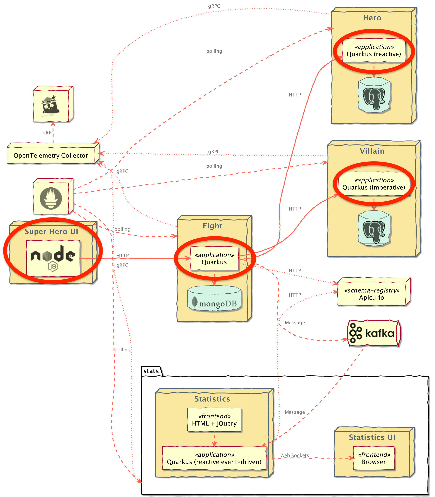

# Microservices Deployment

We've deployed all services e.g. databases, Kafka broker, and schema registry required by our microservices. Now we're going to deploy the microservices indicated in the architecture diagram below and configure them to function properly.

Does it sound interesting? Let's make it happen!! :metal:

