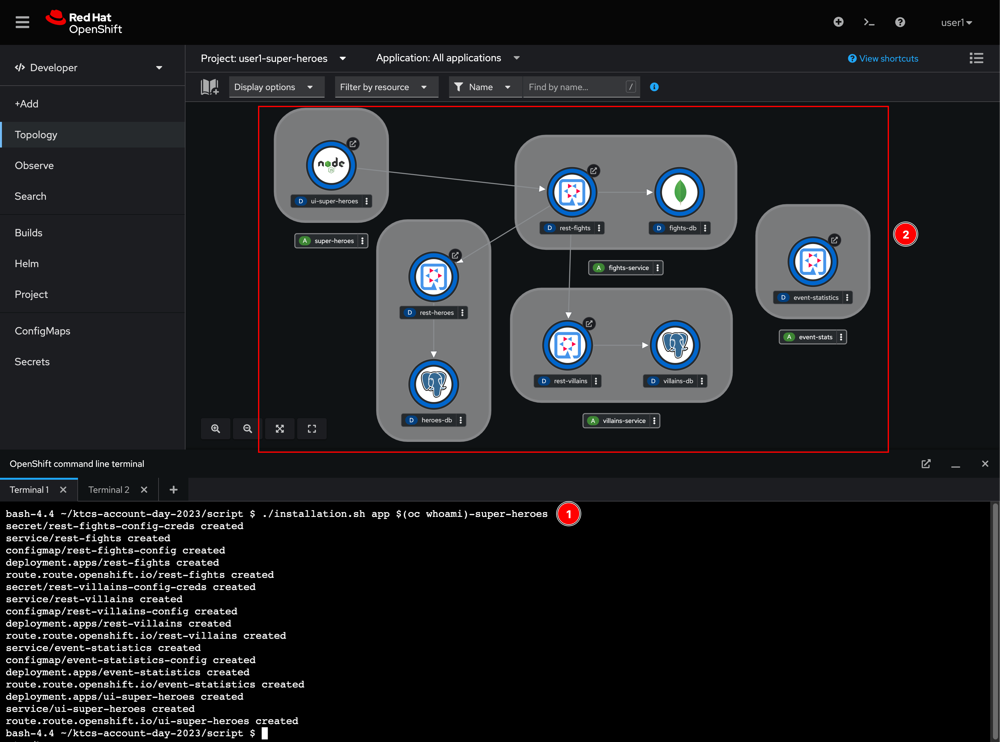
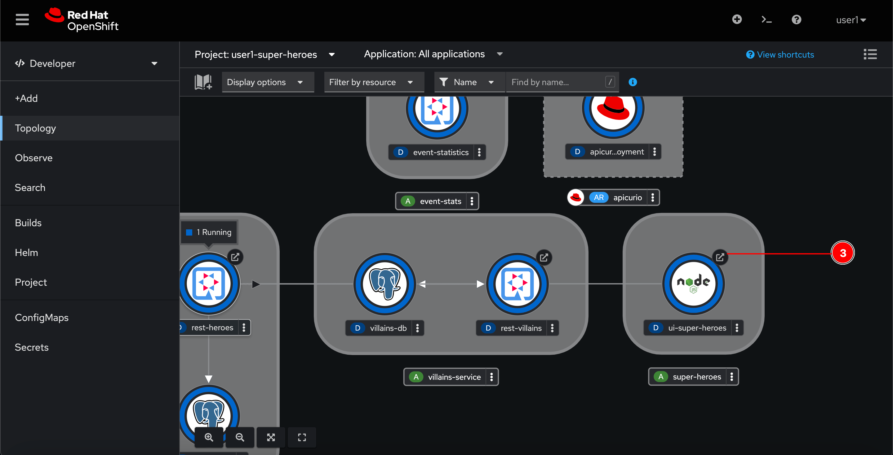
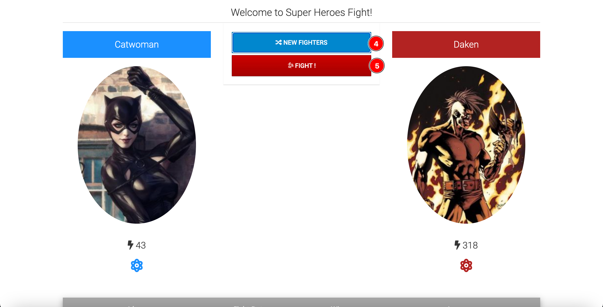
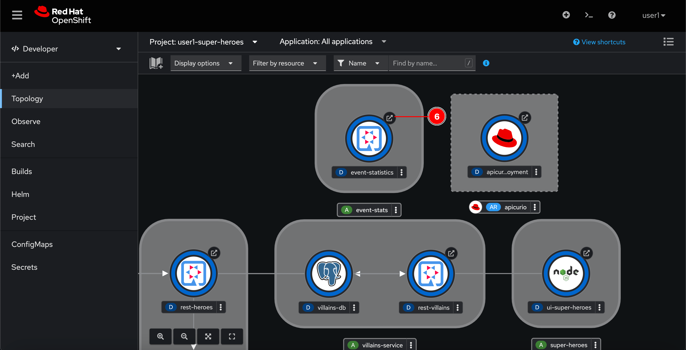
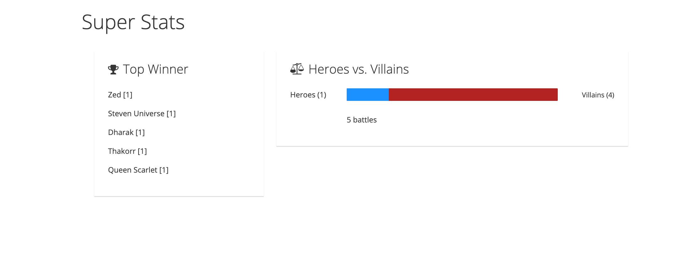

# Other Microservices

You've learnt how to deploy application via OpenShift Web Console in the previous section. Now, for the sake of speed and time saving, we're going to use a script to deploy the rest of microservices as following:

<!--- Fight microservice-->
<!--- Statistics microservice-->
- Super Hero UI microservice

If you're curious what the script does, see the code [here](../../script/installation.sh).

## Deploy application using script

<!--
0. Review YAML file for Deploy Fight microservice at [fights-app.yml](https://raw.githubusercontent.com/chatapazar/dev-day-2024q3/main/manifest/super-heroes/fights-app.yml)
   
   - ConfigMap, Secret, Deployment, Service and Route


1. Review YAML file for Deploy event-statistics at [statistics-app.yml](https://raw.githubusercontent.com/chatapazar/dev-day-2024q3/main/manifest/super-heroes/statistics-app.yml)
   
   - Service, ConfigMap, Deployment and Route

-->

1. Review YAML file for Deploy ui super heroes at [ui-super-heroes-app.yml](https://raw.githubusercontent.com/chatapazar/dev-day-2024q3/main/manifest/super-heroes/ui-super-heroes-app.yml)
   
   - Deployment, Service and Route

2. In the Web Terminal, run following commands to deploy the microservices. Wait for a few seconds you should see all of the microservices get deployed.
    <!--
    ```sh
    curl https://raw.githubusercontent.com/chatapazar/dev-day-2024q3/main/manifest/super-heroes/fights-app.yml -o fights-app.yml
    oc apply -f fights-app.yml
    ```
   -->
   <!--
   ```sh
   curl https://raw.githubusercontent.com/chatapazar/dev-day-2024q3/main/manifest/super-heroes/statistics-app.yml -o statistics-app.yml
   oc apply -f statistics-app.yml
   ```
   -->

   ```sh
    cd ~
    curl https://raw.githubusercontent.com/chatapazar/dev-day-2024q3/main/manifest/super-heroes/ui-super-heroes-app.yml -o ui-super-heroes-app.yml
    oc apply -f ui-super-heroes-app.yml
    ```

    

3. Wait until all microservices up and running (all pods has blue ring around) then click on arrow icon of `ui-super-heroes` pod to open the Super Heroes web application. (if web page show 'Application is not available', try to change url from https to http, in this workshop we create route with http protocol, openshift route support both http & https base on your configuration! :D)

    

5. Play around the application UI by click on **NEW FIGHTERS** then **FIGHT**  to simulate fighting between hero and villain repeatly.

    

6. Go back to OpenShift web console then open the `event-statistics` web page to see fight statistics.

    

7. You should be able to see the result realtime. These fignt information are fetched from Kafka topic.

    
