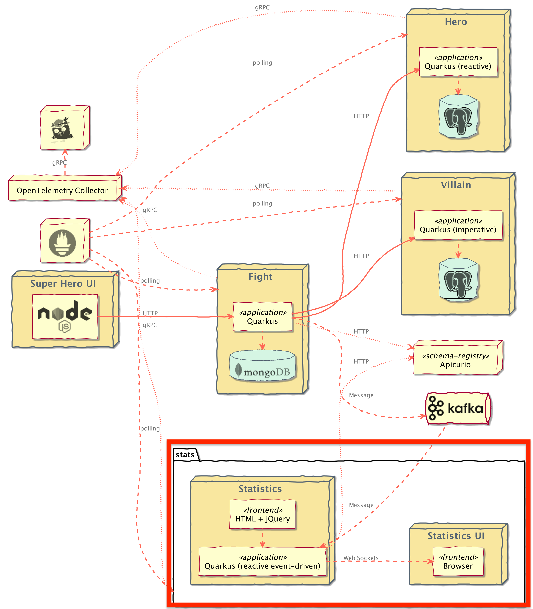

# Statistics and UI Microservices

To demonstrate how to use GitOps for Continuous Deployment (CD) and understand how it works, You will be deploying the **Statistics** and **Statistics UI** microservices using OpenShift GitOps in the [Continuous Deployment (CD)](../continuous-deployment/gitops.md) section.

