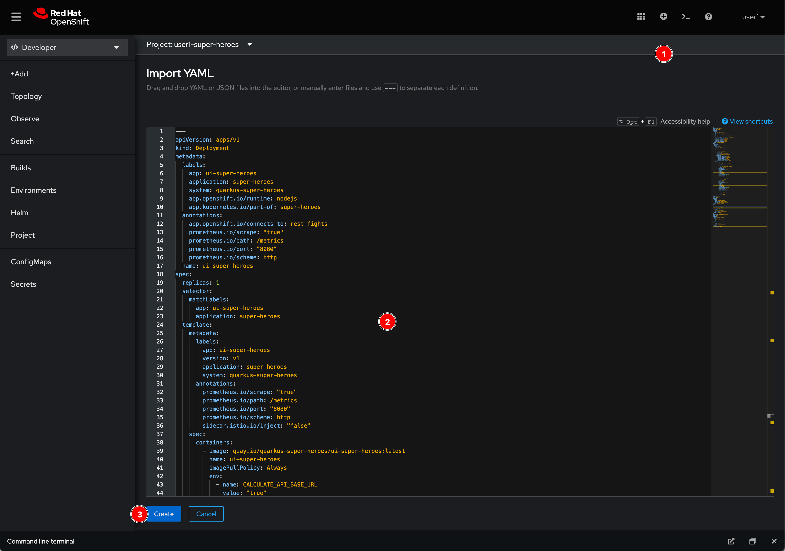
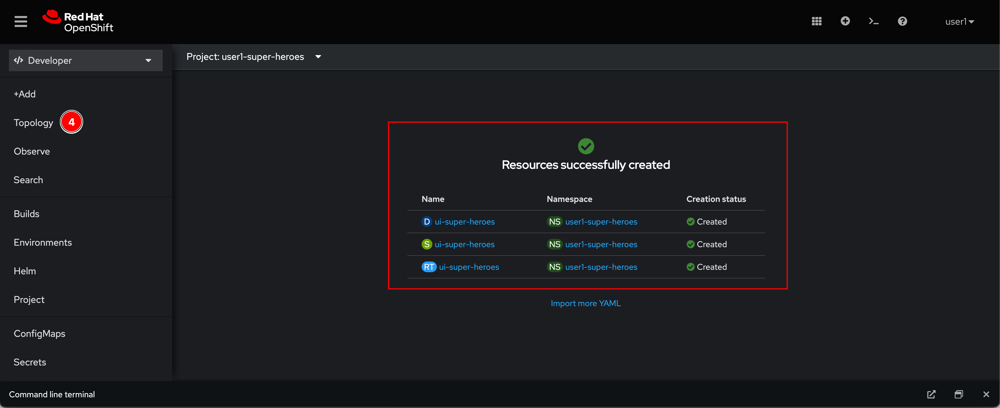
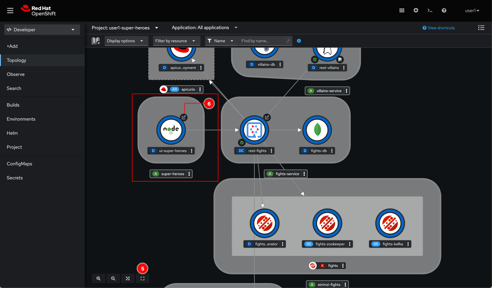
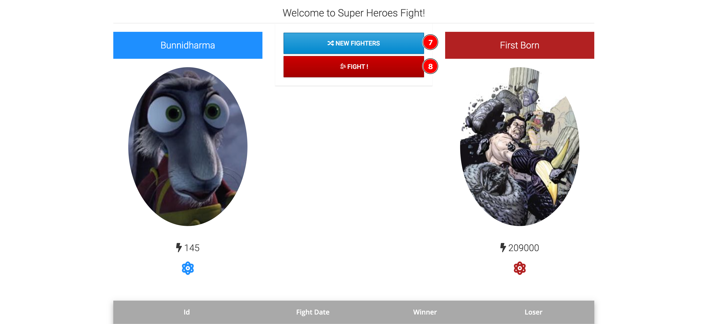

# Super Hero UI Microservice

## Deploy application with YAML

1. Click on  icon located at top right corner of web console.

2. Copy this YAML snippet to the editor and click **Create** button.

   ```yaml
   ---
   apiVersion: apps/v1
   kind: Deployment
   metadata:
     labels:
       app: ui-super-heroes
       application: super-heroes
       system: quarkus-super-heroes
       app.openshift.io/runtime: nodejs
       app.kubernetes.io/part-of: super-heroes
     annotations:
       app.openshift.io/connects-to: rest-fights
       prometheus.io/scrape: "true"
       prometheus.io/path: /metrics
       prometheus.io/port: "8080"
       prometheus.io/scheme: http
     name: ui-super-heroes
   spec:
     replicas: 1
     selector:
       matchLabels:
         app: ui-super-heroes
         application: super-heroes
     template:
       metadata:
         labels:
           app: ui-super-heroes
           version: v1
           application: super-heroes
           system: quarkus-super-heroes
         annotations:
           prometheus.io/scrape: "true"
           prometheus.io/path: /metrics
           prometheus.io/port: "8080"
           prometheus.io/scheme: http
           sidecar.istio.io/inject: "false"
       spec:
         containers:
           - image: quay.io/quarkus-super-heroes/ui-super-heroes:latest
             name: ui-super-heroes
             imagePullPolicy: Always
             env:
               - name: CALCULATE_API_BASE_URL
                 value: "true"
             livenessProbe:
               failureThreshold: 3
               httpGet:
                 path: /
                 port: 8080
                 scheme: HTTP
               initialDelaySeconds: 0
               periodSeconds: 30
               successThreshold: 1
               timeoutSeconds: 10
             ports:
               - containerPort: 8080
                 protocol: TCP
                 name: http
             readinessProbe:
               failureThreshold: 3
               httpGet:
                 path: /
                 port: 8080
                 scheme: HTTP
               initialDelaySeconds: 0
               periodSeconds: 30
               successThreshold: 1
               timeoutSeconds: 10
             resources:
               limits:
                 memory: 128Mi
               requests:
                 memory: 32Mi
   ---
   apiVersion: v1
   kind: Service
   metadata:
     labels:
       name: ui-super-heroes
       application: super-heroes
       system: quarkus-super-heroes
     name: ui-super-heroes
   spec:
     ports:
       - port: 80
         protocol: TCP
         targetPort: 8080
         name: http
     selector:
       app: ui-super-heroes
       application: super-heroes
     type: ClusterIP
   ---
   apiVersion: route.openshift.io/v1
   kind: Route
   metadata:
     name: ui-super-heroes
     labels:
       app: ui-super-heroes
       application: super-heroes
       system: quarkus-super-heroes
   spec:
     to:
       kind: Service
       name: ui-super-heroes
     port:
       targetPort: 8080
   ```

    

3. Web console will show you what resources were successfully created. In thise case, Deployment, Service, and Route (similar to Ingress but has more features). Then go to **Topology** menu.

    

4. Click **Reset view** button located at bottom left corner of view area to rearrange the entities in view area. Look for **ui-super-heroes** pod that we've just deployed with YAML then click the arrrow icon to open its URL.

    

5. Click **NEW FIGHTERS** then **FIGHT!** button to play game.

    

## What have you learnt?

1. How to create Kubernetes resources with YAML.

2. How to import YAML via OpenShift web console.

3. How to quickly rearrange entities in the Topology view area.
