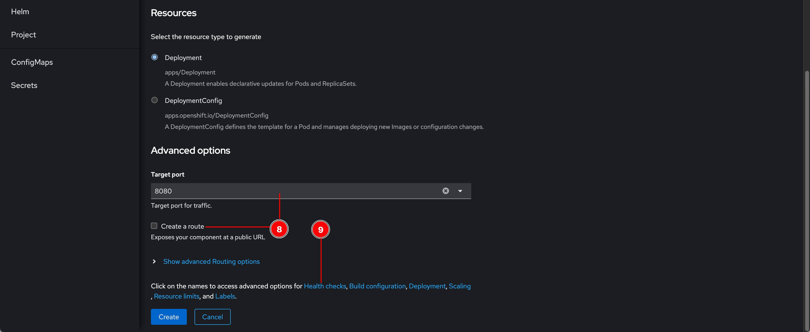
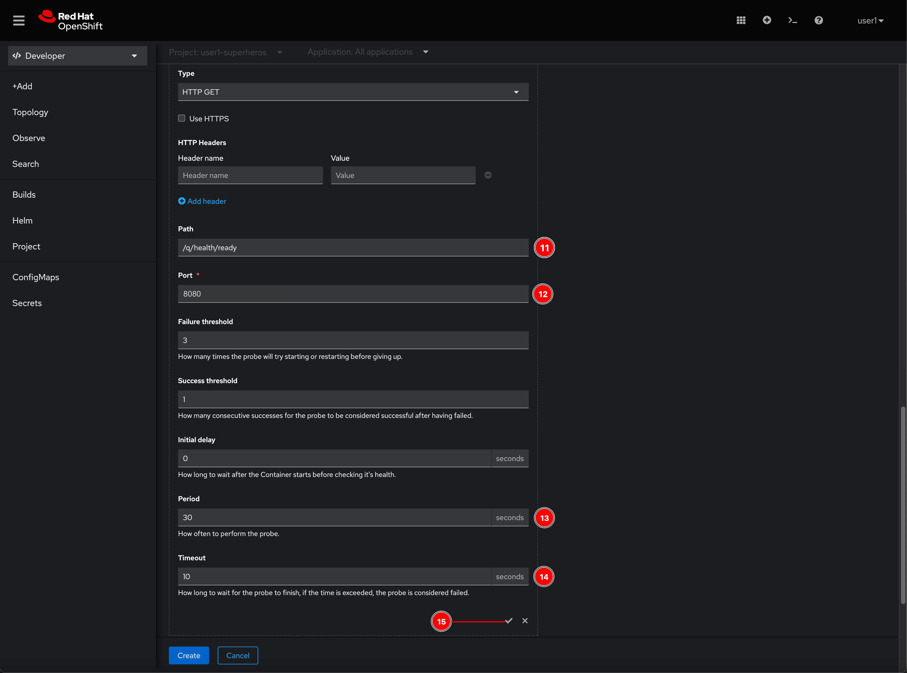
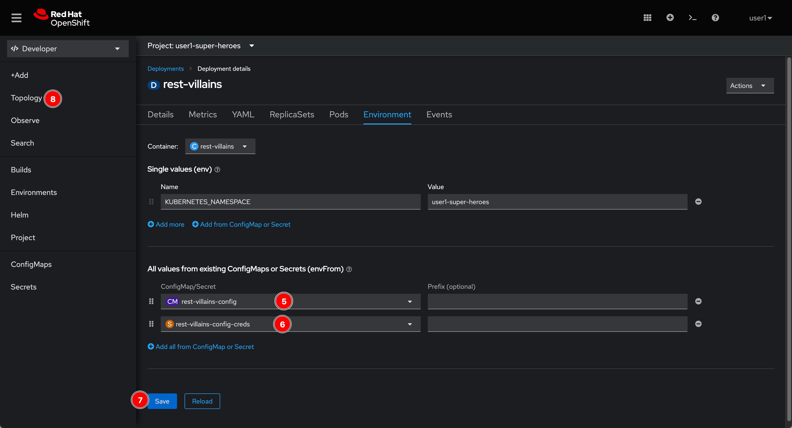

# Villain Microservice

## Create a ConfigMap object to store application configurations

1. Click on  icon located at top right corner of web console.

2. Copy this YAML snippet to the editor and click **Create** button.

   _YAML snippet:_

   ```yaml
   apiVersion: v1
   kind: ConfigMap
   metadata:
     labels:
       app: rest-villains
       application: villains-service
       system: quarkus-super-heroes
     name: rest-villains-config
   data:
     quarkus.hibernate-orm.database.generation: validate
     quarkus.hibernate-orm.sql-load-script: no-file
     quarkus.datasource.jdbc.url: jdbc:otel:postgresql://villains-db:5432/villains_database
     quarkus.opentelemetry.tracer.exporter.otlp.endpoint: http://otel-collector:4317
     quarkus.http.access-log.enabled: 'false'
     quarkus.http.access-log.pattern: >
       %h %l %u %t "%r" %s %b "User-Agent: %{i,User-Agent}" "x-request-id:
       %{i,x-request-id}" "x-b3-traceid: %{i,x-b3-traceid}"  " Referer:
       %{i,Referer}"
   ```

   

3. A **rest-villains-config** ConfigMap object should be created.

   

## Create a Secret object to store the secret configurations

1. Click on  icon located at top right corner of web console.

2. Copy this YAML snippet to the editor and click **Create** button.

   _YAML snippet:_

   ```yaml
   apiVersion: v1
   kind: Secret
   metadata:
     labels:
       app: rest-villains
       application: villains-service
       system: quarkus-super-heroes
     name: rest-villains-config-creds
   data:
     quarkus.datasource.username: c3VwZXJiYWQ=
     quarkus.datasource.password: c3VwZXJiYWQ=
   type: Opaque
   ```

   

3. A **rest-villains-config-creds** Secret object should be created.

   

## Deploy application using OpenShift Build - Source-to-Image (S2I)

1. Go to **Topology** menu, right click on view area then select **Add to Project -> Import from Git** menu.

   

2. Click **Show advanced Git options** link then enter following inputs. OpenShift Build (S2I) will check the project e.g. source code, framework and select builder image for build/compile application for you.

   - **Git Repo URL:** `https://gitlab.com/s.audomsak/developer-advocacy-2022`
   - **Context dir:** `code/rest-villains`
   - **Application:** `villains-service`
   - **Name:** `rest-villains`

   

3. Scroll down to the bottom of the page, select **8080** option for **Target port**, uncheck the **Create a route** checkbox, and then click **Health checks** link.

   

4. Click **Add Readiness probe** link.

   

5. Enter following inputs then click :heavy_check_mark: icon.

   - **Path:** `/q/health/ready`
   - **Port:** `8080`
   - **Period:** `30`
   - **Timeout:** `10`

   

6. Click **Add Liveness probe** link.

   

7. Enter following inputs then click :heavy_check_mark: icon.

   - **Path:** `/q/health/live`
   - **Port:** `8080`
   - **Period:** `30`
   - **Timeout:** `10`

   

8. Click **Build configuration** link.

   

9. Enter following environment variable then click **Deployment** link.

   - **Name:** `MAVEN_MIRROR_URL`
   - **Value:** `http://nexus.nexus.svc.cluster.local:8081/repository/maven-public/`

   Note. This will tell Maven in the builder image to use Nexus deployed on the cluster as a Maven Repository instead to speed up build process.

   

10. Enter following environment variable. Then click **Resource limits** link.

    - **Name:** `KUBERNETES_NAMESPACE`
    - **Value:** `userX-super-heroes` where `X` is your user number.

    

11. Enter following memory request and limit. Then click **Labels** link.

    - **Request:** `256`
    - **Limit:** `768`

    

12. Enter `system=quarkus-super-heroes` then click **Create** button.

    

## Add application configurations in ConfigMap and Secret objects to application container

1. Click on **rest-villains** entity in view area, a panel will show on right hand side. Notice that a build process starts automatically to build source code and container image (you can click **View logs** to see build logs). By the way, just let it run in background for now. Then click **rest-villains** link.

   

2. Go to **Environment** tab to add environment variables to application container. Then click **Add all from ConfigMap or Secret** link.

   

3. Select **rest-villains-config** ConfigMap and **rest-villains-config-creds** Secret objects, then click **Save** button. And then go to **Topology** menu.

   

4. Wait for a while until you see dark blue ring surrounds the **rest-villains** entity. Hover mouse pointer over it, a bubble should show up and say _1 Running_ which means there is 1 pod running.

   

## What have you learnt?

1. How to create ConfigMap object with YAML to keep all application configurations.

2. How to create Secret object with YAML to keep all secret application configurations.

3. How to deploy application with existing source codes using OpenShift Build - Source-to-Image (S2I) with following additional configurations:

   - Application health checks e.g. liveness and readiness probes
   - Require and limit resource i.e. memory for application
   - Environment variable for application container
   - Environment variable for S2I build i.e. Maven Repository setting
   - User-defined label

4. Bind configurations from ConfigMap and Secret objects to application container via environment variables.
5. Change network port to be exposed for application container.
