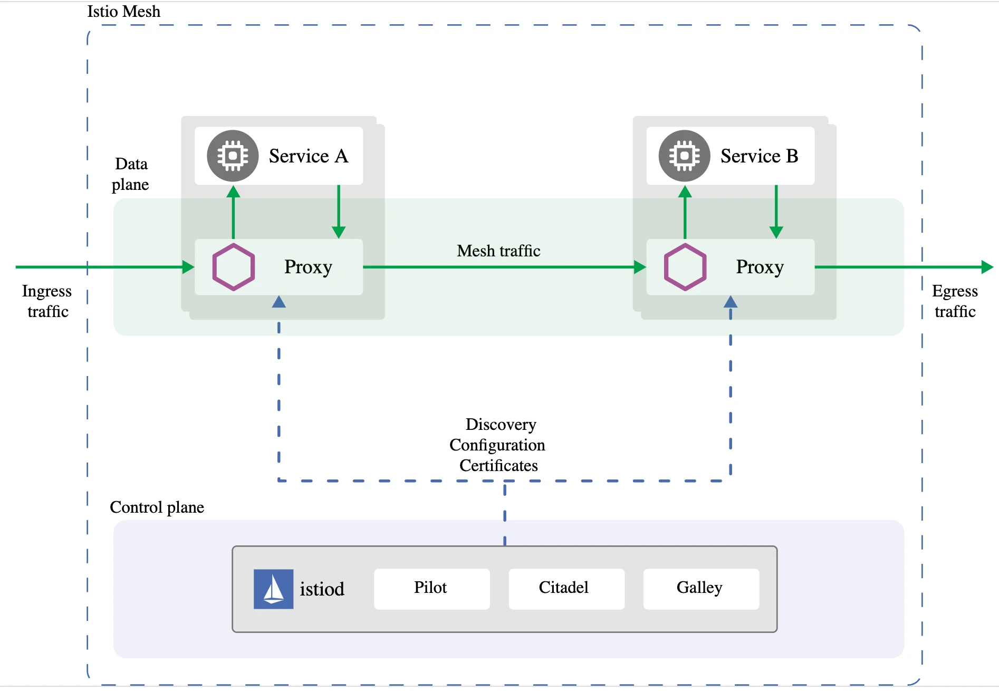
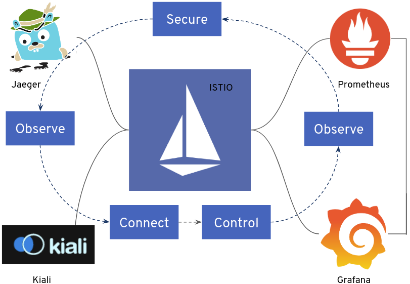

# Service Mesh

## What is service mesh?

A service mesh is a dedicated infrastructure layer that controls service-to-service communication over a network. This method enables separate parts of an application to communicate with each other. Service meshes appear commonly in concert with cloud-based applications, containers and microservices.

A service mesh controls the delivery of service requests in an application. Common features provided by a service mesh include service discovery, load balancing, encryption and failure recovery. High availability is also common through the use of software controlled by APIs rather than through hardware. Service meshes can make service-to-service communication fast, reliable and secure.

## How a service mesh works

A service mesh architecture uses a proxy instance called a sidecar in whichever development paradigm is in use, typically containers and/or microservices. In a microservice application, a sidecar attaches to each service. In a container, the sidecar attaches to each application container, VM or container orchestration unit, such as a Kubernetes pod.

## What is Red Hat OpenShift Service Mesh?

Red Hat® OpenShift® Service Mesh—based on the open source project Istio —provides a uniform way to connect, manage, and observe microservices-based applications. It provides behavioral insight into—and control of—the networked microservices in your service mesh.

## References

[The Istio service mesh](https://istio.io/latest/about/service-mesh/)

[What is Red Hat OpenShift Service Mesh?](https://www.redhat.com/en/technologies/cloud-computing/openshift/what-is-openshift-service-mesh)
