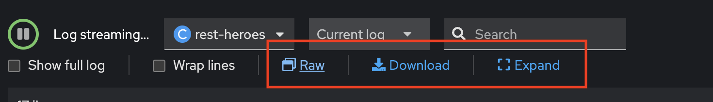

# Application Logging

## What is application log?

Software applications generate logs when something occurs within (or affects) the application. Usually, applications write the relevant log information to a file on the application’s server. To save disk space, some organizations configure applications to send their logs to a network share, a dedicated Syslog server, or a logging application through a webhook. Cloud-based applications can write their logs to the cloud’s logging service.

Some log events relate to internal application states. Examples include:

- Memory leaks
- Non-existent path errors
- Unhandled exceptions in the code
- A system crash

Other types of events relate to external factors the application recognizes. Examples include:

- Disk space warnings
- Server reboots
- Lost network access

Each application is different, so the events logged will depend on how the developers have configured it to record events. Usually, critical events like errors or warnings are logged by default. However, you could also see events relating to successful operations such as data transfer complete, backup successful, or shutting down gracefully.

Some common fields are present in most application logs:

- Timestamp: the date and time of the event, which can be in the server’s local time or another time zone like UTC.
- Log Level: the severity of the event. Some example log levels include DEBUG, INFO, WARNING, and CRITICAL.
- Username: the network (or logged-in) user responsible for the event. For some system-related events, this field will be blank.
- Source IP: the client (application process or user) IP address. For local events, this field may be empty.
- Destination IP: the local server IP address.
- Event Message: the event description, usually in short text form.

## OpenShift Container Platform logging

As a cluster administrator, you can deploy logging on an OpenShift Container Platform cluster, and use it to collect and aggregate node system audit logs, application container logs, and infrastructure logs. You can forward logs to your chosen log outputs, including on-cluster, Red Hat managed log storage. You can also visualize your log data in the OpenShift Container Platform web console, or the Kibana web console, depending on your deployed log storage solution.

## Logging architecture

The major components of the logging are:

* **Collector**
The collector is a daemonset that deploys pods to each OpenShift Container Platform node. It collects log data from each node, transforms the data, and forwards it to configured outputs. You can use the Vector collector or the legacy Fluentd collector.

* **Log store**
The log store stores log data for analysis and is the default output for the log forwarder. You can use the default LokiStack log store, the legacy Elasticsearch log store, or forward logs to additional external log stores.

* **Visualization**
You can use a UI component to view a visual representation of your log data. The UI provides a graphical interface to search, query, and view stored logs. The OpenShift Container Platform web console UI is provided by enabling the OpenShift Container Platform console plugin.

Logging collects container logs and node logs. These are categorized into types:

* **Application logs**
Container logs generated by user applications running in the cluster, except infrastructure container applications.

* **Infrastructure logs**
Container logs generated by infrastructure namespaces: openshift*, kube*, or default, as well as journald messages from nodes.

* **Audit logs**
Logs generated by auditd, the node audit system, which are stored in the /var/log/audit/audit.log file, and logs from the auditd, kube-apiserver, openshift-apiserver services, as well as the ovn project if enabled.

## Trouble Shooting with Log Console

1. In Topology view, click rest-heroes deployment, select Resources tab in popup panel, click view logs link at rest-heroes pod

   

2. In Logs Tab, you can view logs of your application in this page. this page will show current logs of container. if you have some action with container such as restart, old log will not appear again.!!!
   
   

3. In Logs Tab, cosole will provided many features to view logs such as Raw, Download and Expand.

   

4. Click Raw to view raw logs data.
   
   

5. Click Expand if you want to view in full screen.

   

6. Change tab to Aggregated Logs to view log of this container and another logs from another container.
   
   

7. back to Logs tab again, note your latest 3 logs line in your favorite notepad/editor.
   
   

8. recheck in Aggregated Logs tab, Can you see your latest 3 logs line in this tab??? 
   
   

9. Test restart Pod, Back to Topology view, click rest-heroes deployment and select Details tab, click scale down to 0
   
   

10. after scale down to 0, wait 1 minute, scale up to 1 again.
    
    

11. Back to Log tab of pod again, view new logs, check logs time. old log will not appear after you restart pod !!!
    
    

12. change to Aggregated Logs, check current logs, old log will not appear same Logs tab.
    
    

13. To view the entire log or past episodes, click observe in left menu, select Logs tab, select filter by container and select 'rest-heroes', click Run Query
    
    

14. find logs from rest-heres container both before and after restart (log that you noted in step 7)
    
    

15. Click Clear all filter, test to filter with severity, change filter with content and select severity with 'error'
    
    

16. change severity to 'info'
    
    

17. Click Show Query and input following LogQL to query '{ log_type="application", kubernetes_namespace_name="user4-super-heroes", kubernetes_container_name="rest-heroes" } | json '
    
    

18. add '|~ "started in.*"' to filter logs content have 'started in' in content of log 

    

## References

* [About Logging](https://docs.openshift.com/container-platform/4.16/observability/logging/cluster-logging.html)
