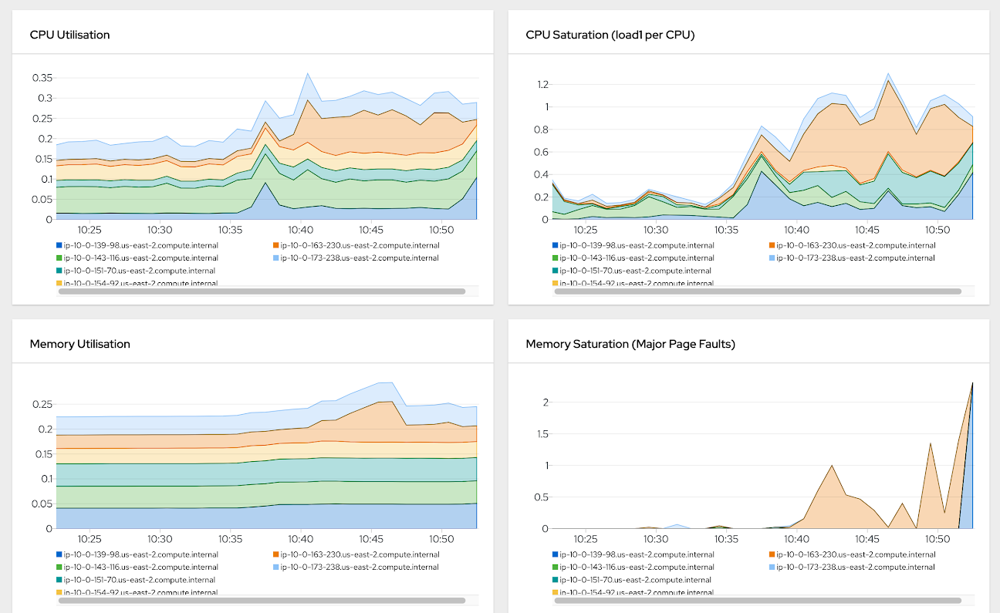

# Application Metrics



## Metrics are your first sign of trouble

It's important to monitor your application because the first step to fixing a problem is knowing it exists. For example, without monitoring, you may not know when your database server is overloaded or when a new feature has broken something in an older part of the system.

System monitoring tools can help you track many different aspects of your software: CPU utilization, memory footprint, I/O wait times, latency, throughput, errors, and so on. Most applications have at least some metric that can be useful for performance tuning or debugging purposes (although it's easy to get overwhelmed by the number of metrics available). The trick is figuring out which ones are most relevant for your particular situation and understanding how they fit into the big picture.

## OpenShift Monitoring

In OpenShift Container Platform, cluster components are monitored by scraping metrics exposed through service endpoints. You can also configure metrics collection for user-defined projects.

You can define the metrics that you want to provide for your own workloads by using Prometheus client libraries at the application level.

In OpenShift Container Platform, metrics are exposed through an HTTP service endpoint under the `/metrics` canonical name. You can list all available metrics for a service by running a `curl` query against `http://<endpoint>/metrics`. For instance, you can expose a route to the `prometheus-example-app` example service and then run the following to view all of its available metrics:

```sh
curl http://<example_app_endpoint>/metrics
```

Example output:

```text
HELP http_requests_total Count of all HTTP requests
# TYPE http_requests_total counter
http_requests_total{code="200",method="get"} 4
http_requests_total{code="404",method="get"} 2
# HELP version Version information about this binary
# TYPE version gauge
version{version="v0.1.0"} 1
```
