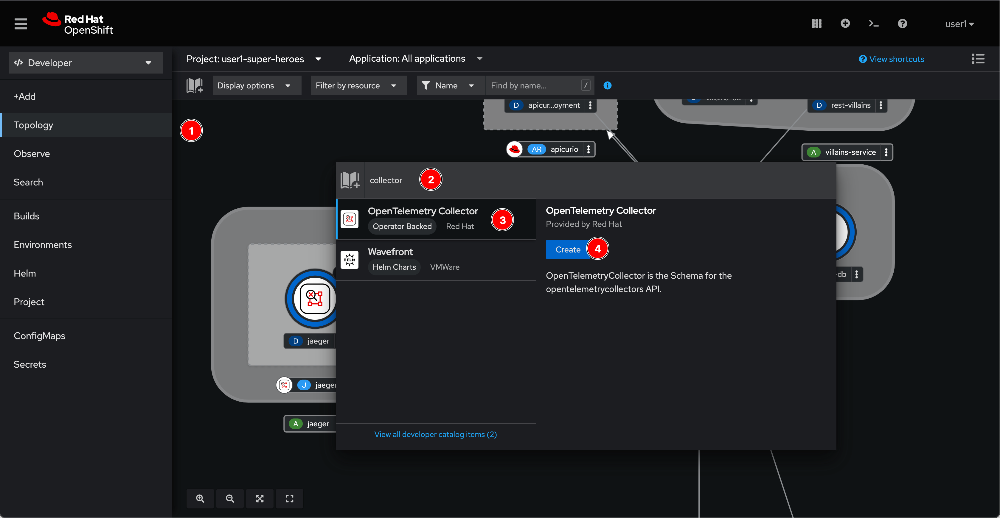
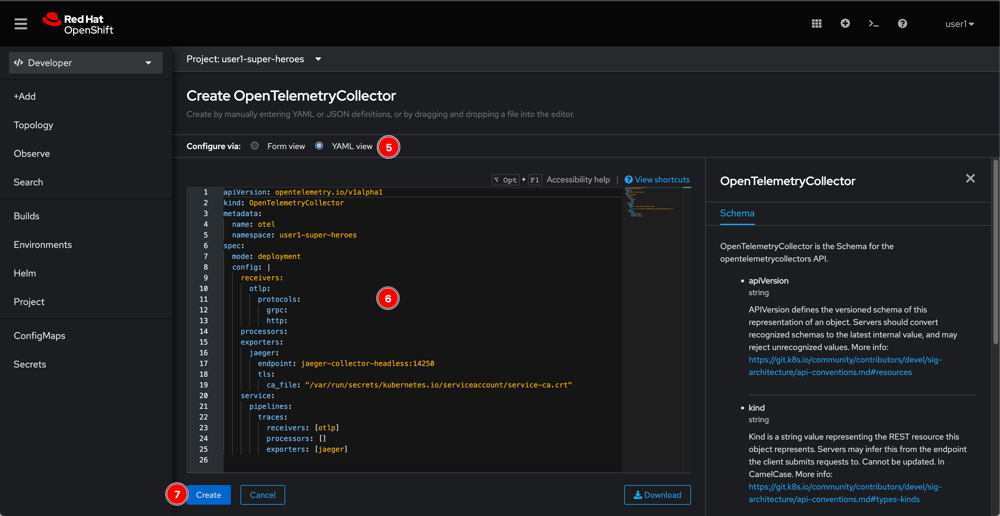
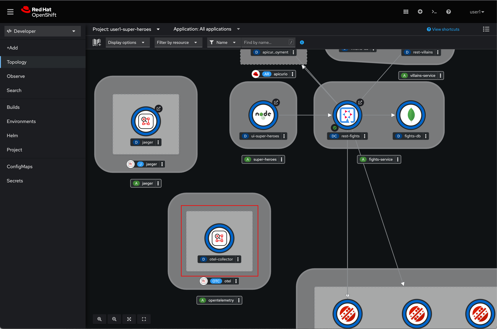

# Configure OpenShift Distributed Tracing Data Collection

## Deploy distributed tracing data collection

1. Click on the book icon, to add application from Developer Catalog then type `collector` in the search box. Select **OpenTelemetry Collector** and click **Create** button.

    

2. Switch to **YAML view**, copy following YAML snippet to the editor. :exclamation: **DO NOT FORGET** to change `userX` in line `16` to your user, then click **Create** button.

   *YAML snippet:*

   ```yaml
   apiVersion: opentelemetry.io/v1alpha1
   kind: OpenTelemetryCollector
   metadata:
     name: otel
   spec:
     mode: deployment
     config: |
       receivers:
         otlp:
           protocols:
             grpc:
             http:
       processors:
       exporters:
         jaeger:
           endpoint: jaeger-collector-headless.userX-super-heroes.svc.cluster.local:14250
           tls:
             ca_file: "/var/run/secrets/kubernetes.io/serviceaccount/service-ca.crt"
       service:
         pipelines:
           traces:
             receivers: [otlp]
             processors: []
             exporters: [jaeger]
    ```

    

3. Wait for a monent you'll see OpenTelemetry collector instance get deployed.

    

## What have you learnt?

How to deploy distributed tracing data collection (based on [OpenTelemetry](https://opentelemetry.io/) open source project).
