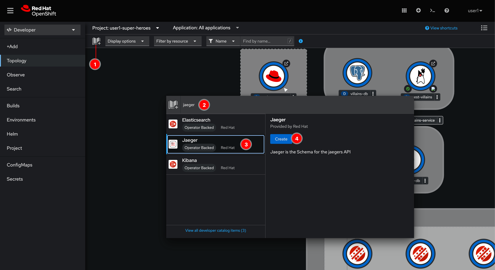
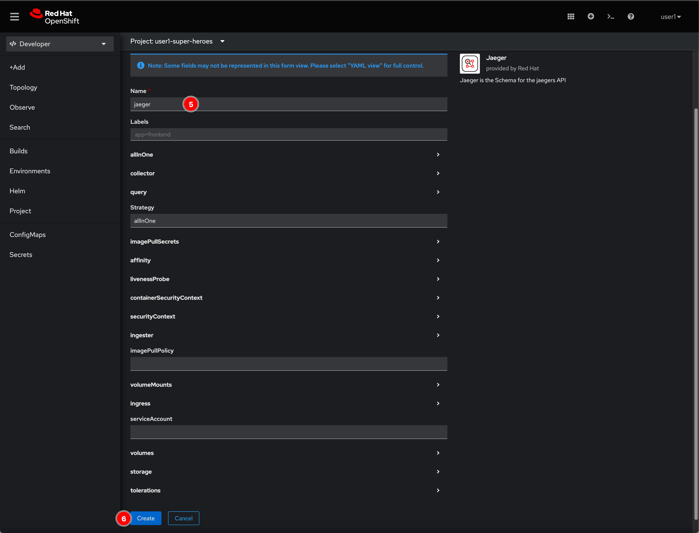
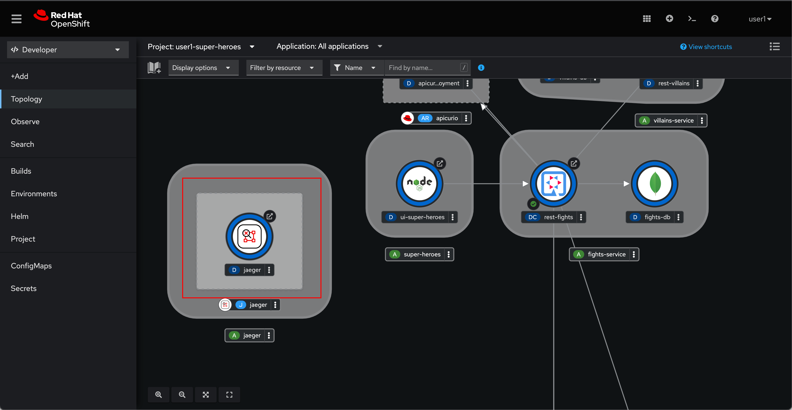

# Configure OpenShift Distributed Tracing Platform

## Deploy distrubuted tracing default strategy

1. Back to userX-super-heroes project

2. Click on the book icon, to add application from Developer Catalog then type `jaeger` in the search box. Select **Jaeger** and click **Create** button.

    

3. Enter `jaeger` to the **Name** field then click **Create** button.

    

4. Wait for a monent you'll see Jaeger instance get deployed.

    

## What have you learnt?

How to set up distrubuted tracing platform (based on [Jaeger](https://www.jaegertracing.io/) open source project).
