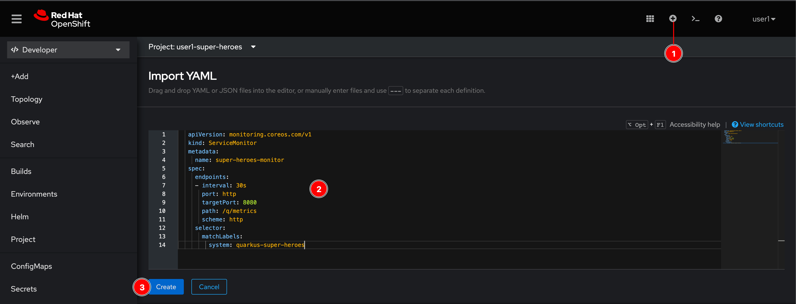
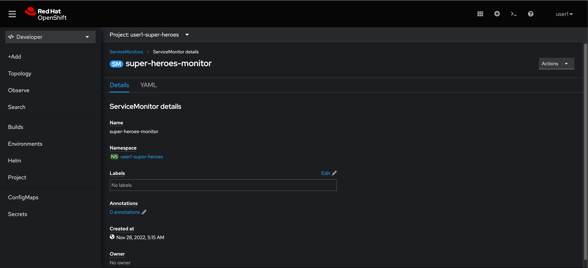

# Configure Service Monitoring

In OpenShift Container Platform, you can enable monitoring for user-defined projects in addition to the default platform monitoring. You can monitor your own projects in OpenShift Container Platform without the need for an additional monitoring solution. Using this feature centralizes monitoring for core platform components and user-defined projects.

In this workshop, user-defined projects monitoring is already enable so you don't need to worry about that. What you need to do is create a **Service Monitor** resource to tell the platform monitoring what workload/services you want it to monitor.

## Create Service Monitor

1. Click on  icon located at top right corner of web console.

2. Copy this YAML snippet to the editor and click **Create** button.

    - `path: /q/metrics` is the URI exposed by our microservices. Prometheus will call the services with this URI to collect metrics.
    - `targetPort: 8080` is the network port exposed by services.

   ```yaml
   apiVersion: monitoring.coreos.com/v1
   kind: ServiceMonitor
   metadata:
     name: super-heroes-monitor
   spec:
     endpoints:
     - interval: 30s
       port: http
       targetPort: 8080
       path: /q/metrics
       scheme: http
     selector:
       matchLabels:
         system: quarkus-super-heroes
   ```

    

3. A **super-heroes-monitor** ServiceMonitor resource should be created.

    

## What have you learnt?

How to create Service Monitor object to use the platform monitoring to monitor your application.
