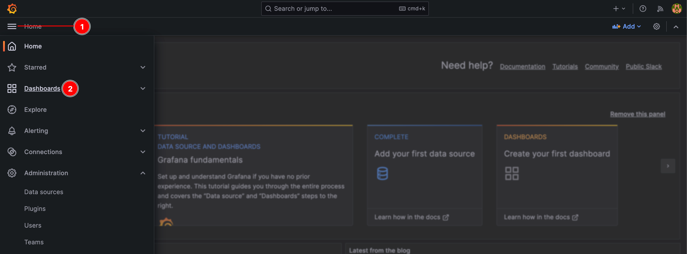
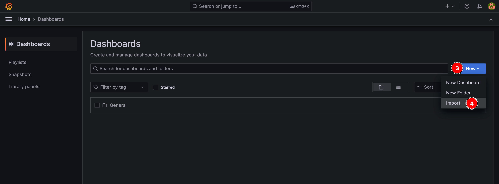
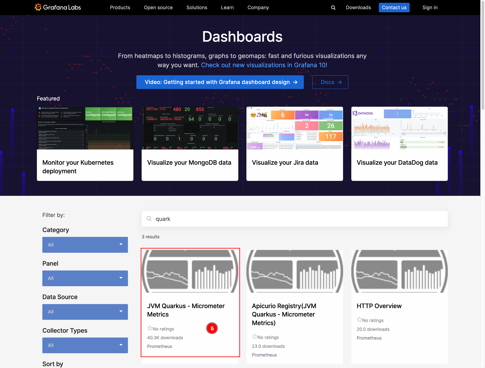
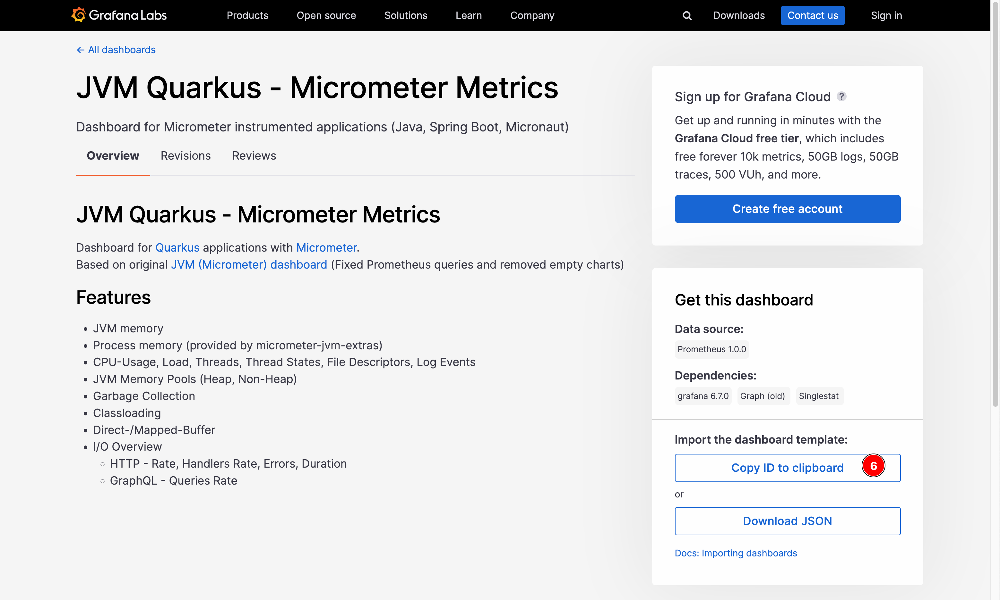
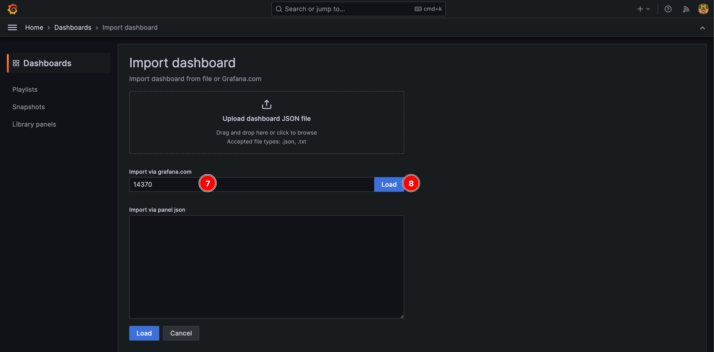
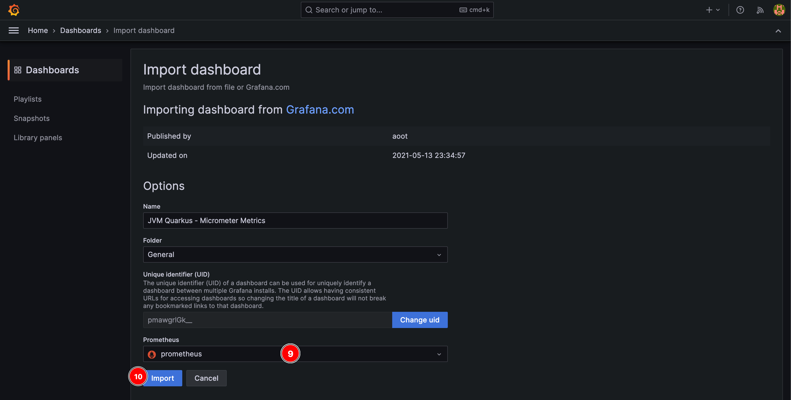
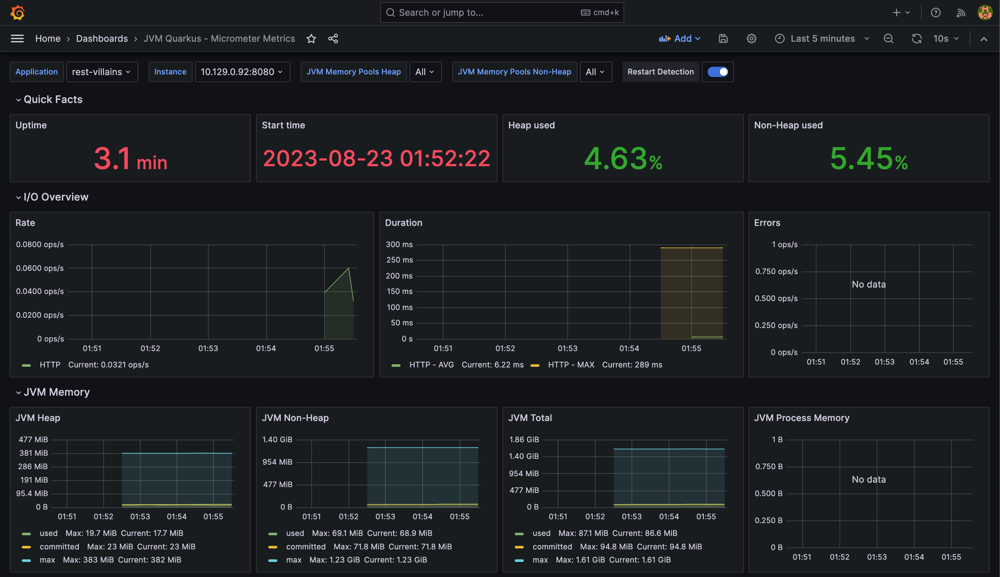

# Create Grafana Dashboard

Now we've configured the datasource for our Grafana instance. Basically, the Grafana can now query all application metrics from Prometheus in OpenShift cluster. Next we need to create a dashboard to display those application metrics in a graphical way rather the plain text returned from `/q/metrics` endpoint of our microservices.

## Create Grafana Dashboard for Java application

1. Go to Grafana web console, click on hamberger menu, then select **Dashboards** menu.

    

2. Click on **New** button then select **Import** menu.

    

3. Go to [Grafana Dashbords portal](https://grafana.com/grafana/dashboards/?search=quarkus) to get a completed free dashboard created by community. Then select the **JVM Quarkus - Micrometer** dashboard.
   
   https://grafana.com/grafana/dashboards/14370-jvm-quarkus-micrometer-metrics/

    

4. Click on **Copy ID to clipboard** button to copy the dashboard ID.

    

5. Go back to Grafana web console, paste the dashbord ID to textbox then click on **Load** button.

    

6. Select `prometheus` datasource then click on **Import** button.

    

7. The dashboard will be imported and application metrics are displayed in various type of visualization. (select application from dropdownlist if data not found!!!)

    
