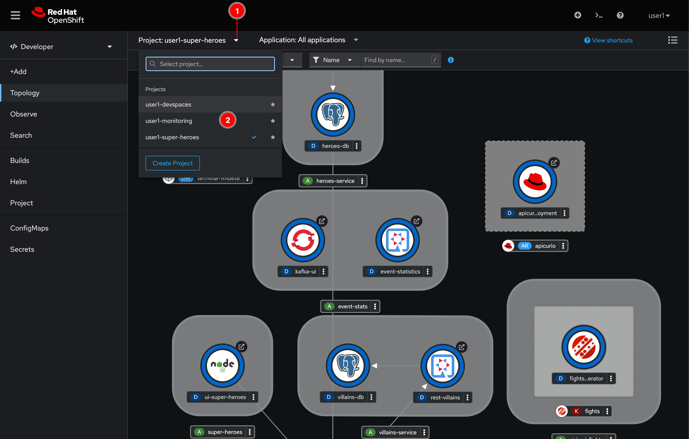
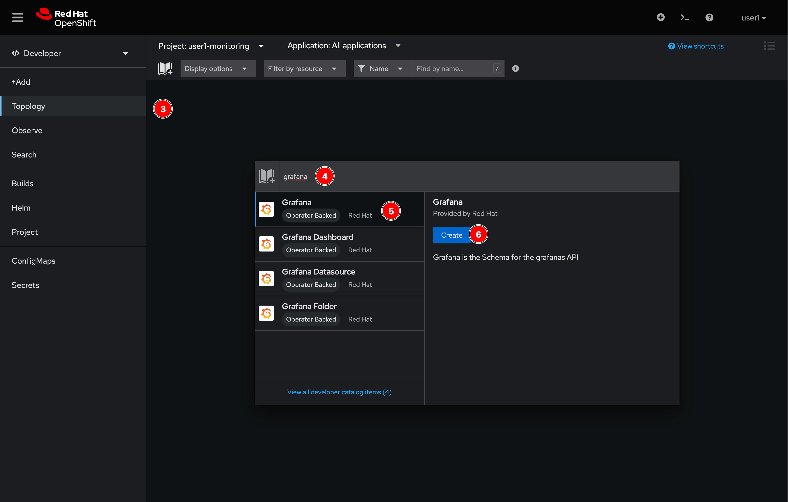
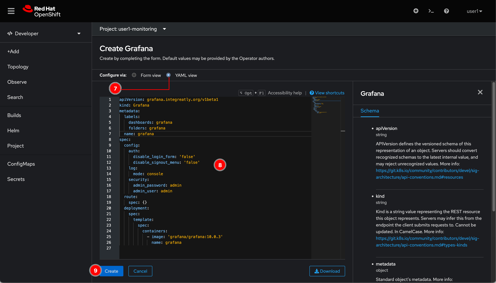
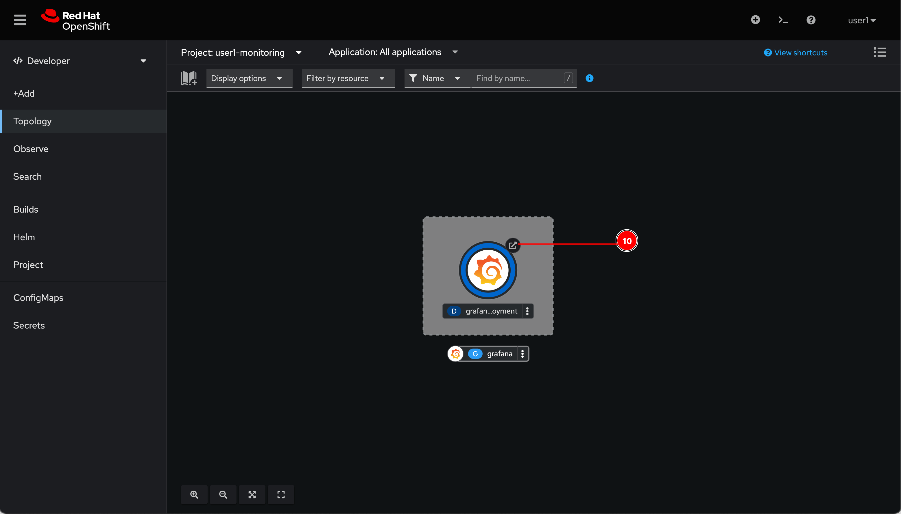

# Create Grafana Instance

There're many ways to deploy Grafana on OpenShift or Kubernetes cluster. However, Using operator and CRD to manage and deploy the Grafana instance seems to be the easiest way.

The cluster you're using for this workshop already has Grafana Operator installed so you just need to create the Grafana custom resource (CRD) and let the operator deploy Grafana instance for you.

## Create Grafana instance via OpenShift web console

1. Click on the **Project** drop-down list then select **user*X*-monitoring** project where ***X*** is your username.

   

2. Click on the book icon, to add application from Developer Catalog then type `grafana` in the search box. Select **Grafana** and click **Create** button.

   

3. Switch to **YAML view**, replace the content with this YAML snippet. Then click **Create** button.

    ```yaml
    apiVersion: grafana.integreatly.org/v1beta1
    kind: Grafana
    metadata:
      labels:
        dashboards: grafana
        folders: grafana
      name: grafana
    spec:
      config:
        auth:
          disable_login_form: 'false'
          disable_signout_menu: 'false'
        log:
          mode: console
        security:
          admin_password: admin
          admin_user: admin
      route:
        spec: {}
      deployment:
        spec:
          template:
            spec:
              containers:
              - image: 'grafana/grafana:10.0.3'
                name: grafana
    ```

    

4. Wait for a monent you'll see Grafana get deployed. Click on the arrow icon to open Grafana web console.

   

5. Login with username `admin` and password `admin`.

   

6. You'll be asked to change the password, just click on **Skip** link.

   

## What have you learnt?

How to deploy Grafan using Grafana Operator.
