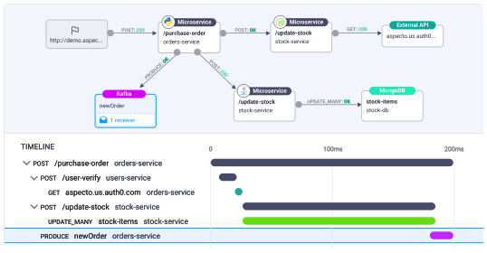
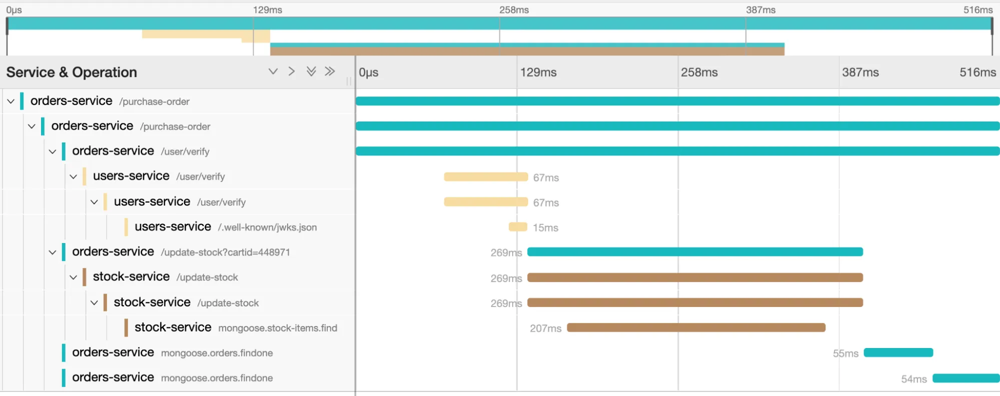

# Distributed Tracing

Distributed tracing is a method of tracking application requests as they flow from frontend devices to backend services and databases. Developers can use distributed tracing to troubleshoot requests that exhibit high latency or errors.

## Distributed tracing architecture

Every time a user takes an action in an application, a request is executed by the architecture that may require dozens of different services to participate to produce a response. **Red Hat OpenShift distributed tracing** lets you perform distributed tracing, which records the path of a request through various microservices that make up an application.

**Red Hat OpenShift distributed tracing** records the execution of individual requests across the whole stack of microservices, and presents them as traces. A trace is a data/execution path through the system. An end-to-end trace is comprised of one or more spans.

A span represents a logical unit of work in **Red Hat OpenShift distributed tracing** that has an operation name, the start time of the operation, and the duration, as well as potentially tags and logs. Spans may be nested and ordered to model causal relationships.

## Distributed tracing overview

As a service owner, you can use distributed tracing to instrument your services to gather insights into your service architecture. You can use distributed tracing for monitoring, network profiling, and troubleshooting the interaction between components in modern, cloud-native, microservices-based applications.

With distributed tracing you can perform the following functions:

* Monitor distributed transactions
* Optimize performance and latency
* Perform root cause analysis
* Red Hat OpenShift distributed tracing consists of two main components:

* **Red Hat OpenShift distributed tracing platform** - This component is based on the open source Jaeger project.

* **Red Hat OpenShift distributed tracing data collection** - This component is based on the open source OpenTelemetry project.
Both of these components are based on the vendor-neutral OpenTracing APIs and instrumentation.

## References

* [Distributed Tracing Overview](https://www.datadoghq.com/knowledge-center/distributed-tracing/)

* [OpenTelemetry - a vendor-neutral open-source Observability framework](https://opentelemetry.io/)

* [Jaeger - open source, end-to-end distributed tracing](https://www.jaegertracing.io/)
