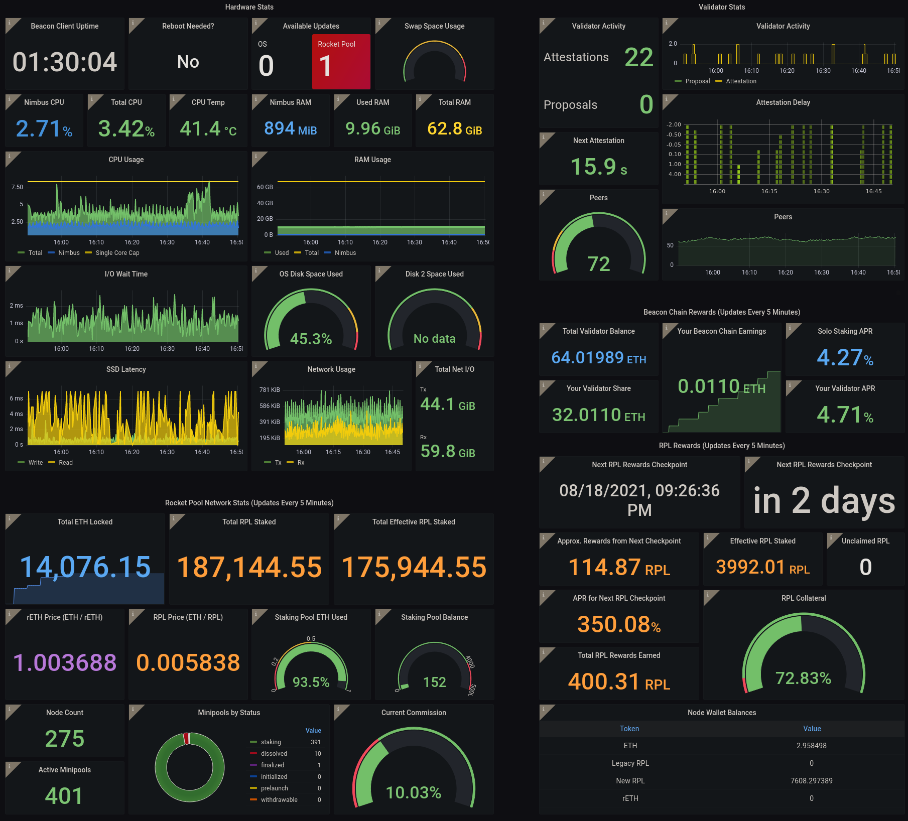
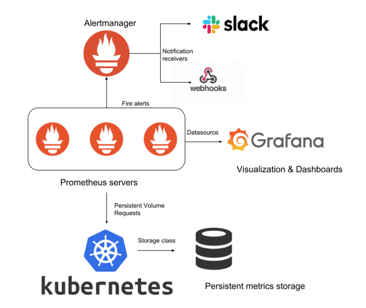

# Monitor Application with Grafana

## What is Grafana & What Is It Used For?

Grafana is an open source solution for running data analytics, pulling up metrics that make sense of the massive amount of data & to monitor our apps with the help of cool customizable dashboards.

Grafana connects with every possible data source, commonly referred to as databases such as Graphite, Prometheus, Influx DB, ElasticSearch, MySQL, PostgreSQL etc.

Grafana being an open source solution also enables us to write plugins from scratch for integration with several different data sources.

The tool helps us study, analyse & monitor data over a period of time, technically called time series analytics.

It helps us track the user behaviour, application behaviour, frequency of errors popping up in production or a pre-prod environment, type of errors popping up & the contextual scenarios by providing relative data.

## What Is a Grafana Dashboard?

The dashboards pull data from the plugged-in data sources such as Graphite, Prometheus, Influx DB, ElasticSearch, MySQL, PostgreSQL etc.  These are a few of many data sources which Grafana supports by default.

The dashboards contain a gamut of visualization options such as geo maps, heat maps, histograms, all the variety of charts & graphs which a business typically requires to study data.

A dashboard contains several different individual panels on the grid. Each panel has different functionalities.

## How does Grafana work with Prometheus?

Prometheus is an open source data monitoring tool. The combination of Prometheus & Grafana is the de-facto tool combination in the industry for deploying a data visualization setup. Grafana dashboard is used for visualizing the data whereas the backend is powered by Prometheus.

Though Prometheus too has data visualization features & stuff. But still, Grafana is preferred for visualizing data. Queries are fired from the dashboard & the data is fetched from Prometheus.
It acts as a perfect open source data model for storing time series data.

## References

* [Prometheus - Monitoring system &amp; time series database](https://prometheus.io/)

* [Grafana - The open observability platform](https://grafana.com/)
