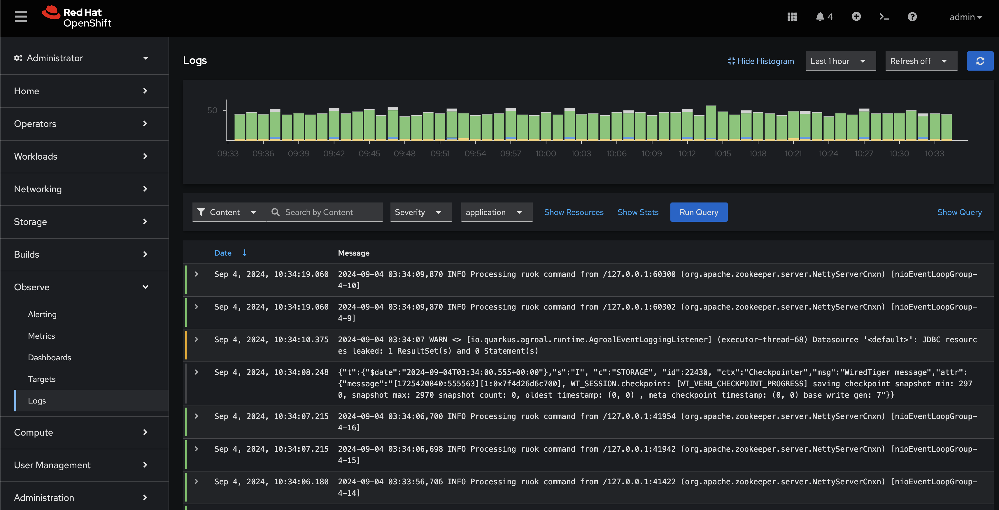
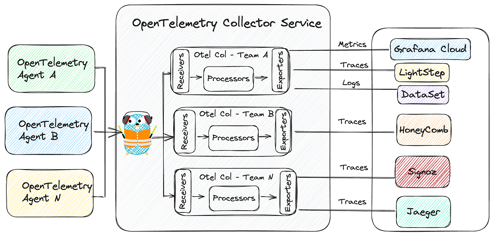
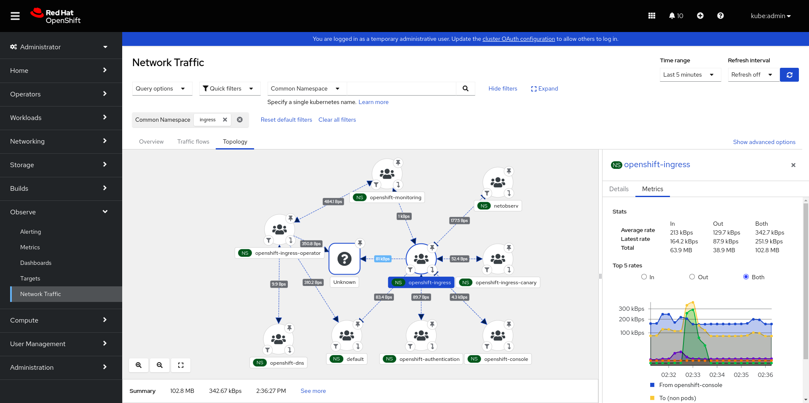
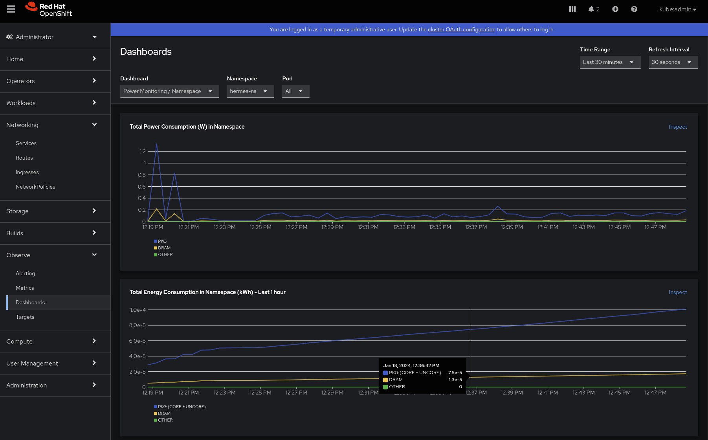

# OpenShift Observability

## What is OpenShift Observability?

Red Hat OpenShift Observability provides real-time visibility, monitoring, and analysis of various system metrics, logs, traces, and events to help users quickly diagnose and troubleshoot issues before they impact systems or applications. To help ensure the reliability, performance, and security of your applications and infrastructure, OpenShift Container Platform offers the following Observability components:

- Monitoring

- Logging

- Distributed tracing

- Red Hat build of OpenTelemetry

- Network Observability

- Power monitoring

Red Hat OpenShift Observability connects open-source observability tools and technologies to create a unified Observability solution. The components of Red Hat OpenShift Observability work together to help you collect, store, deliver, analyze, and visualize data.

## Logging

Collect, visualize, forward, and store log data to troubleshoot issues, identify performance bottlenecks, and detect security threats. In logging 5.7 and later versions, users can configure the LokiStack deployment to produce customized alerts and recorded metrics.

For more information, see [About Logging.](https://docs.openshift.com/container-platform/4.16/observability/logging/cluster-logging.html#cluster-logging)

## Monitoring

Monitor the in-cluster health and performance of your applications running on OpenShift Container Platform with metrics and customized alerts for CPU and memory usage, network connectivity, and other resource usage. Monitoring stack components are deployed and managed by the Cluster Monitoring Operator.

Monitoring stack components are deployed by default in every OpenShift Container Platform installation and are managed by the Cluster Monitoring Operator (CMO). These components include Prometheus, Alertmanager, Thanos Querier, and others. The CMO also deploys the Telemeter Client, which sends a subset of data from platform Prometheus instances to Red Hat to facilitate Remote Health Monitoring for clusters.

For more information, see [Monitoring overview](https://docs.openshift.com/container-platform/4.16/observability/monitoring/monitoring-overview.html#monitoring-overview) and [About remote health monitoring.](https://docs.openshift.com/container-platform/4.16/support/remote_health_monitoring/about-remote-health-monitoring.html#about-remote-health-monitoring)

## Distributed tracing

Store and visualize large volumes of requests passing through distributed systems, across the whole stack of microservices, and under heavy loads. Use it for monitoring distributed transactions, gathering insights into your instrumented services, network profiling, performance and latency optimization, root cause analysis, and troubleshooting the interaction between components in modern cloud-native microservices-based applications.

For more information, see [Distributed tracing architecture.](https://docs.openshift.com/container-platform/4.16/observability/distr_tracing/distr_tracing_arch/distr-tracing-architecture.html#distributed-tracing-architecture)

## Red Hat build of OpenTelemetry

Instrument, generate, collect, and export telemetry traces, metrics, and logs to analyze and understand your software’s performance and behavior. Use open-source back ends like Tempo or Prometheus, or use commercial offerings. Learn a single set of APIs and conventions, and own the data that you generate.

For more information, see [Red Hat build of OpenTelemetry.](https://docs.openshift.com/container-platform/4.16/observability/otel/otel-installing.html#install-otel)

## Network Observability

Observe the network traffic for OpenShift Container Platform clusters and create network flows with the Network Observability Operator. View and analyze the stored network flows information in the OpenShift Container Platform console for further insight and troubleshooting.

For more information, see [Network Observability overview.](https://docs.openshift.com/container-platform/4.16/observability/network_observability/network-observability-overview.html#network-observability-overview)

## Power monitoring

Monitor the power usage of workloads and identify the most power-consuming namespaces running in a cluster with key power consumption metrics, such as CPU or DRAM measured at the container level. Visualize energy-related system statistics with the Power monitoring Operator.

For more information, see [Power monitoring overview.](https://docs.openshift.com/container-platform/4.16/observability/power_monitoring/power-monitoring-overview.html#power-monitoring-overview)

