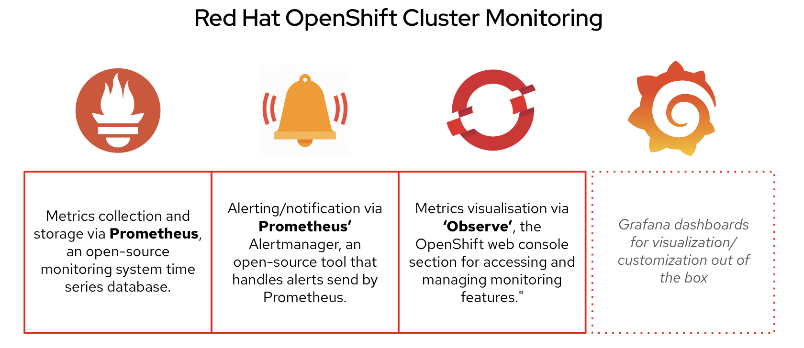
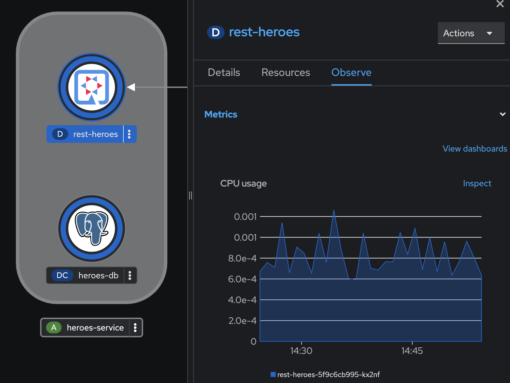
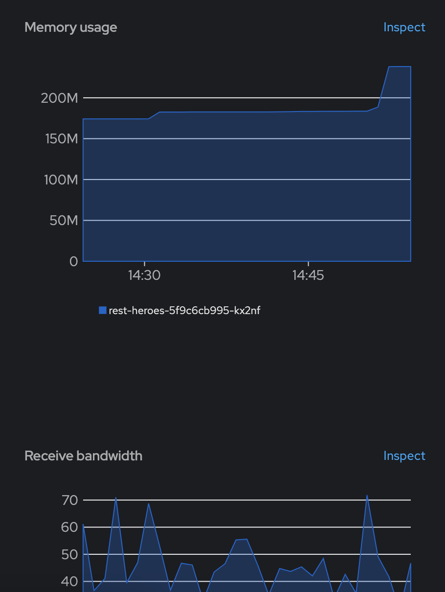
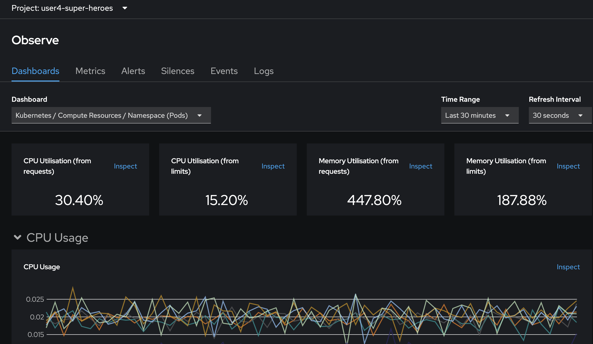
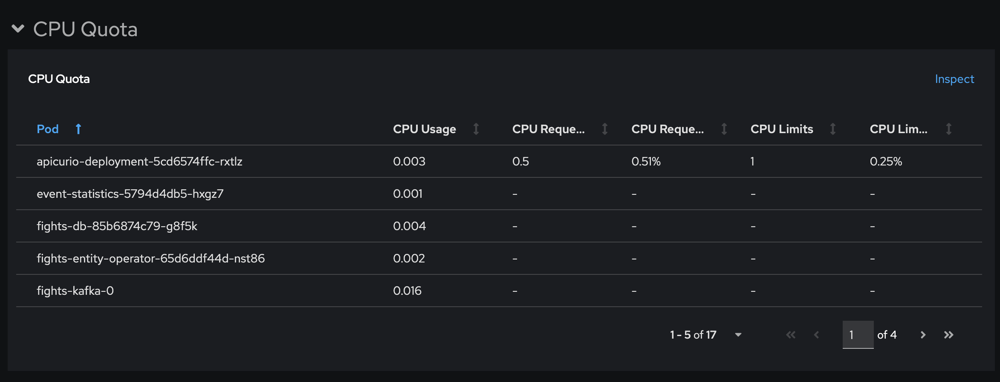
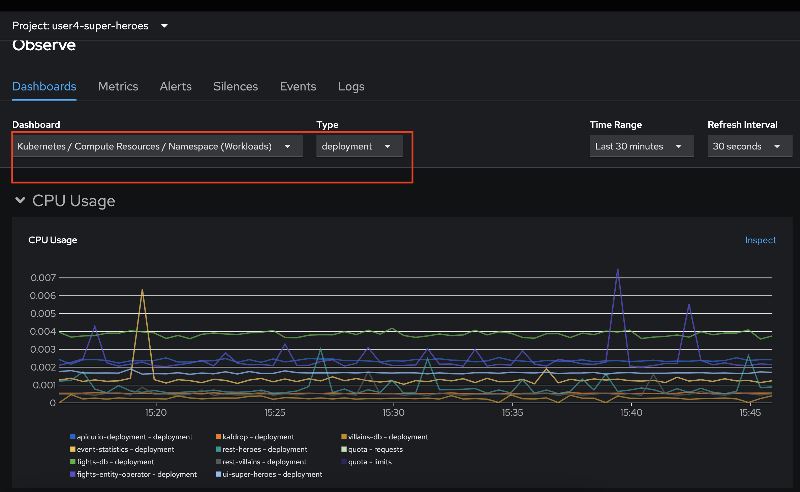
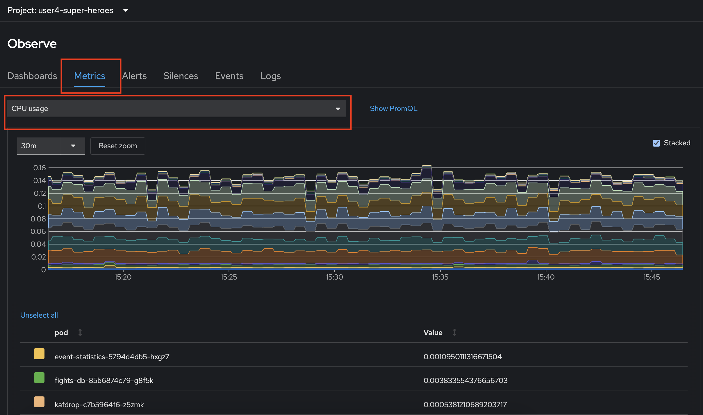
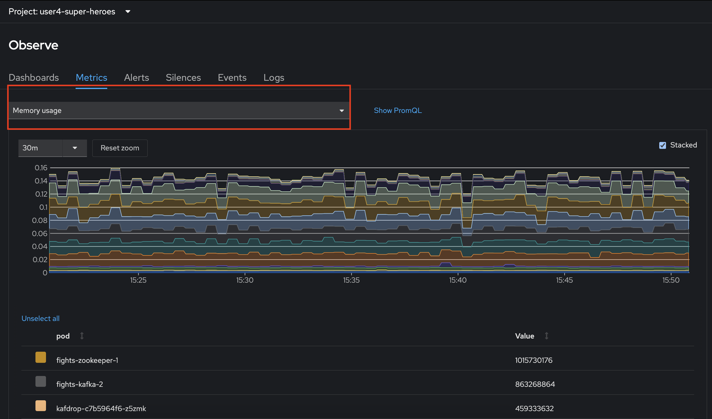
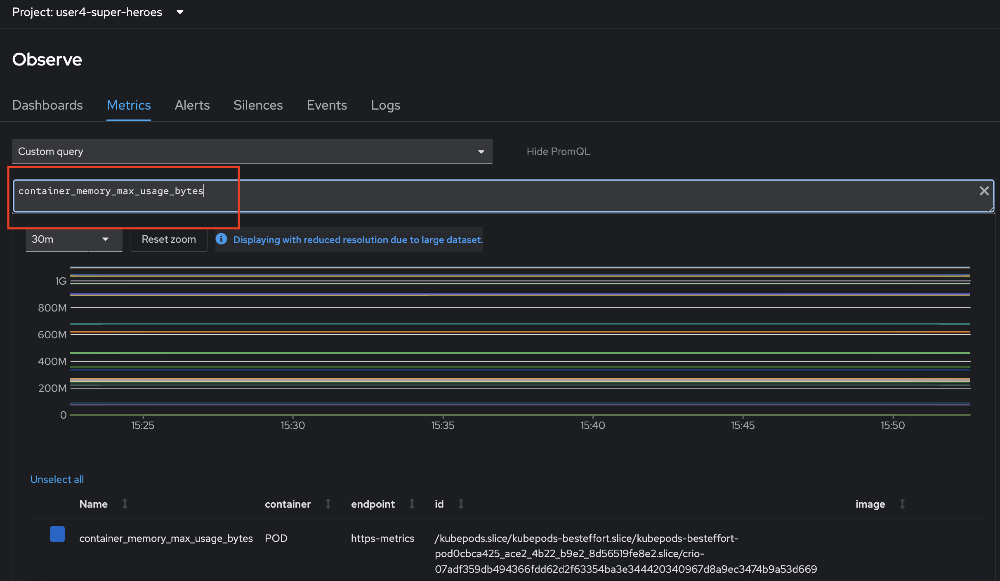

# OpenShift Monitoring

## OpenShift Container Platform monitoring

OpenShift Container Platform includes a preconfigured, preinstalled, and self-updating monitoring stack that provides monitoring for core platform components. You also have the option to enable monitoring for user-defined projects.

A cluster administrator can configure the monitoring stack with the supported configurations. OpenShift Container Platform delivers monitoring best practices out of the box.

A set of alerts are included by default that immediately notify administrators about issues with a cluster. Default dashboards in the OpenShift Container Platform web console include visual representations of cluster metrics to help you to quickly understand the state of your cluster. With the OpenShift Container Platform web console, you can view and manage metrics, alerts, and review monitoring dashboards.

In the Observe section of OpenShift Container Platform web console, you can access and manage monitoring features such as metrics, alerts, monitoring dashboards, and metrics targets.

## Example of Pre-defined OpenShift Monitoring

1. In Topology view, Click rest-heroes deployment, select Observe tab in popup panel, view CPU usage Metrics

   

2. scroll down to view Memory usage and Receive bandwidth
   
   

3. if you need more monitoring information of your workload, click Observe menu from left menu, select Dashboards tab, view monitoring information of your pod such as CPU Usage
   
   

4. Scroll down to view CPU Quota, Memory Usage, Memory Quota etc.
   
   

5. Try to change Dashboard to Kubernetes/Compute Resources/Namespace(Workloads) and type to deployment
   
   

6. Change to Metrics tab, select CPU usage from dropdown list, check box stacked to view cpu usage of all pod in this project

   

7. select Memory usage from dropdown list to view memory usage of all pod in this project

   

8. change dropdownlist to Custom Query to use PromQL (Prometheus Query Language) query metrics such as 
   
   - PromQL: 'container_memory_max_usage_bytes'
   - Enter to run

   

## References

* [Monitoring Overview](https://docs.openshift.com/container-platform/4.11/monitoring/monitoring-overview.html)
