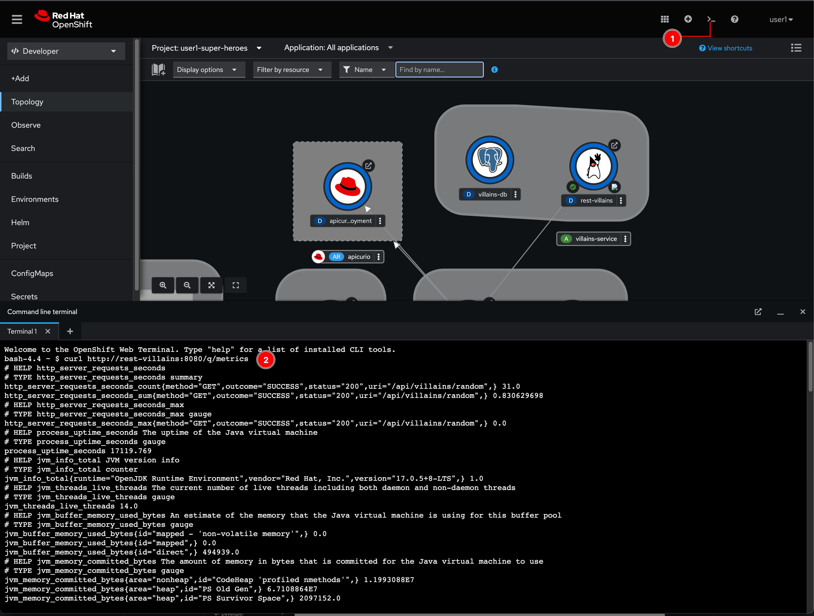
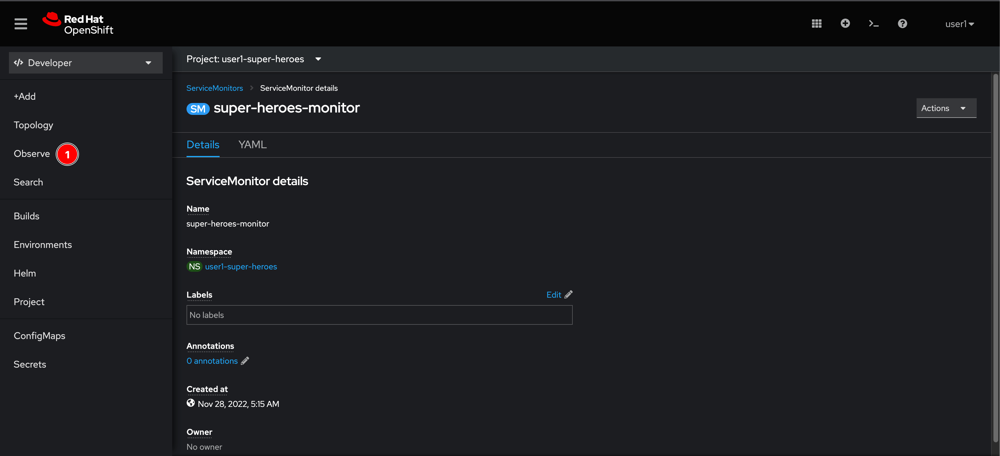
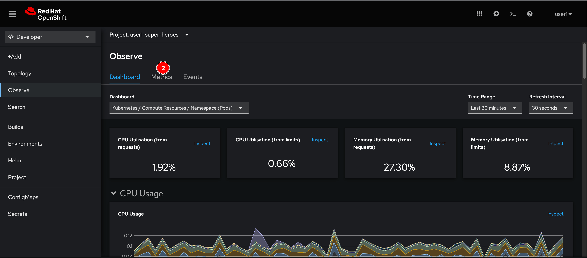
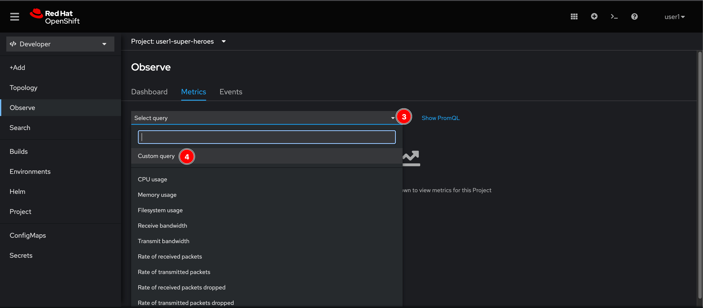
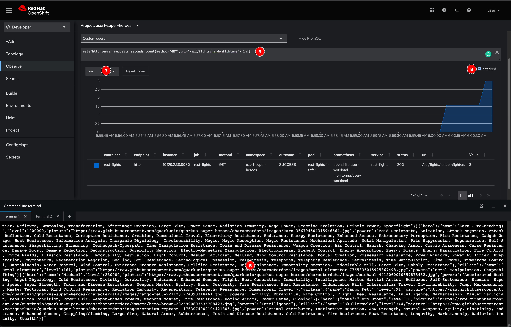

# Query Application Metrics

## Query application metrics manually

Open Web Terminal then run this command to query application metrics. You can also query metrics of other microservices as well by just change `rest-villains` hostname to other service hostnames i.e. `rest-fights`.

However, this way is not practical and really hard to understand what each metric value means. So, we'll do something better by using OpenShift platform monitoring.

```sh
curl http://rest-villains:8080/q/metrics
```



## Query application metrics via OpenShift web console

1. Go to **Observe** menu.

    

2. Click on **Metrics** tab.

    

3. Click **Select query** drop-down list menu then select **Custom query**.

    

4. Open Web Terminal and run following command to simulate load test to the Fight microservice.

    ```sh
    while(true); do curl http://rest-fights:8080/api/fights/randomfighters; sleep 0.2; done;
    ```

5. Let the `curl` command runs aside. Enter fillowing query in the Expression input text, then change zoom to `5m`, and then check **Stacked** option.

    Click on the Expression input text then keep pressing `Enter` button on keyboard. You shold see the histogram moving.

    ```txt
    rate(http_server_requests_seconds_count{method="GET",uri="/api/fights/randomfighters"}[1m])
    ```

    

6. Click on Web Terminal window then press Ctrl + C button on keyboard to stop `curl` command.

## What have you learnt?

1. How to query application metrics manually.

2. How to use OpenSHift built-in monitoring tool to query application metrics.
