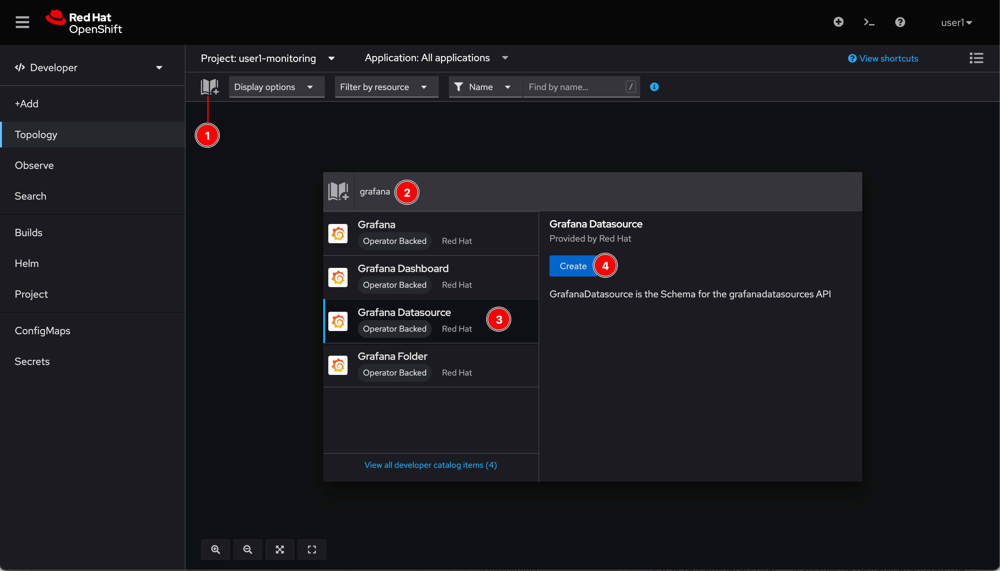
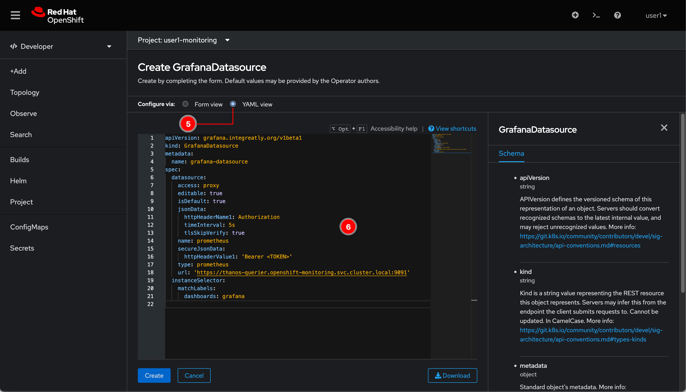
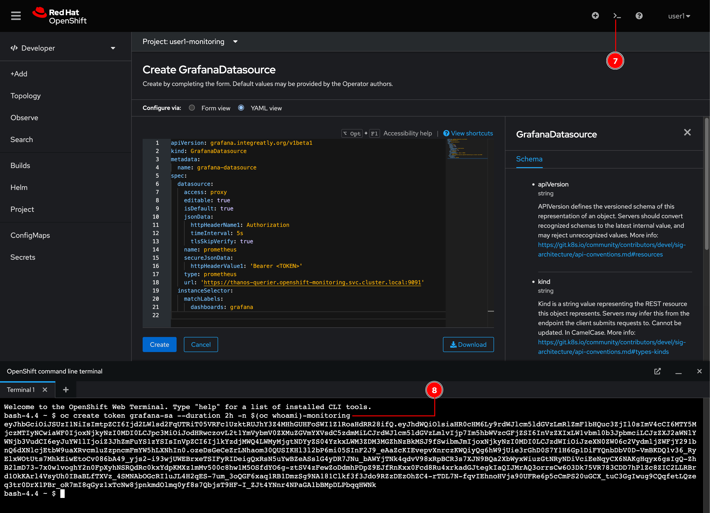
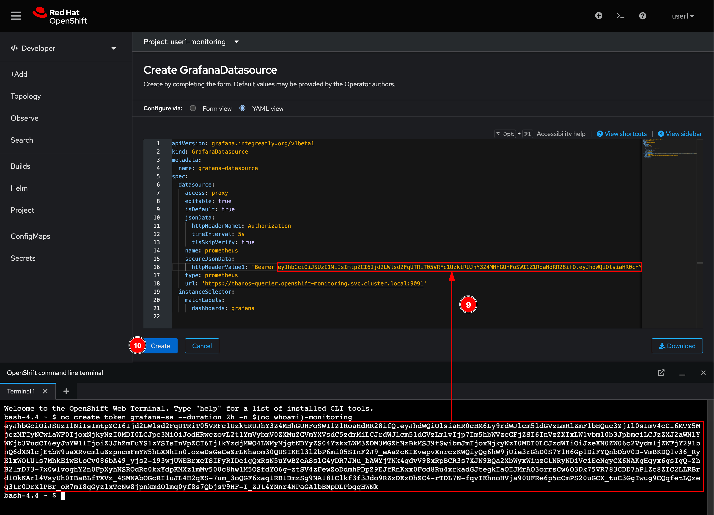
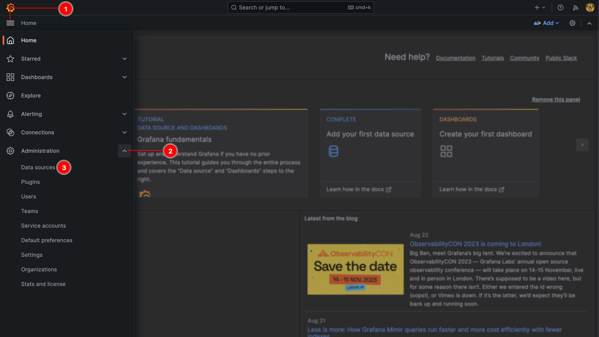
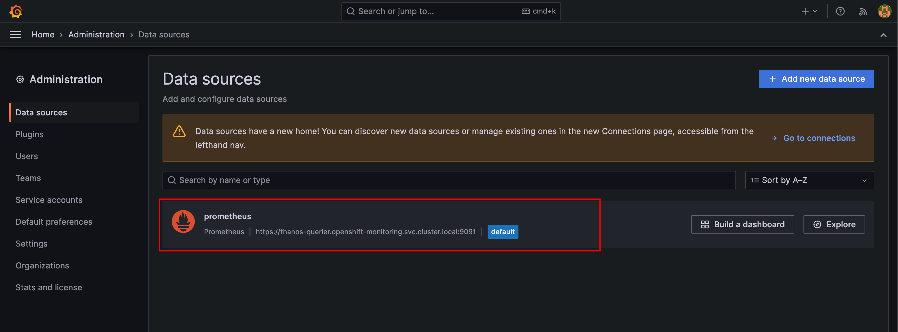

# Setup Grafana Datasource

In the previous section you've deployed Grafana instance using Grafana Operator. However, Grafana needs to consume data (application metrics) from somewhere to display on Grafana dashboard.

OpenShift comes with monitoring stack with a collection of software e.g. Prometheus, AlertManager, Thanos etc. that can be used as a datasource for Grafana. Remember that we've already learnt how to query application metrics under the **Observe** menu via OpenShift web console in the earlier section.

## Create Grafana datasource

1. Click on the book icon, to add application from Developer Catalog then type `grafana` in the search box. Select **Grafana Datasource** and click **Create** button.

    

2. Switch to **YAML view** then replace the content with this YAML snippet.

    ```yaml
    apiVersion: grafana.integreatly.org/v1beta1
    kind: GrafanaDatasource
    metadata:
      name: grafana-datasource
    spec:
      datasource:
        access: proxy
        editable: true
        isDefault: true
        jsonData:
          httpHeaderName1: Authorization
          timeInterval: 5s
          tlsSkipVerify: true
        name: prometheus
        secureJsonData:
          httpHeaderValue1: 'Bearer <TOKEN>'
        type: prometheus
        url: 'https://thanos-querier.openshift-monitoring.svc.cluster.local:9091'
      instanceSelector:
        matchLabels:
          dashboards: grafana
    ```

    

3. Open Web Terminal, then run following command to create a token for Grafana to access Prometheus and query metrics data.

    ```sh
    oc create token grafana-sa --duration 24h -n $(oc whoami)-monitoring
    ```

    

4. Replace the **&lt;TOKEN&gt;** at **line 16** in the YAML editor with the token string from the Web Terminal. Then click **Create** button.

    

5. Go to Grafana web console then click on hamberger menu, expand the **Administration** section, and then select **Data sources** menu.

    

6. You should be able to see a Prometheus datasource pointing to Thanos in OpenShift monitoring stack.

    
