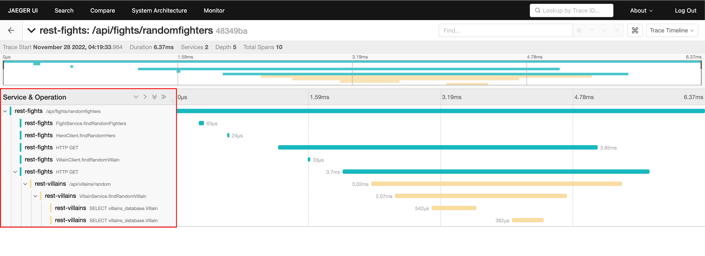

# Trace application transaction

## Tracing application information

1. Open Super Heroes main UI web then start a random fight.

   

2. Switch back to OpenShift web console, then open Jaeger web console by click on arrow icon from **jaeger** entity.

   

3. Click **Log in with OpenShift** button.

   

4. Log in with your username and password.

   

5. Click **Allow selected permissions** button.

   

6. Select following options then click **Find Traces** button.

    - **Service:** `rest-fights`
    - **Operation:** `/api/fights/randomfighters`

   

7. Click on one of the Traces result.

   

8. You'll see the trace from the **Fight** (rest-fights) service all the way down to the **Villain** (rest-villains) service.

   

9. Expand the **Tags** section to see details of each span e.g. data, configurations, context information etc.

   

## Trace a fight transaction

1. Select **rest-fights** service and the **/api/fights** operation. Click **Find Traces** then click on the first trace from result.

   

2. Click on **rest-fights FightService.performFight** then click **Tags** to see API call input.

   

3. Note the name of fighters in the input request.

   

4. Switch to Super Heros main UI, then compare the fighter names you see in Jaeger to the fighter names of the last fight in Super Heros main UI.

   

5. Go back to Jarger web console and expore more spans. You'll see the trace to Kafka topic as well.

   

## What have you learnt?

How to use Jaeger to trace application transaction.
