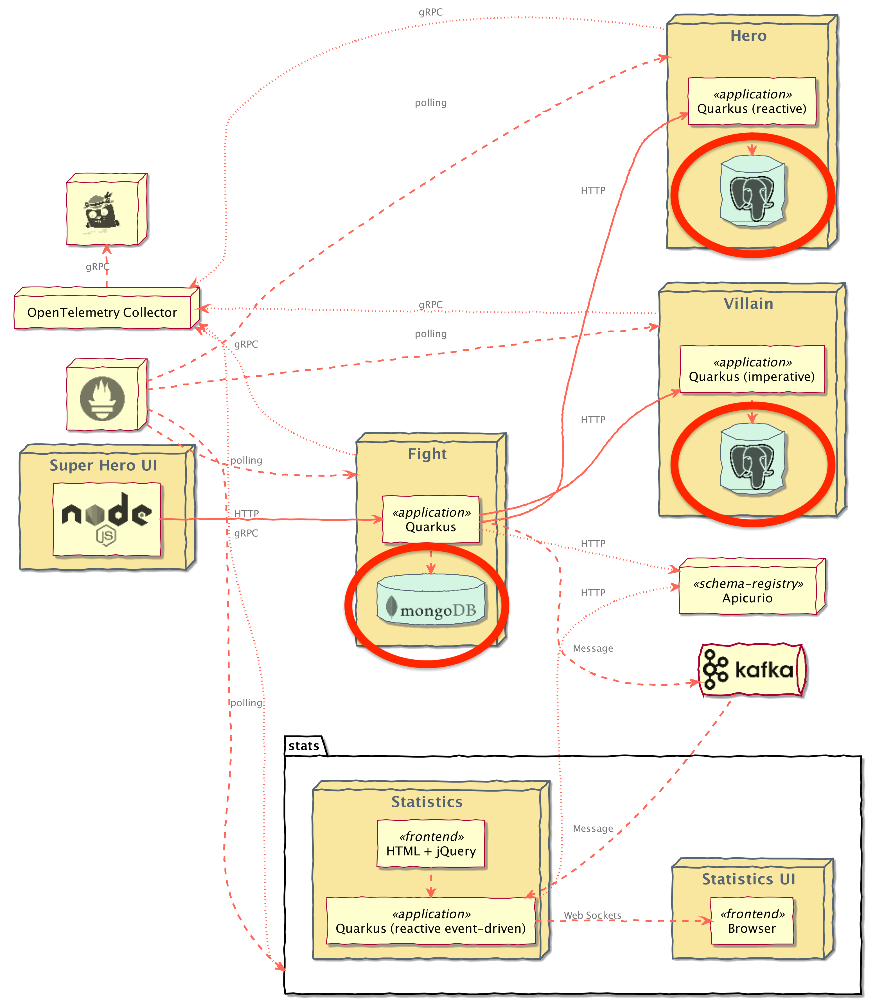

# Databases Deployment

Our Hero, Villain, and Fight microservices require PostgreSQL and MongoDB databases to be able to work as the architecture diagram below. So, we have to setup the databases for the microservices before we're going to deploy them.

