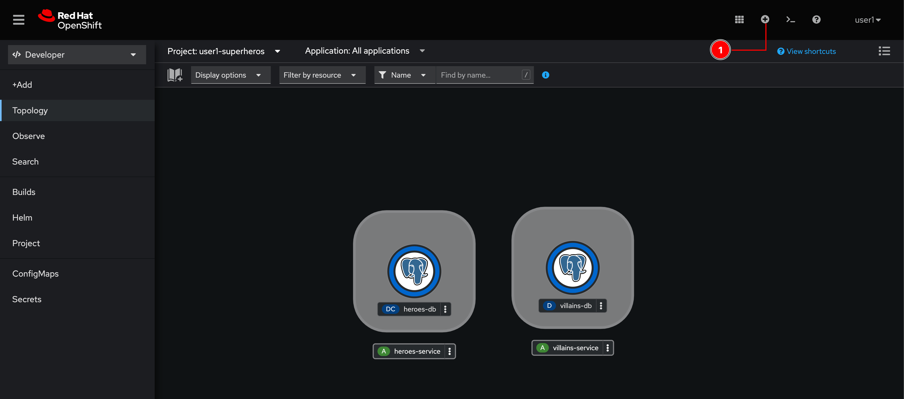
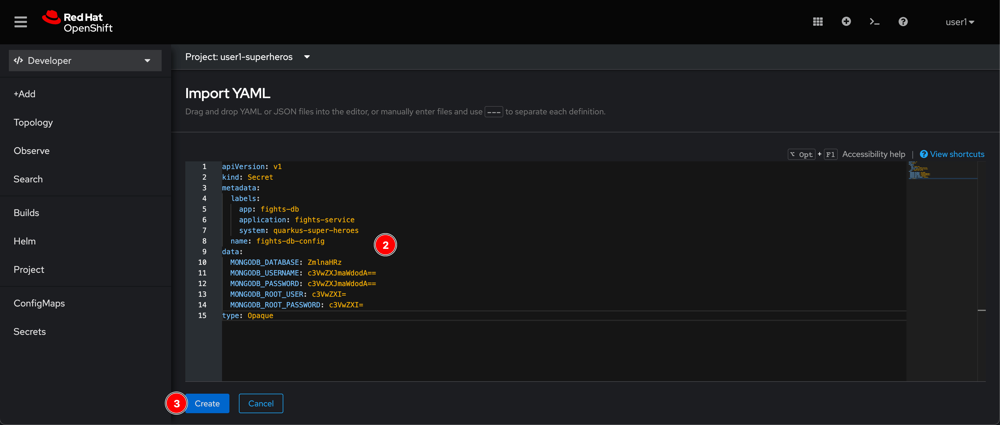
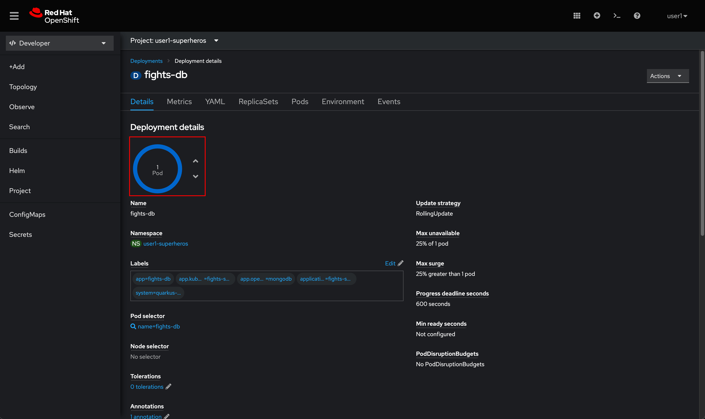
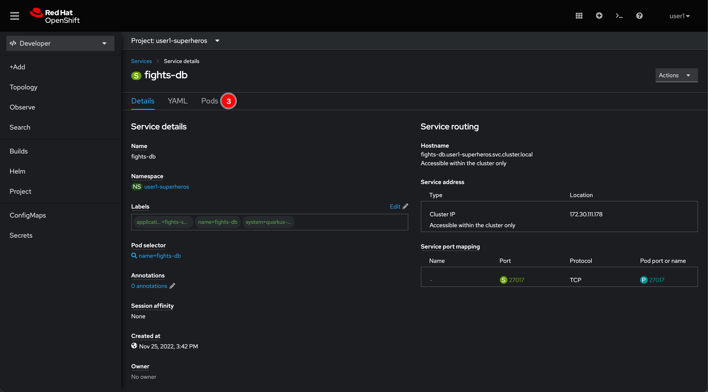
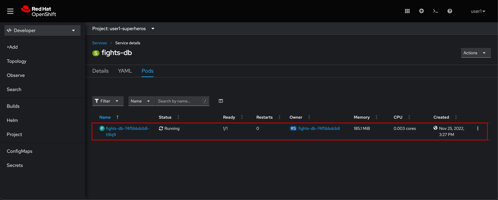
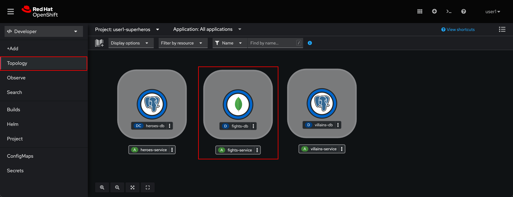

# Deploy Database For Fight Microservice

## Deploy MongoDB database with YAML file

### Create a Secret object to store database configurations

1. Click on  icon located at top right corner of web console.

    

2. Copy this YAML snippet to the editor and click **Create** button.

    *YAML snippet:*

    ```yaml
    apiVersion: v1
    kind: Secret
    metadata:
      labels:
        app: fights-db
        application: fights-service
        system: quarkus-super-heroes
      name: fights-db-config
    data:
      MONGODB_DATABASE: ZmlnaHRz
      MONGODB_USERNAME: c3VwZXJmaWdodA==
      MONGODB_PASSWORD: c3VwZXJmaWdodA==
      MONGODB_ROOT_USER: c3VwZXI=
      MONGODB_ROOT_PASSWORD: c3VwZXI=
    type: Opaque
    ```

    

3. A `fights-db-config` Secret object should be created. You can view the secret values by click on **Reveal values** link.

    

### Deploy MongoDB database application container

1. Click on  icon located at top right corner of web console.

2. Copy this YAML snippet to the editor and click **Create** button. Please note that the `fights-db-config` Secret object gets bound to MongoDB container as environment variables.

    *YAML snippet:*

    ```yaml
    apiVersion: apps/v1
    kind: Deployment
    metadata:
      labels:
        app: fights-db
        application: fights-service
        system: quarkus-super-heroes
        app.kubernetes.io/part-of: fights-service
        app.openshift.io/runtime: mongodb
      name: fights-db
    spec:
      replicas: 1
      selector:
        matchLabels:
          name: fights-db
      template:
        metadata:
          labels:
            application: fights-service
            name: fights-db
            system: quarkus-super-heroes
        spec:
          containers:
            - envFrom:
                - secretRef:
                    name: fights-db-config
              image: bitnami/mongodb:5.0
              name: fights-db
              ports:
                - containerPort: 27017
              resources:
                limits:
                  memory: 256Mi
                requests:
                  memory: 64Mi
    ```

    

3. A `fights-db` Deployment object should be created and there is 1 Pod running.

    

### Craete a Service object for accessing MongoDB Pod

1. Click on  icon located at top right corner of web console.

2. Copy this YAML snippet to the editor and click **Create** button.

    *YAML snippet:*

    ```yaml
    apiVersion: v1
    kind: Service
    metadata:
      labels:
        name: fights-db
        application: fights-service
        system: quarkus-super-heroes
      name: fights-db
    spec:
      ports:
        - port: 27017
          protocol: TCP
          targetPort: 27017
      selector:
        name: fights-db
      type: ClusterIP
    ```

    

3. A `fights-db` Service object should be created. Go to **Pods** tab you should be able to see the Service is pointing and will be forwarding traffic to the `fights-db-xxxxxxx` Pod which is the MongoDB pod.

    

    

4. Go to **Topology** menu, you should see `fights-db` MongoDB entity.

    

## What have you learnt?

1. How to create Kubernetes resources e.g. Secret, Deployment, and Service objects with YAML via OpenShift web console.

2. How to view actual value stored in the Secret object.

3. How to check which pod(s) the Service object is pointing and will be forwarding traffic to.
