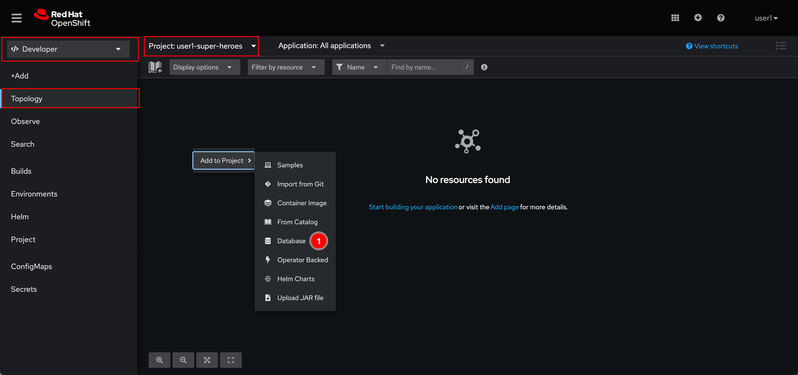
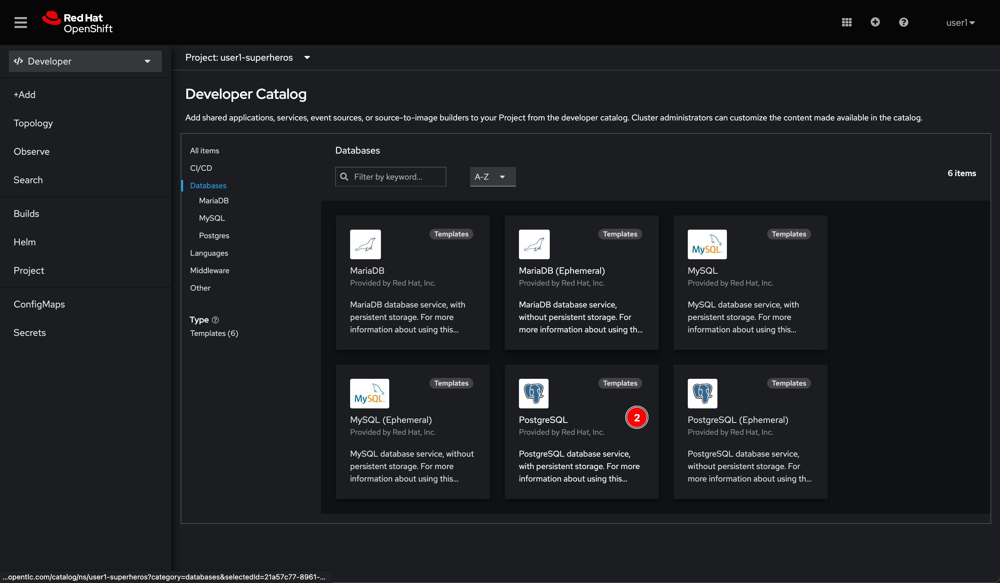
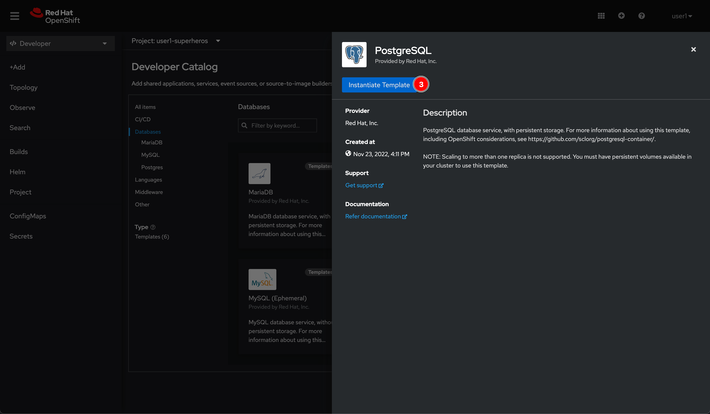
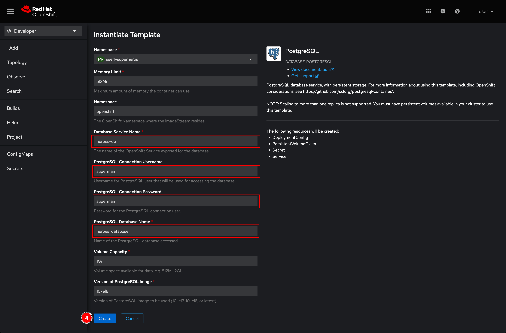
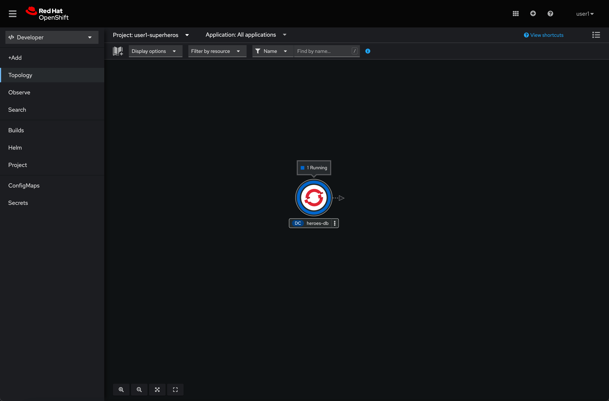
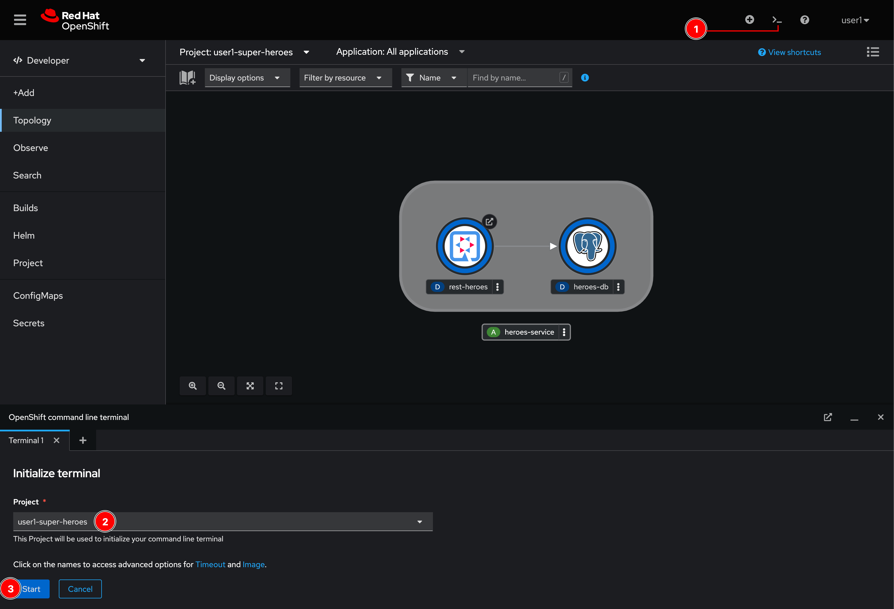
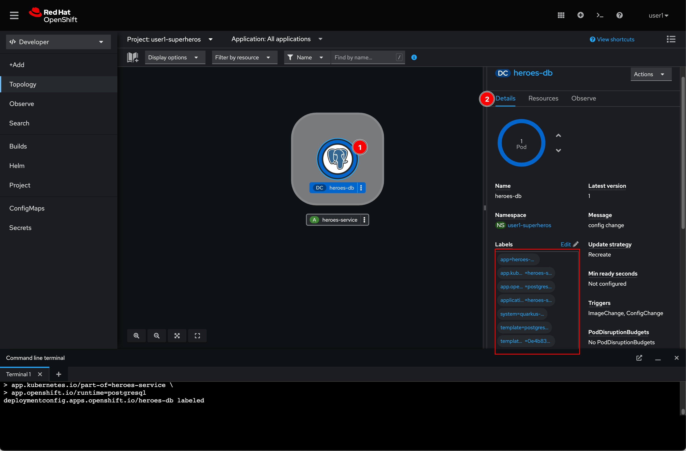
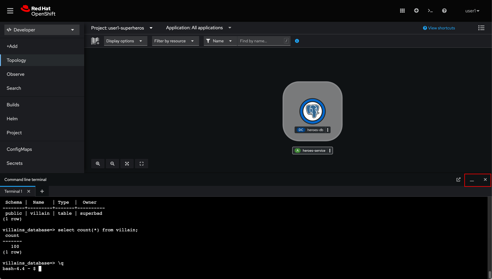

# Deploy Database For Hero Microservice

## Deploy PostgreSQL database from Developer Catalog

1. Make sure that you're in **Developer** perspective, project **user*X*-super-heroes** is selected, and in the **Topology** page. Then right click in view area and select **Database** menu.

   

2. Select **PostgreSQL** database.

   

3. Click **Instantiate Template** button.

   

4. Enter following inputs (leave it as is for other fields) then click **Create** button.

   - **Database Service Name:** `heroes-db`
   - **PostgreSQL Connection Username:** `superman`
   - **PostgreSQL Connection Password:** `superman`
   - **PostgreSQL Database Name:** `heroes_database`

   

5. Wait for awhile, the **heroes-db** pod should be up and running.

   

## Initial data to database

We need to load some data into the database we've just deployed. How to do that? the answer is using PostgreSQL client to execute a SQL script. Let's do it!

1. Click on the **Web Terminal** icon located at top right corner of web console. Then select **user*X*-super-heroes** and click **Start** button.

    

2. Wait for a few moment, you should see a terminal shows up.

    

3. Run `curl` command to download SQL script.

    ```sh
    curl https://raw.githubusercontent.com/rhthsa/developer-advocacy-2022/main/manifest/super-heroes/heroes-db-init.sql -o heroes-db-init.sql
    ```

    Sample output:

    ```txt
      % Total    % Received % Xferd  Average Speed   Time    Time     Time  Current
                                 Dload  Upload   Total   Spent    Left  Speed
    100 86517  100 86517    0     0   180k      0 --:--:-- --:--:-- --:--:--  180k
    ```

4. Run `psql` (PostgreSQL client) command to connect to the `heroes-db` PostgreSQL server. **The password is `superman`**.

    ```sh
     psql postgresql://heroes-db:5432/heroes_database?user=superman
    ```

    Sample output:

    ```txt
    bash-4.4 ~ $  psql postgresql://heroes-db:5432/heroes_database?user=superman
    Password:
    psql (10.21)
    Type "help" for help.

    heroes_database=>
    ```

5. Execute the SQL script with this command:

    ```sh
     \i heroes-db-init.sql
    ```

    Sample output:

    ```txt
    heroes_database=> \i heroes-db-init.sql
    DROP TABLE
    DROP SEQUENCE
    CREATE SEQUENCE
    CREATE TABLE
    INSERT 0 1
    INSERT 0 1
    ....
    ....
    ....
    heroes_database=>
    ```

6. Use `\dt` command to check if a new table gets created.

    ```sh
    \dt
    ```

    Sample output:

    ```sh
    heroes_database=> \dt
        List of relations
    Schema | Name | Type  |  Owner
    --------+------+-------+----------
    public | hero | table | superman
    (1 row)
    ```

7. Query number of rows in the table.

    ```sh
    select count(*) from hero;
    ```

    Sample output:

    ```txt
    heroes_database=> select count(*) from hero;
    count
    -------
    100
    (1 row)
    ```

8. Use `\q` command to disconnect from PostgreSQL server.

    ```sh
    \q
    ```

## Add label to workload

1. Run following command in Web Terminal to add a few [labels](https://kubernetes.io/docs/concepts/overview/working-with-objects/labels/) to **heroes-db** workload.

    ```sh
    oc label dc heroes-db \
    app=heroes-db \
    application=heroes-service \
    system=quarkus-super-heroes \
    app.kubernetes.io/part-of=heroes-service \
    app.openshift.io/runtime=postgresql
    ```

2. The **heroes-db** entity in UI will change immediately. Click on it then go to **Details** tab. You should be able to see the labels were added.

    

3. You can minimize or close the **Web Terminal** window when not use it.

    

## What have you learnt?

1. How to deploy PostgreSQL database service from Developer Catalog.

2. How to use Web Terminal via OpenShift web console to interact with application deployed on cluster (in this case, heroes-db PostgreSQL) without having to install terminal applications i.e. PuTTY, Cmder, Xshell, SecureCRT etc. on your computer.

3. How to use `curl` command to download file from website.

4. How to use `psql` (PostgreSQL client) command to connect to PostgreSQL database server and a few tasks e.g. run SQL script, list tables, and run SQL statement.

5. How to add labels to workload using `oc` - [OpenShift command line tool](https://docs.okd.io/4.11/cli_reference/openshift_cli/getting-started-cli.html#cli-getting-started).
