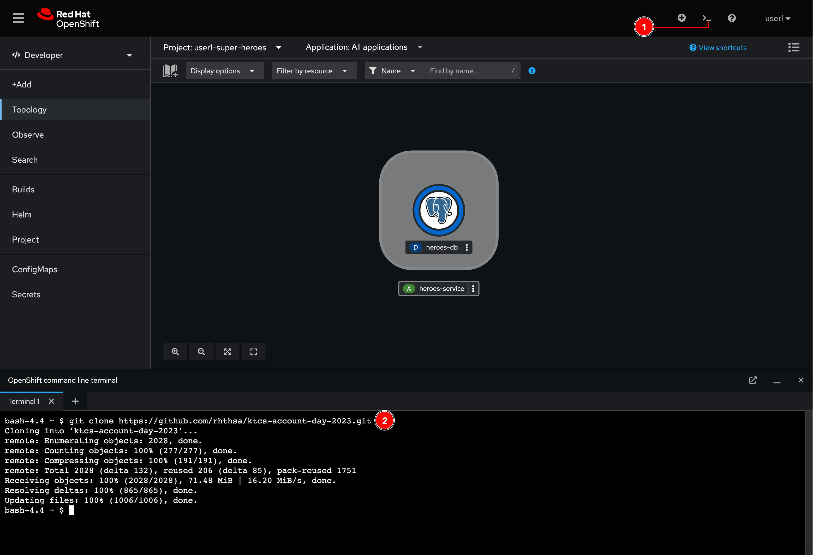
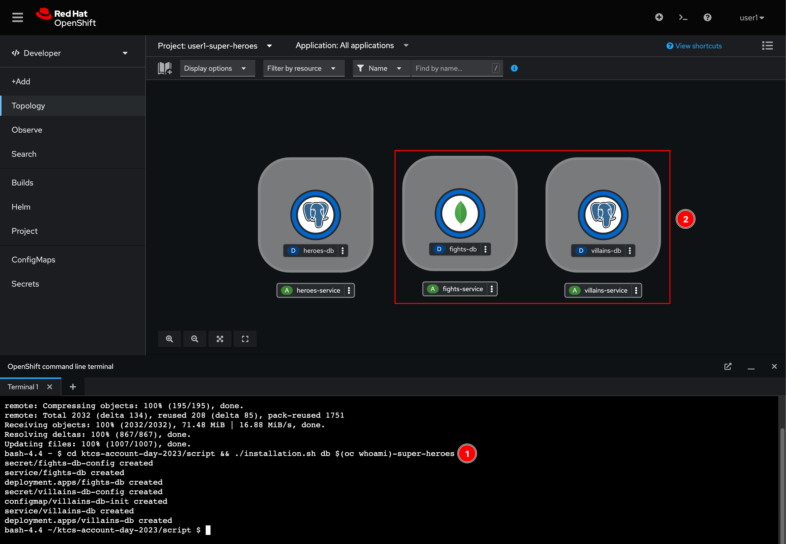

# Deploy Databases For Other Microservices

You've learnt how to deploy database service i.e. PostgreSQL via OpenShift Web Console in the previous section. Now, for the sake of speed and time saving, we're going to use a script to deploy the rest of database services as following:

- PostgreSQL database for the Villain service
- MongoDB database for the Fight service

If you're curious what the script does, see the code [here](../../script/installation.sh).

## Deploy databases using script

1. Open the Web Terminal. Then run this command to clone Git repository to local.

    ```sh
    git clone https://gitlab.com/workshop6/ktcs-account-day-2023.git
    ```

   

2. Run following commands to deploy the databases. Wait for a few seconds you should see the **fights-db** and **villains-db** databases get deployed.

    ```sh
    cd ktcs-account-day-2023/script && ./installation.sh db $(oc whoami)-super-heroes
    ```

    
