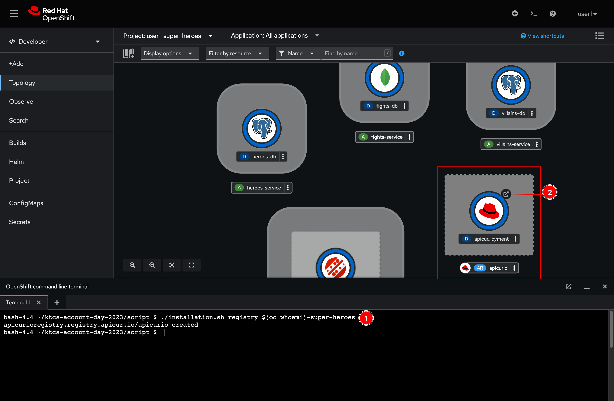

# Service Registry (Apicurio) Deployment

Since the **Fight** and **Statistics** microservices will be producing and consuming events or messages to/from Kafka broker as the architecture diagram below. To make sure that the message format is valid and consumable by the services, we need to define the message schema and keep it somewhere that services can access and use the schema to validate the messages.

## Schema Registry

In the messaging and event streaming world, data that are published to topics and queues often must be serialized or validated using a Schema (e.g. Apache Avro, JSON Schema, or Google protocol buffers). Schemas can be packaged in each application, but it is often a better architectural pattern to instead register them in an external system and then referenced from each application.

 So, we have to setup the schema registry for the microservices before we're going to deploy them.


## Deploy Red Hat Integration - Service Registry

Red Hat Integration - Service Registry is based on [Apicruio Registry](https://www.apicur.io/registry/) open source project. Follow these steps to deploy it.

In the Web Terminal, run following commands to deploy the service registry. Wait for a few seconds you should see apicurio service registry get deployed. You can click on the arrow icon to open the service registry web console as well.

```sh
./installation.sh registry $(oc whoami)-super-heroes
```


