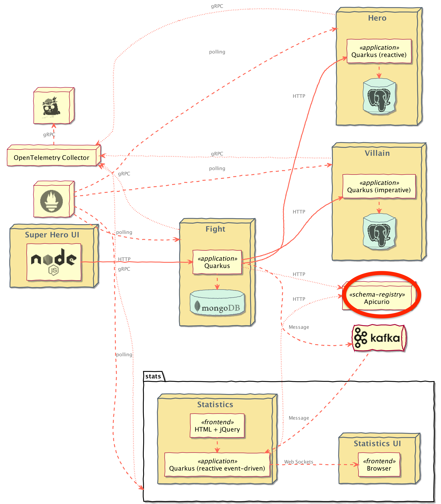
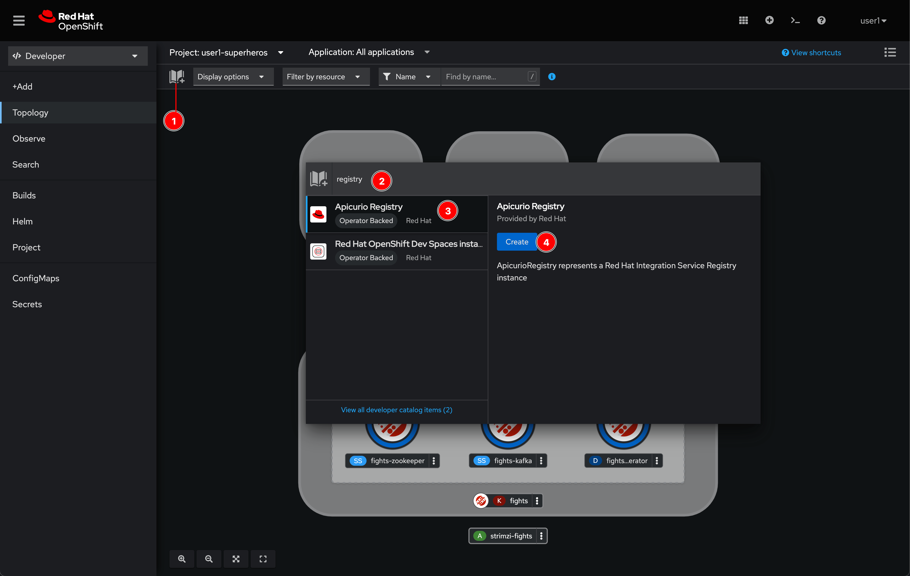
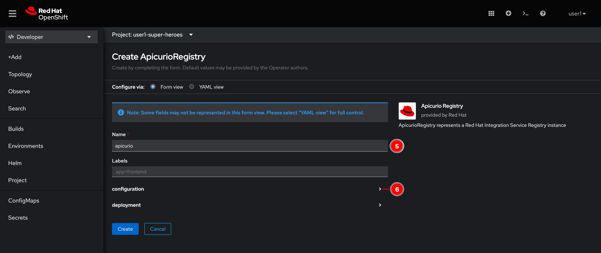
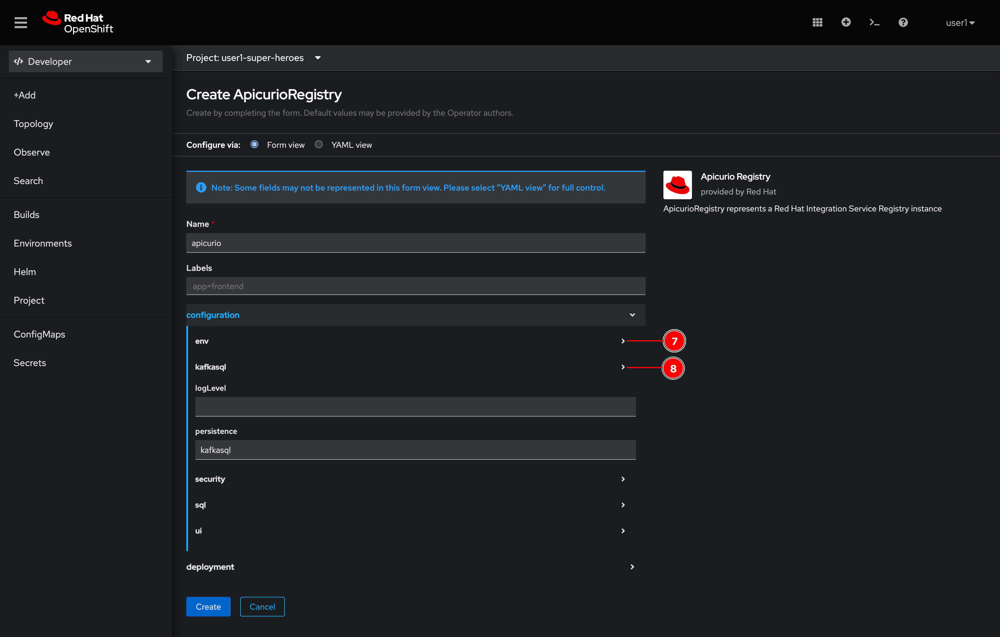
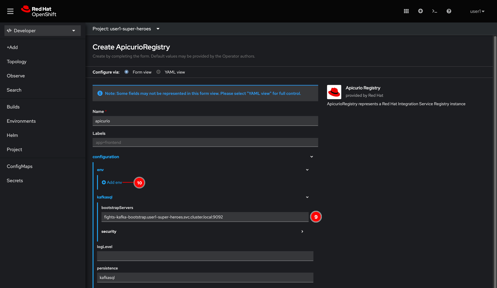
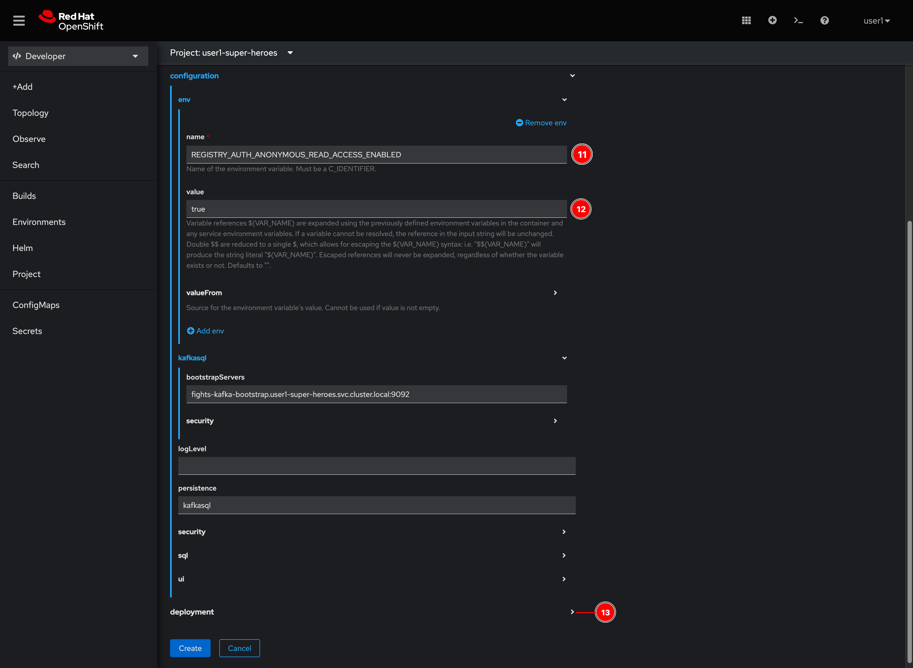
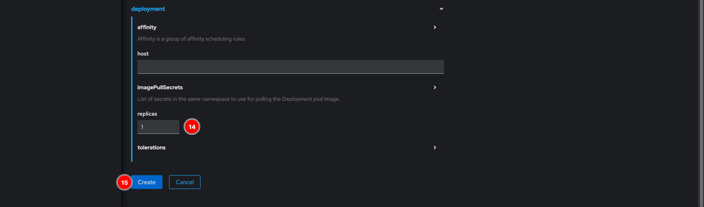
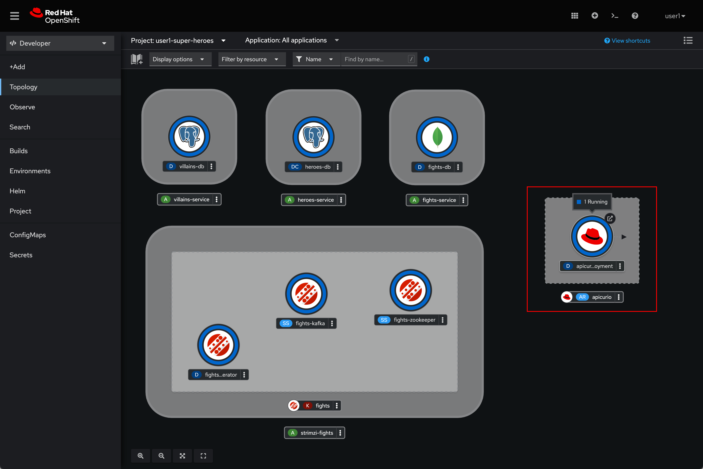

# Service Registry (Apicurio) Deployment

Since the **Fight** and **Statistics** microservices will be producing and consuming events or messages to/from Kafka broker as the architecture diagram below. To make sure that the message format is valid and consumable by the services, we need to define the message schema and keep it somewhere that services can access and use the schema to validate the messages.

## Schema Registry

In the messaging and event streaming world, data that are published to topics and queues often must be serialized or validated using a Schema (e.g. Apache Avro, JSON Schema, or Google protocol buffers). Schemas can be packaged in each application, but it is often a better architectural pattern to instead register them in an external system and then referenced from each application.

 So, we have to setup the schema registry for the microservices before we're going to deploy them.

## Deploy Red Hat Integration - Service Registry

Red Hat Integration - Service Registry is based on [Apicruio Registry](https://www.apicur.io/registry/) open source project. Follow these steps to deploy it.

1. Click on the book icon, to add application from Developer Catalog then type `registry` in the search box. Select **Apicurio Registry** and click **Create** button.

    

2. Enter `apicurio` to the **Name** field then click **>** to expand the **configuration** section.

    

3. Click **>** to expand the **env** and **kafkasql** sections.

    

4. Enter `fights-kafka-bootstrap.userX-super-heroes.svc.cluster.local:9092` to **bootstrapServers** field. :exclamation:**DO NOT FORGET** to change the `userX` to your user. Then click **Add env** link.

    This is an internal DNS hostname and port of the Kafka broker you've deployed earlier. Basically, we're going to use Kafka as a datastore for Apicurio Registry to store schemas. However, the datastore can be SQL database i.g. PostgreSQL as well.

    

5. Enter following environment variable then click **>** to expand **deployment** section.

    - **name:** `REGISTRY_AUTH_ANONYMOUS_READ_ACCESS_ENABLED`
    - **value:** `true`

    

6. Enter `1` to replicas field then click **Create** button.

    

7. Wait for a while until you see dark blue ring surrounds the **apicurio** entity. That means the pod is running! :tada:

    

## What have you learnt?

How to set up Apicurio Registry (schema registry) instance using Red Hat Integration - Service Registry ( based on [Apicruio Registry](https://www.apicur.io/registry/) open source project).
