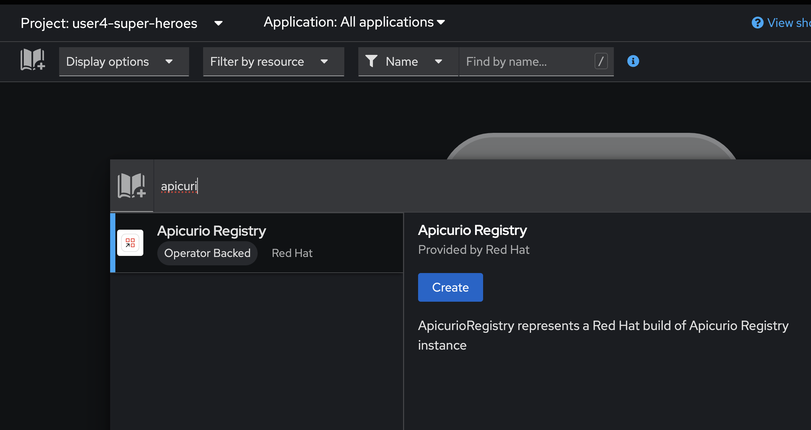
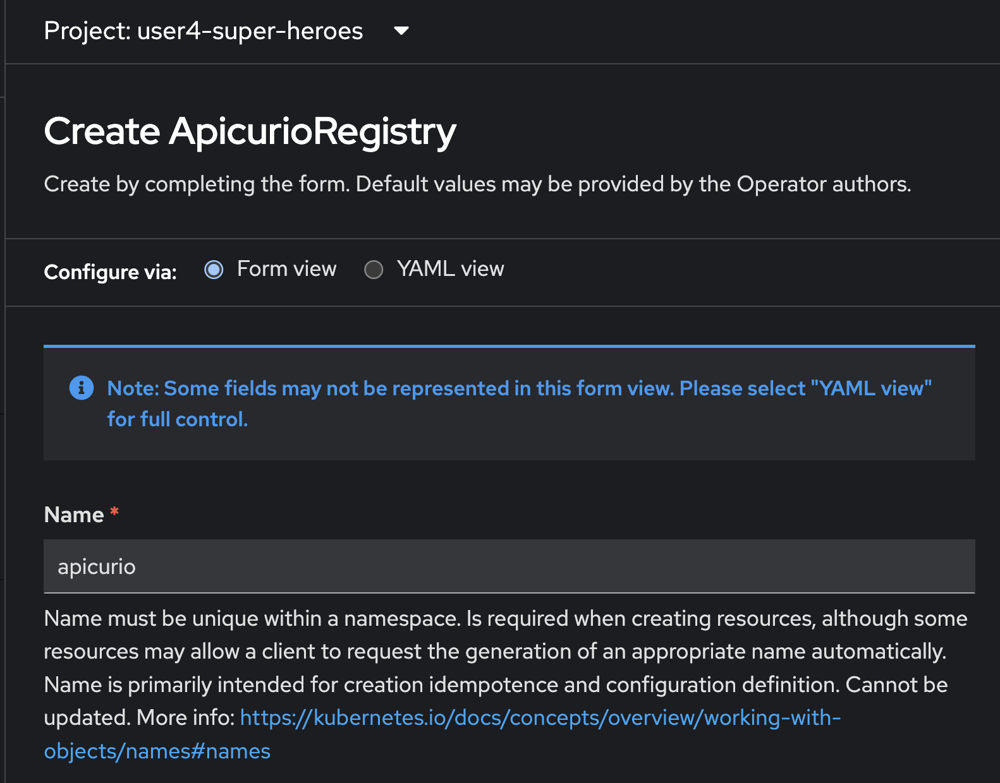
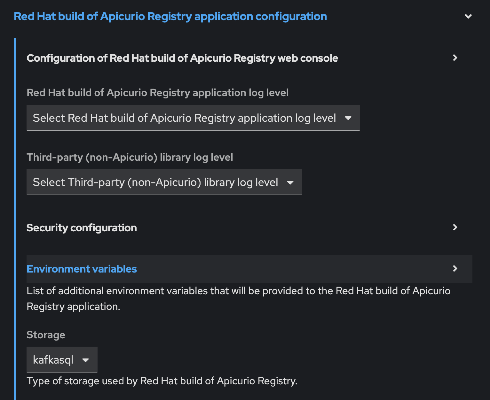
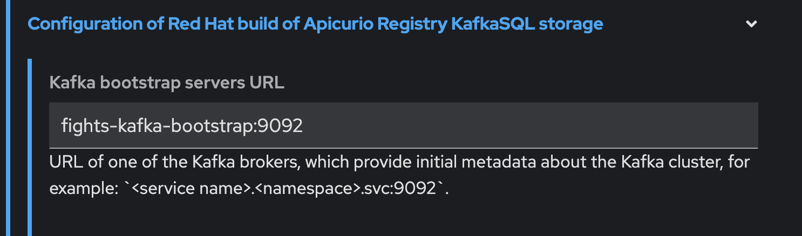
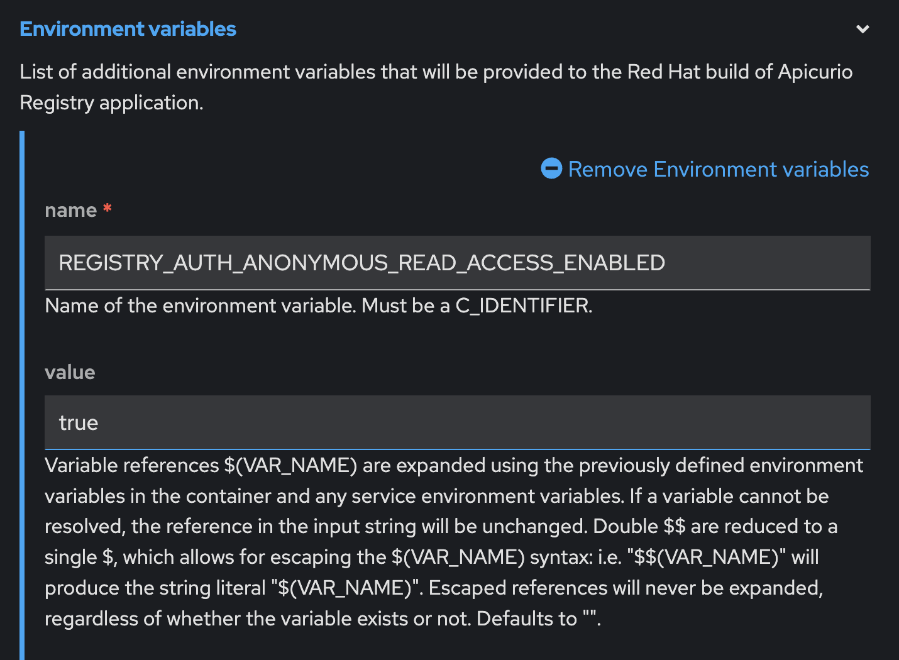
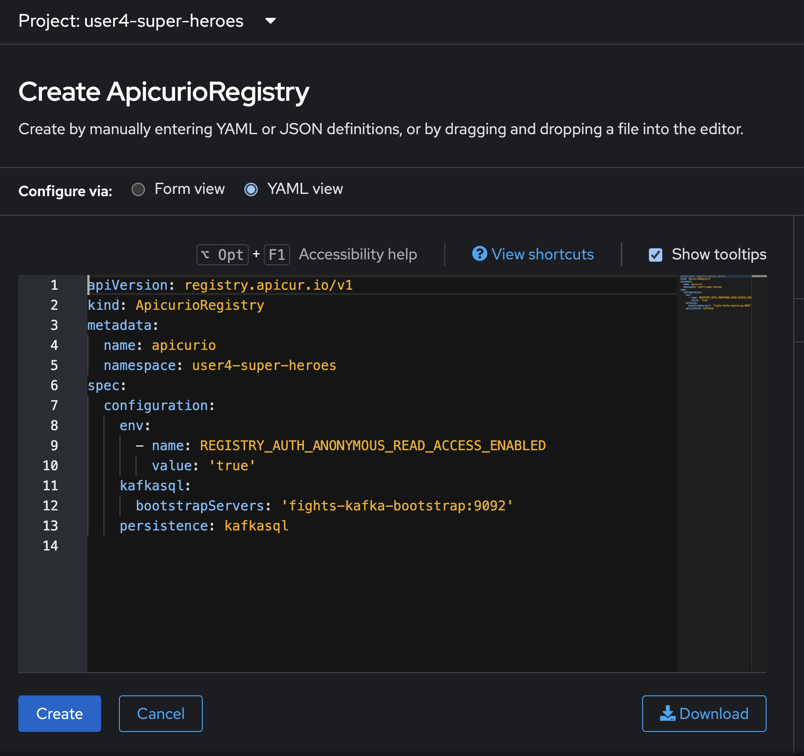
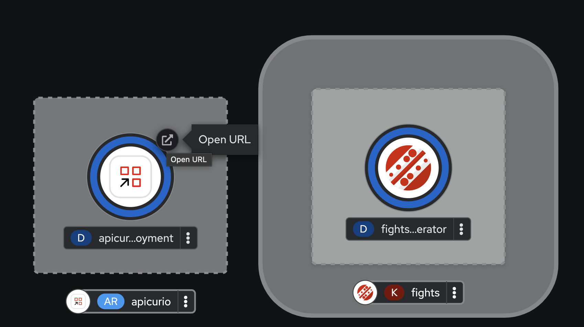
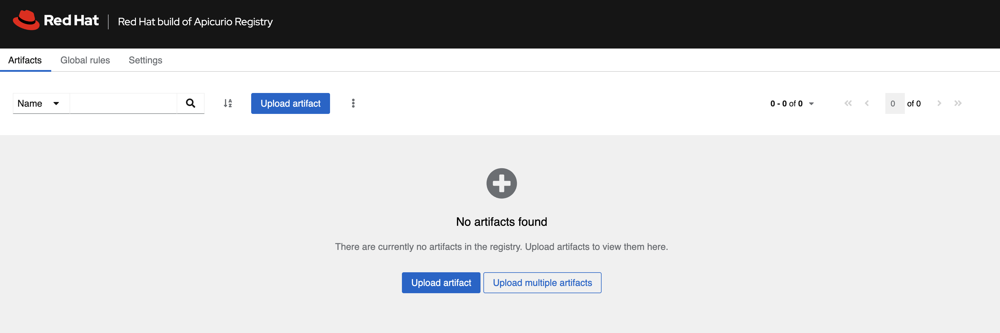

# Service Registry (Apicurio) Deployment

Since the **Fight** and **Statistics** microservices will be producing and consuming events or messages to/from Kafka broker as the architecture diagram below. To make sure that the message format is valid and consumable by the services, we need to define the message schema and keep it somewhere that services can access and use the schema to validate the messages.

## Schema Registry

In the messaging and event streaming world, data that are published to topics and queues often must be serialized or validated using a Schema (e.g. Apache Avro, JSON Schema, or Google protocol buffers). Schemas can be packaged in each application, but it is often a better architectural pattern to instead register them in an external system and then referenced from each application.

 So, we have to setup the schema registry for the microservices before we're going to deploy them.

## Deploy Red Hat build of Apicurio Registry

Red Hat build of Apicurio Registry is based on [Apicruio Registry](https://www.apicur.io/registry/) open source project. Follow these steps to deploy it.

1. Back to Topology view, Click Add to Project icon in Topology view (book icon), search with 'apicurio' and select 'Apicurio Registry' and click create button
   
   

2. In from view, set name to 'apicurio'
   
   

3. Expand Red Hat Build of Apicurio Registry application configuration, set storage to kafkasql
   
   

4. Expand Configuration of Red Hat build of Apicurio Registry KafkaSQL storage and 
   
   - set kafka bootstrap servers URL to `fights-kafka-bootstrap:9092`
   
   

5. set Environment variables, 
   
   - add name to `REGISTRY_AUTH_ANONYMOUS_READ_ACCESS_ENABLED`
   - add value to `true`
   
   

6. Switch to YAML view and recheck your configuration for deploy apicurio registry, click create button
   
   

7. wait until pod running, click open url to view Red Hat build of Apicurio Registry
   
   
   
   

## What have you learnt?

How to set up Schema/Service Registry using Red Hat build of Apicurio Registry (based on [Apicurio Registry](https://www.apicur.io/registry/) open source project).