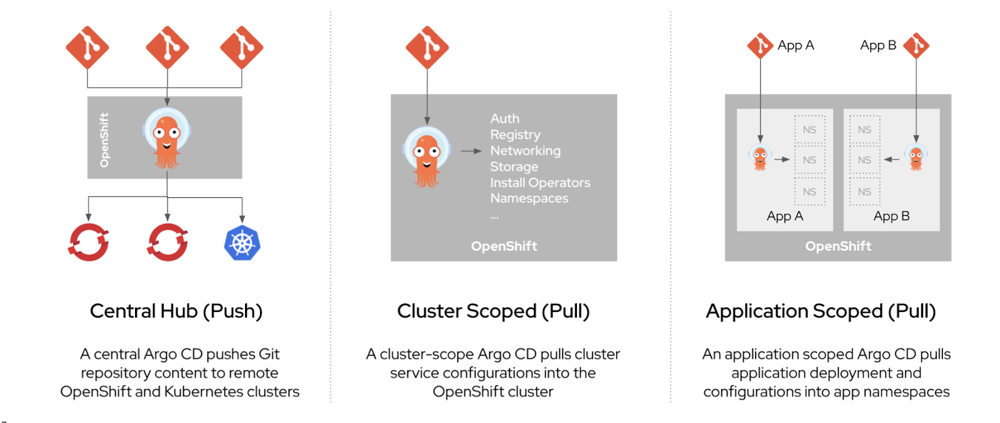

# Understanding OpenShift GitOps

## About GitOps

GitOps is a declarative way to implement continuous deployment for cloud native applications. You can use GitOps to create repeatable processes for managing OpenShift Container Platform clusters and applications across multi-cluster Kubernetes environments. GitOps handles and automates complex deployments at a fast pace, saving time during deployment and release cycles.

The GitOps workflow pushes an application through development, testing, staging, and production. GitOps either deploys a new application or updates an existing one, so you only need to update the repository; GitOps automates everything else.

GitOps is a set of practices that use Git pull requests to manage infrastructure and application configurations. In GitOps, the Git repository is the only source of truth for system and application configuration. This Git repository contains a declarative description of the infrastructure you need in your specified environment and contains an automated process to make your environment match the described state. Also, it contains the entire state of the system so that the trail of changes to the system state are visible and auditable. By using GitOps, you resolve the issues of infrastructure and application configuration sprawl.

GitOps defines infrastructure and application definitions as code. Then, it uses this code to manage multiple workspaces and clusters to simplify the creation of infrastructure and application configurations. By following the principles of the code, you can store the configuration of clusters and applications in Git repositories, and then follow the Git workflow to apply these repositories to your chosen clusters. You can apply the core principles of developing and maintaining software in a Git repository to the creation and management of your cluster and application configuration files.

## About Red Hat OpenShift GitOps

Red Hat OpenShift GitOps ensures consistency in applications when you deploy them to different clusters in different environments, such as: development, staging, and production. Red Hat OpenShift GitOps organizes the deployment process around the configuration repositories and makes them the central element. It always has at least two repositories:

1. Application repository with the source code

2. Environment configuration repository that defines the desired state of the application

These repositories contain a declarative description of the infrastructure you need in your specified environment. They also contain an automated process to make your environment match the described state.

Red Hat OpenShift GitOps uses Argo CD to maintain cluster resources. Argo CD is an open-source declarative tool for the continuous integration and continuous deployment (CI/CD) of applications. Red Hat OpenShift GitOps implements Argo CD as a controller so that it continuously monitors application definitions and configurations defined in a Git repository. Then, Argo CD compares the specified state of these configurations with their live state on the cluster.

Argo CD reports any configurations that deviate from their specified state. These reports allow administrators to automatically or manually resync configurations to the defined state. Therefore, Argo CD enables you to deliver global custom resources, like the resources that are used to configure OpenShift Container Platform clusters.

