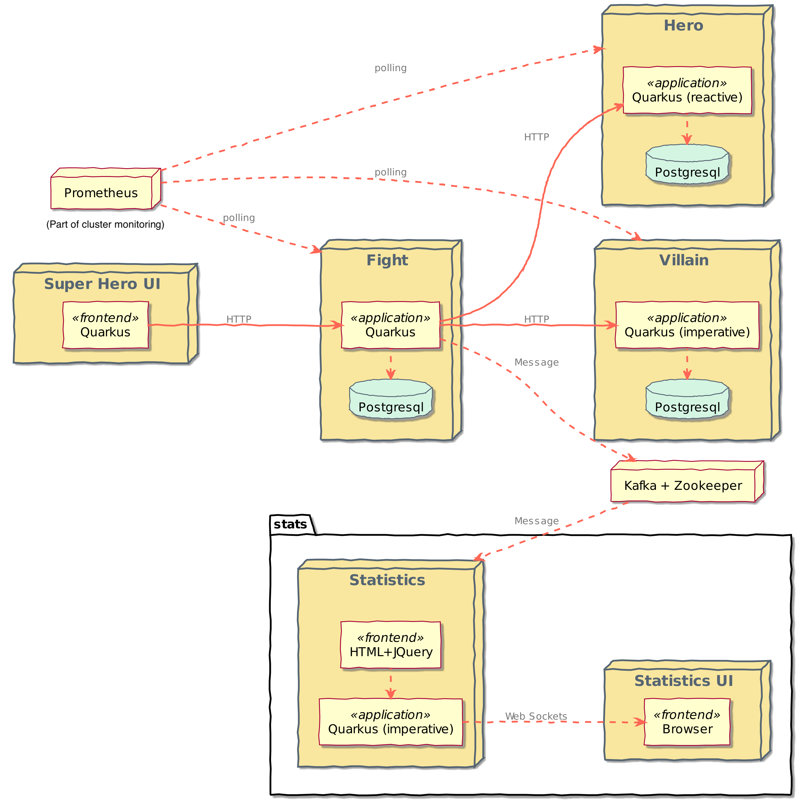
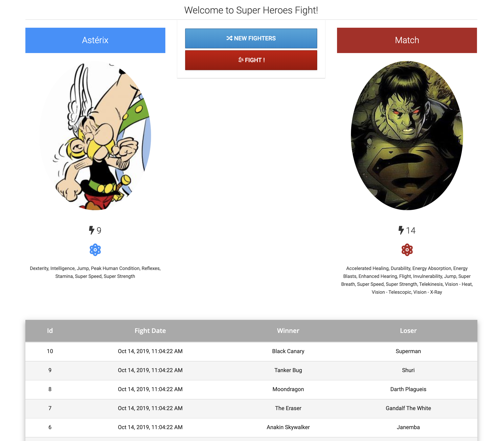

# Application Architecture

In this workshop, you will deploy an existing application that allows superheroes to fight against supervillains. You will be containerizing and deploying several microservices communicating either synchronously via REST or asynchronously using Kafka:

* ***Super Hero UI***: an Angular application to pick up a random superhero, a random supervillain, and makes them fight. The Super Hero UI is exposed via Quarkus and invokes the Fight REST API.

* ***Villain REST API***: A classical HTTP microservice exposing CRUD operations on Villains, stored in a PostgreSQL database.

* ***Hero REST API***: A reactive HTTP microservice exposing CRUD operations on Heroes, stored in a Postgres database.

* ***Fight REST API***: This REST API invokes the Hero and Villain APIs to get a random superhero and supervillain. Each fight is, then, stored in a MongoDB database. This microservice can be developed using both the classical (imperative) or reactive approach. Invocations to the hero and villain services are protected using resilience patterns (retry, timeout, circuit-breakers).

* ***Statistics***: Each fight is asynchronously sent (via Kafka) to the Statistics microservice. It has an HTML + JQuery UI displaying all the statistics.

The main UI allows you to pick up one random Hero and Villain by clicking on "**New Fighters.**" Then it’s just a matter of clicking on "**Fight!**" to get them to fight. The table at the bottom shows the list of the previous fights.

