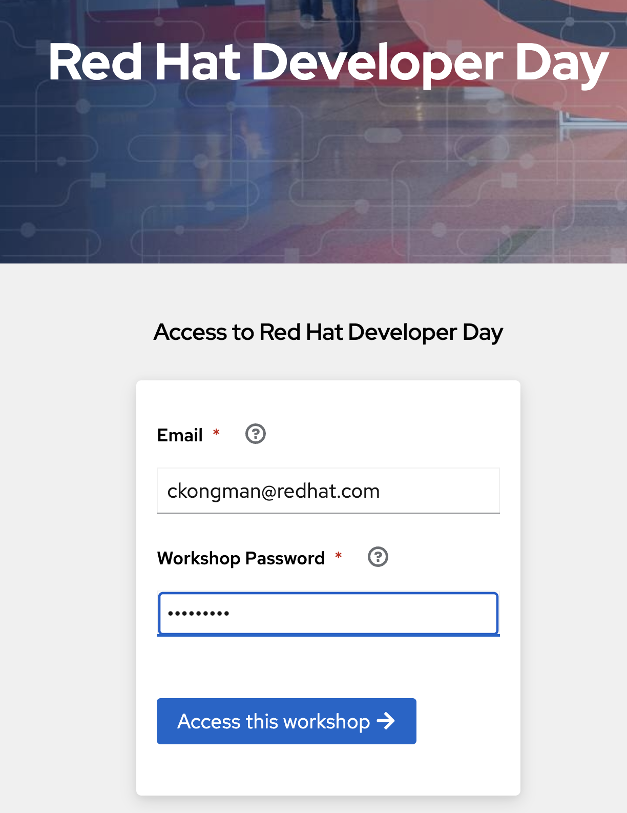
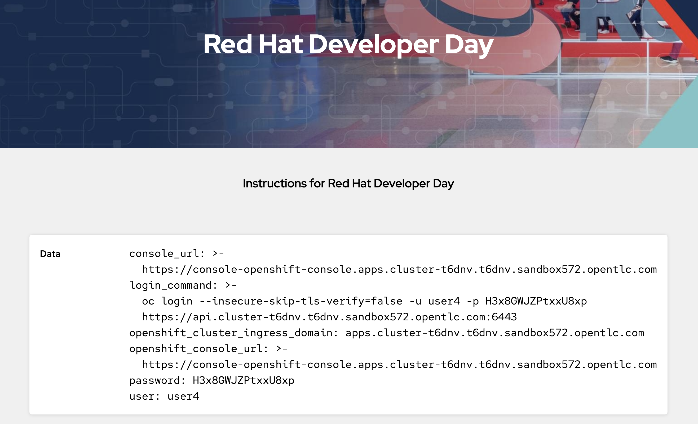
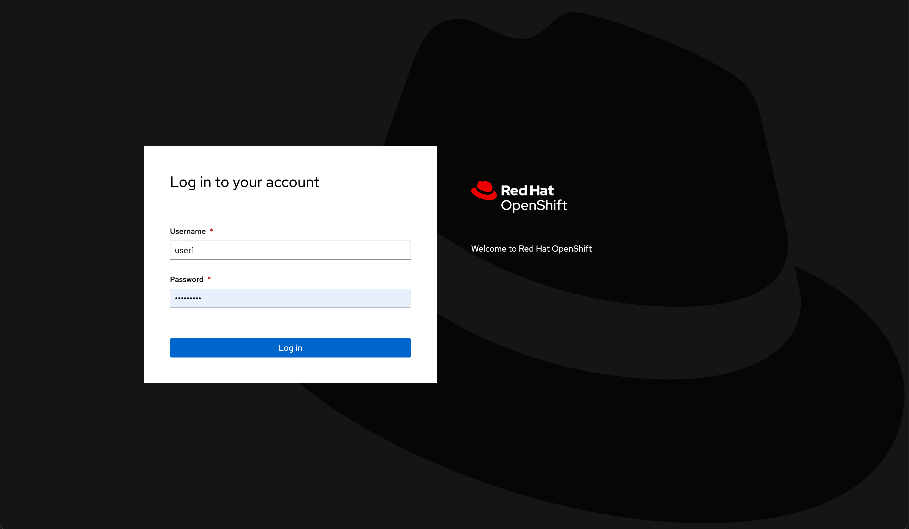
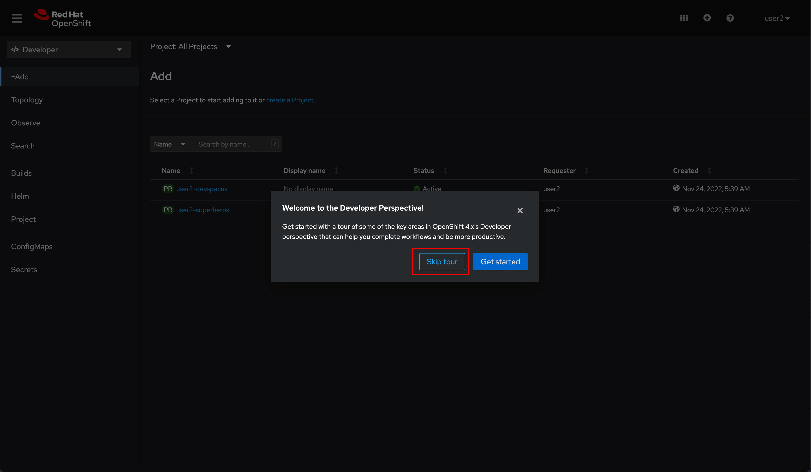
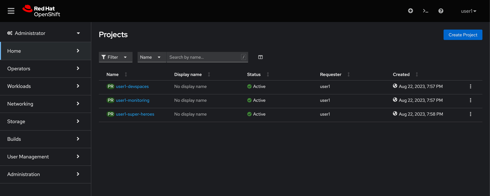

# Getting Started

## Login to OpenShift Web Console

Workshop organizer will provide you the OpenShift Web Console URL as well as a credential for login. Open the URL in your favourite web browser and log in with your credential.

* First Step, register with your email address and use access password (openshift)

  

* After success registration, workshop information will be appear!!! open OpenShift Console URL (console_url information), get password and your username (such as user1)

  

* Input your username and password

  

* Once you've logged in you'll see a welcome dialog, just click **Skip tour** button to close the dialog.

  

## Projects (Namespaces)

You will be provided with pre-setup projects/namespaces, [software, and operators](#installed-softwares-and-operators) as following:

* **user*X*-super-heroes:** This is the **main project** you're going to deloy the Quarkus Super Heroes application in here.

* **user*X*-monitoring:** A project for Grafana that will be used to monitor the application.

* **user*X*-devspaces:** A project for Red Hat OpenShift Dev Spaces - Web-based, cloud-native IDE.

Note. ***X*** is your user number.

## Installed Softwares and Operators

Just in case you're curious about what else are installed in the cluster for this workshop. Here's the list of installed softwares and operators:

* Web Terminal
* Grafana Operator
* Dev Workspace Operator
* Red Hat OpenShift Dev Spaces
* Red Hat Streams for Apache Kafka
* Red Hat build of Apicurio Registry
* Red Hat OpenShift distributed tracing platform
* Red Hat build of OpenTelemetry
* Red Hat Cluster Logging
* Red Hat Loki Operator
* Red Hat OpenShift GitOps

## References

* [What are Red Hat OpenShift Operators?](https://www.redhat.com/en/technologies/cloud-computing/openshift/what-are-openshift-operators)
