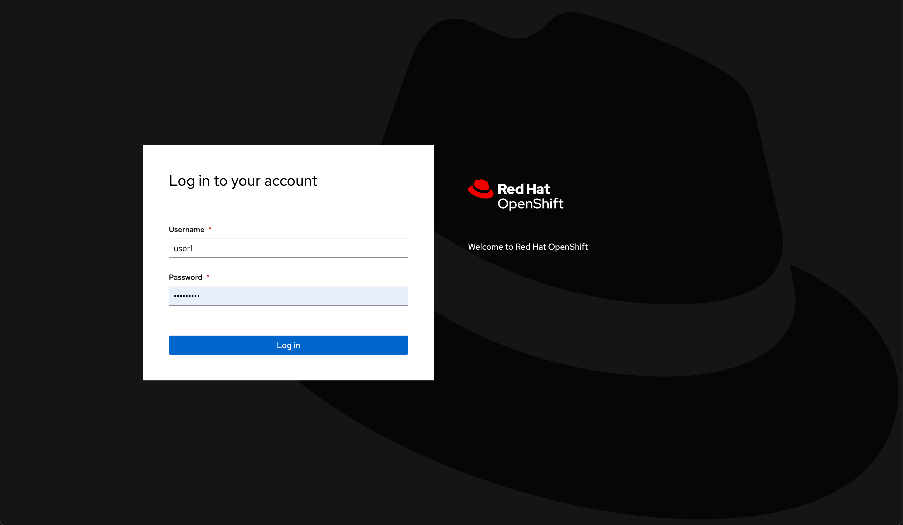
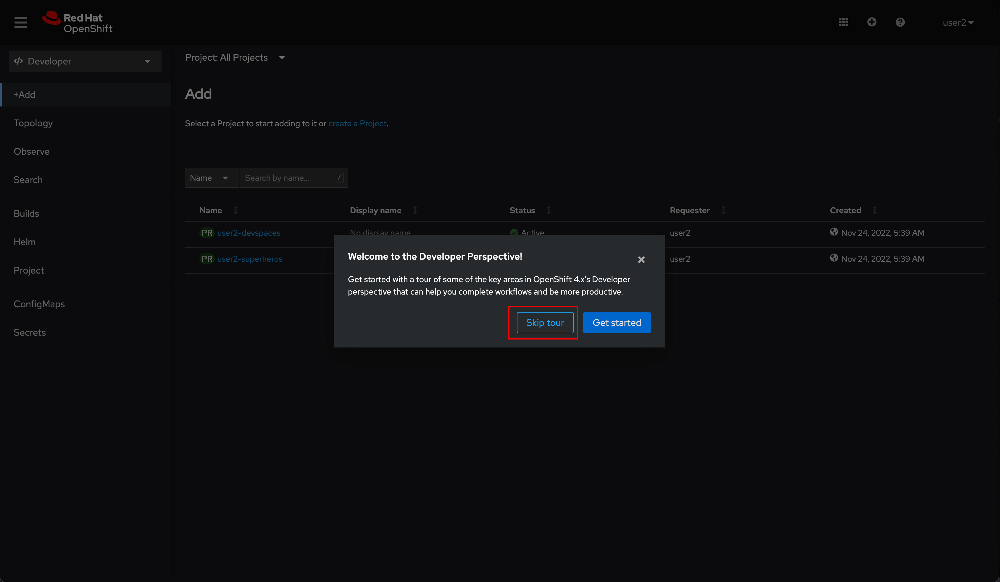

# Getting Started

## Login to OpenShift Web Console

Workshop organizer will provide you the OpenShift Web Console URL as well as a credential for login. Open the URL in your favourite web browser and log in with your credential.

Once you've logged in you'll see a welcome dialog, just click **Skip tour** button to close the dialog.

## Projects (Namespaces)

You will be provided with pre-setup projects/namespaces, [software, and operators](#installed-softwares-and-operators) as following:

* **user*X*-superheroes:** This is the **main project** you're going to deloy the Quarkus Super Heroes application in here.

* **user*X*-devspaces:** A project for Red Hat OpenShift Dev Spaces - Web-based, cloud-native IDE.

* **user*X*-istio-system:** A project for deploying OpenShift Service Mesh

Note. ***X*** is your user number.

## Installed Softwares and Operators

Just in case you're curious about what else are installed in the cluster for this workshop. Here's the list of installed softwares and operators:

* Web Terminal
* Gitea Operator
* Grafana Operator
* Dev Workspace Operator
* Red Hat OpenShift GitOps
* Red Hat OpenShift Dev Spaces
* Red Hat OpenShift Service Mesh
* Red Hat Integration - AMQ Streams
* Red Hat OpenShift distributed tracing platform
* Red Hat OpenShift distributed tracing data collection
* Sonatype Nexus Repository Manager 3 OSS

## References

* [What are Red Hat OpenShift Operators?](https://www.redhat.com/en/technologies/cloud-computing/openshift/what-are-openshift-operators)
