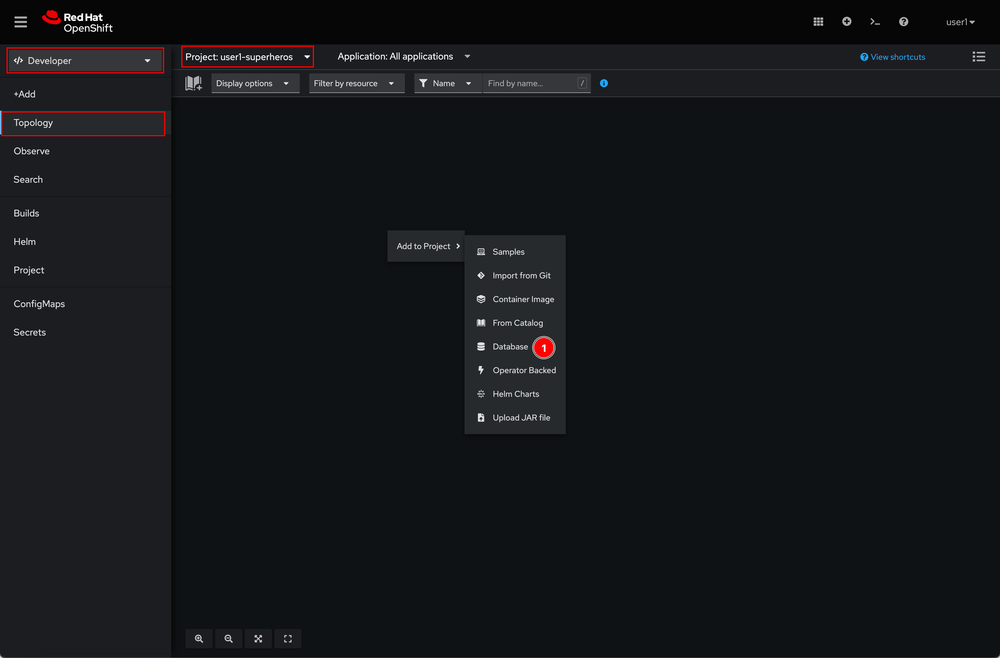
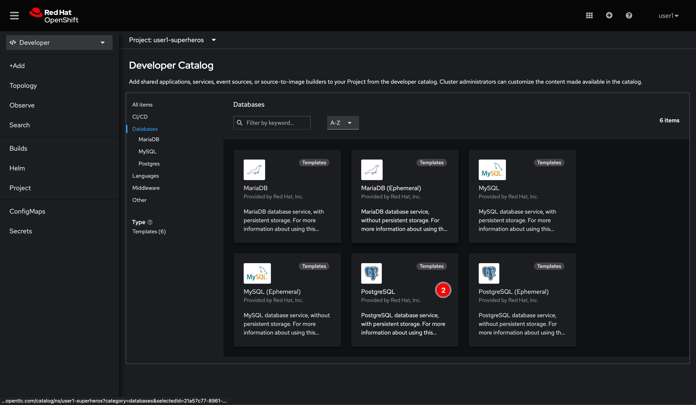
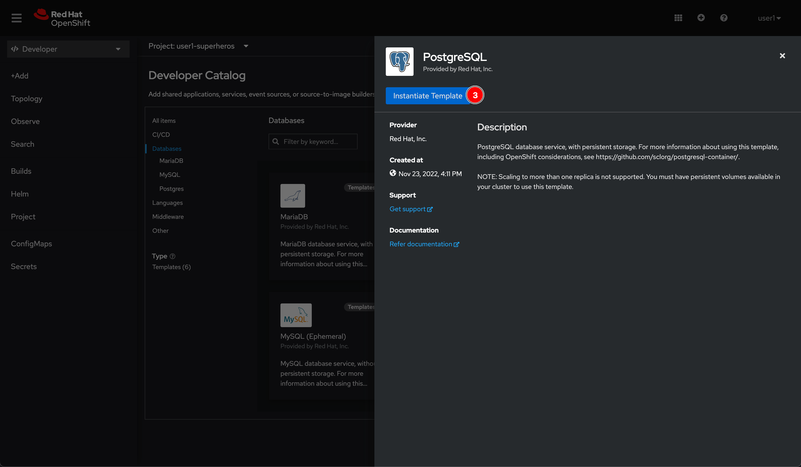
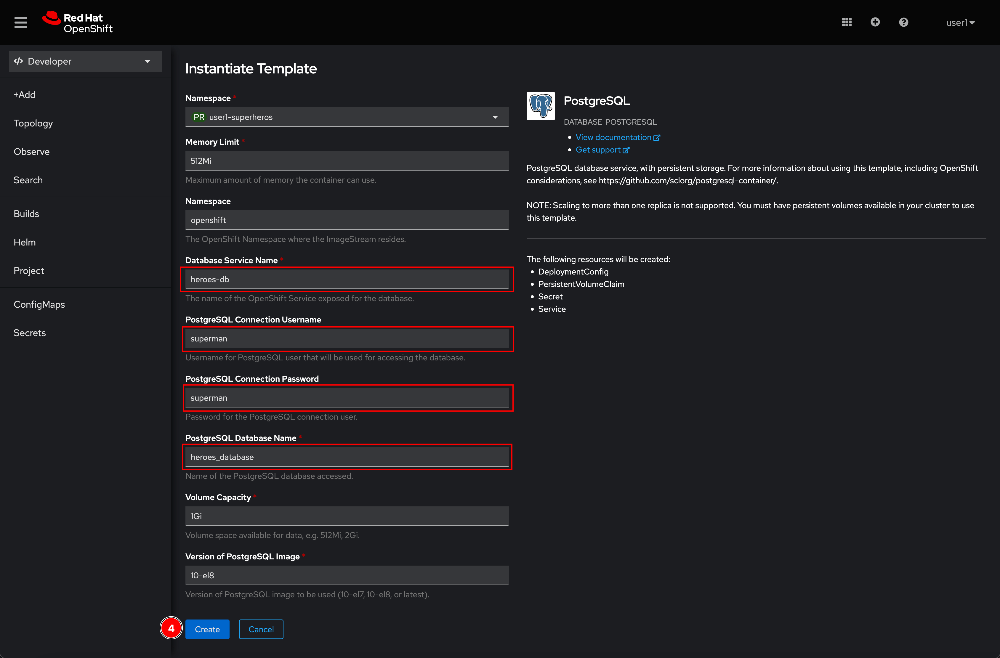
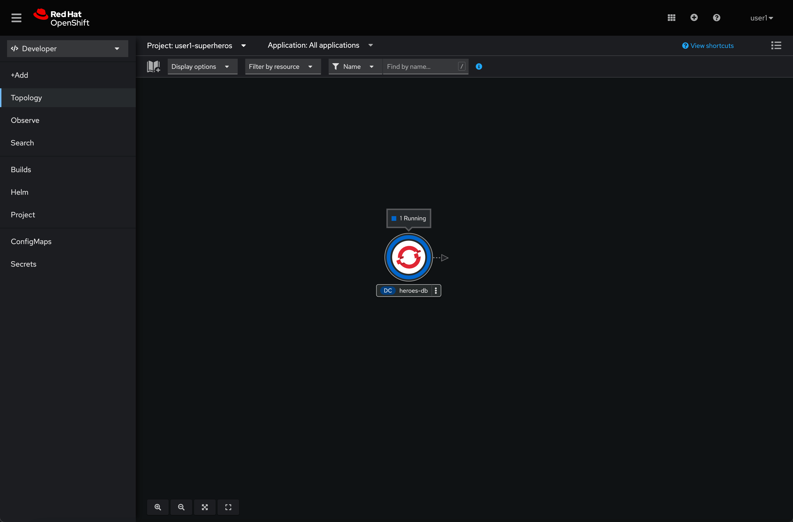
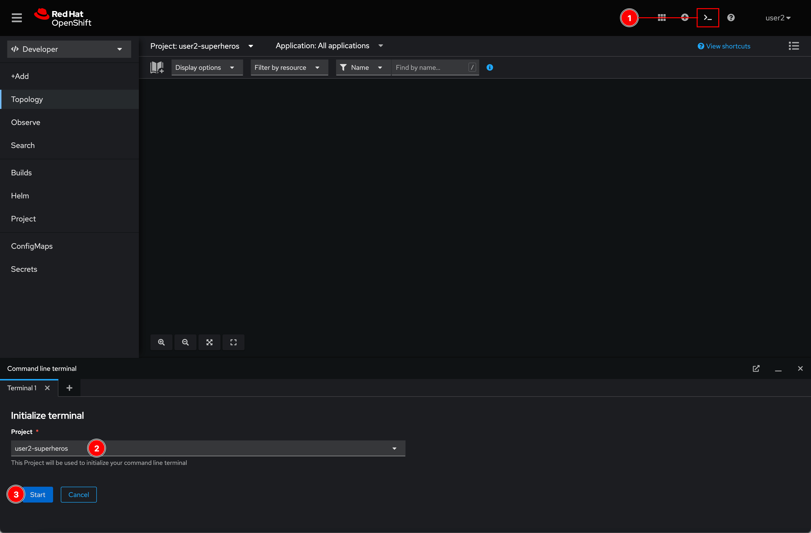
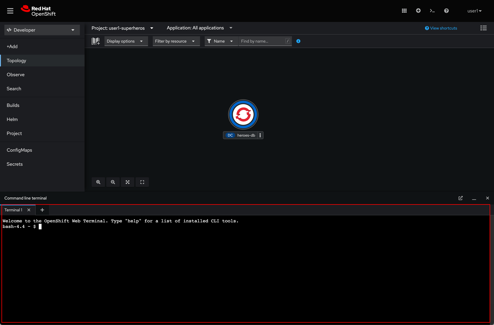

# Deploy Database For Hero Microservice

## Deploy PostgreSQL database from Developer Catalog

1. Make sure that you're in **Developer** perspective, project **user*X*-superheroes** is selected, and in the **Tolplogy** page. Then right click in view area then select **Database** menu.

   

2. Select **PostgreSQL** database.

   

3. Click **Instantiate Template** button.

   

4. Enter following inputs (leave it as is for other fields) then click **Create** button.

   - **Database Service Name:** `heroes-db`
   - **PostgreSQL Connection Username:** `superman`
   - **PostgreSQL Connection Password:** `superman`
   - **PostgreSQL Database Name:** `heroes_database`

   

5. Wait for awhile, the `heroes-db` pod should be up and running.

   

## Initial data to database

We need to load some data into the database we've just deployed. How to do that? the answer is using PostgreSQL client to execute a SQL script. Let's do it!

1. Click on the **Web Terminal** icon located on top right corner of web console. Then select **user*X*-superheroes** and click **Start** button.

    

2. Wait for a few moment, you should see a terminal shows up.

    

3. Use `curl` command to download SQL script.

    ```sh
    curl https://raw.githubusercontent.com/rhthsa/developer-advocacy-2022/main/manifest/super-heroes/heroes-db-init.sql -o heroes-db-init.sql
    ```

    Sample output:

    ```sh
      % Total    % Received % Xferd  Average Speed   Time    Time     Time  Current
                                 Dload  Upload   Total   Spent    Left  Speed
    100 86517  100 86517    0     0   180k      0 --:--:-- --:--:-- --:--:--  180k
    ```

4. Use `psql` (PostgreSQL client) to connect to the `heroes-db` PostgreSQL server. **The password is `superman`**.

    ```sh
     psql postgresql://heroes-db:5432/heroes_database?user=superman
    ```

    Sample output:

    ```sh
    bash-4.4 ~ $  psql postgresql://heroes-db:5432/heroes_database?user=superman
    Password:
    psql (10.21)
    Type "help" for help.

    heroes_database=>
    ```

5. Execute the SQL script with this command:

    ```sh
     \i heroes-db-init.sql
    ```

    Sample output:

    ```sh
    heroes_database=> \i heroes-db-init.sql
    DROP TABLE
    DROP SEQUENCE
    CREATE SEQUENCE
    CREATE TABLE
    INSERT 0 1
    INSERT 0 1
    ....
    ....
    ....
    heroes_database=>
    ```

6. Use `\dt` command to check if a new table gets created.

    ```sh
    \dt
    ```

    Sample output:

    ```sh
    heroes_database=> \dt
        List of relations
    Schema | Name | Type  |  Owner
    --------+------+-------+----------
    public | hero | table | superman
    (1 row)
    ```

7. Query number of rows in the table.

    ```sh
    select count(*) from hero;
    ```

    Sample output:

    ```sh
    heroes_database=> select count(*) from hero;
    count
    -------
    100
    (1 row)
    ```

8. Use `\q` command to disconnect from PostgreSQL server.

    ```sh
    \q
    ```

---

## What you've learned?

1. How to deploy PostgreSQL database service (for the Hero microservice) from Developer Catalog.

2. How to use Web Terminal via OpenShift web console to interact with application deployed on cluster (in this case, heroes-db PostgreSQL) without having to install terminal applications i.e. PuTTY, Cmder, Xshell, SecureCRT etc. on your computer.