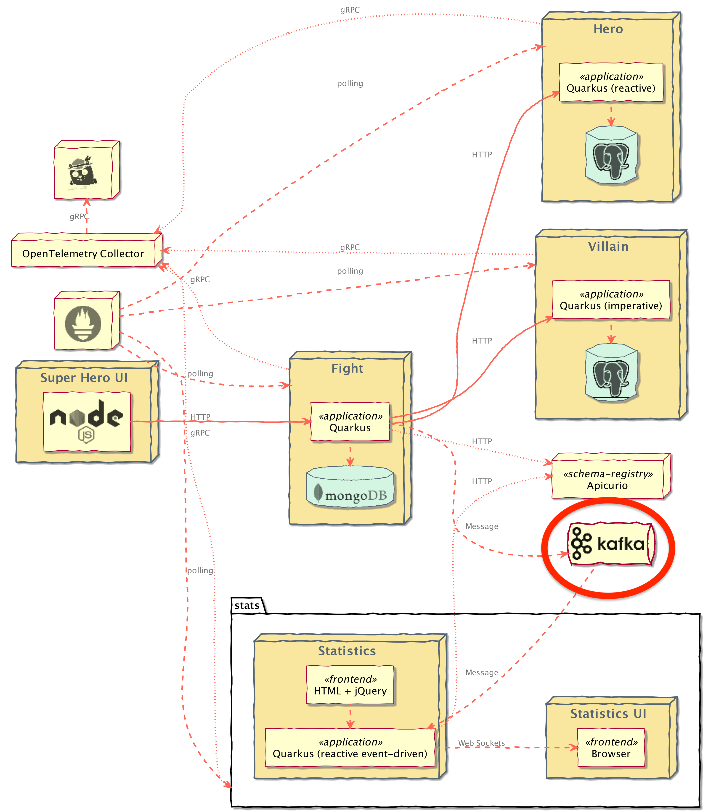
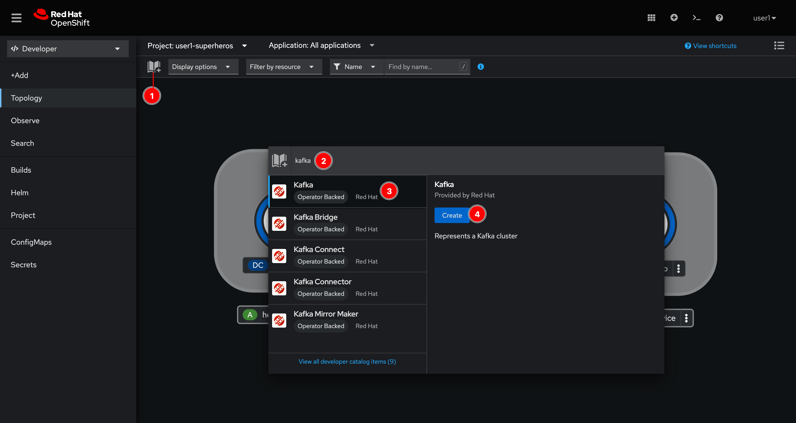
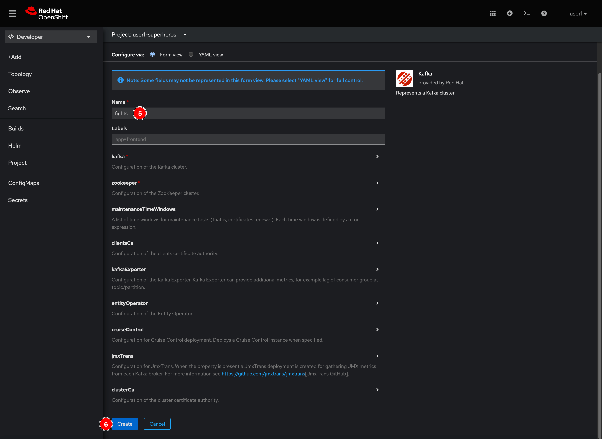
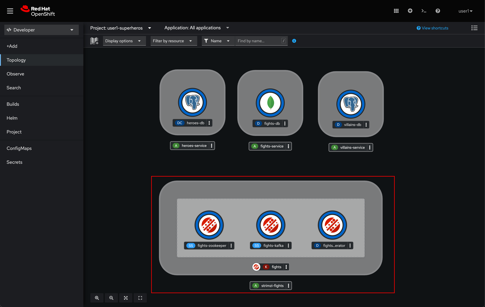

# AMQ Streams (Kafka) Deployment

The **Fight** and **Statistics** microservices will be interacting with Kafka broker as the architecture diagram below. So, we have to setup the broker for the microservices before we're going to deploy them.

## Setup Kafka cluster

1. Click on the book icon, to add application from Developer Catalog then type `kafka` in the search box. Select **Kafka** and click **Create** button.

    

2. Enter `fights` to the **Name** field then click **Create** button.

    

3. Wait for a monent you'll see Kafka cluster get deployed. Who says setup Kafka cluster is hard? :smirk:

    

## What have you learnt?

How to set up Kafka cluster using AMQ Streams (based on [Strimzi](https://strimzi.io/) open source project).
