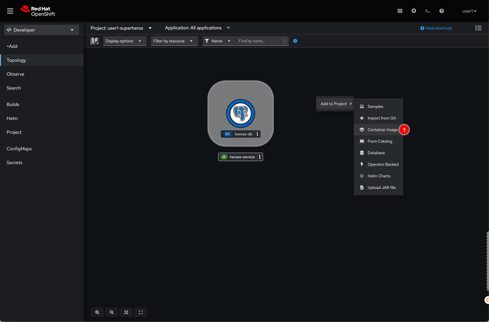
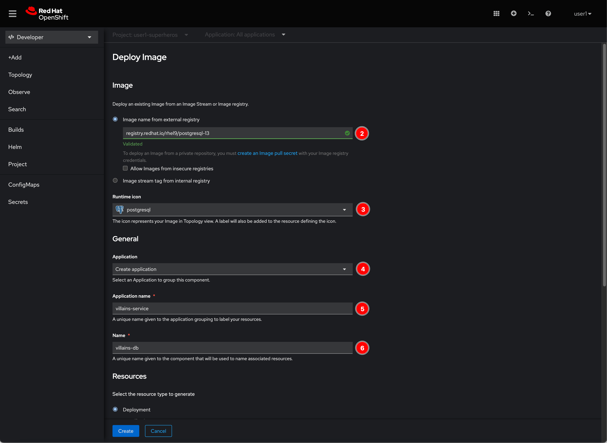
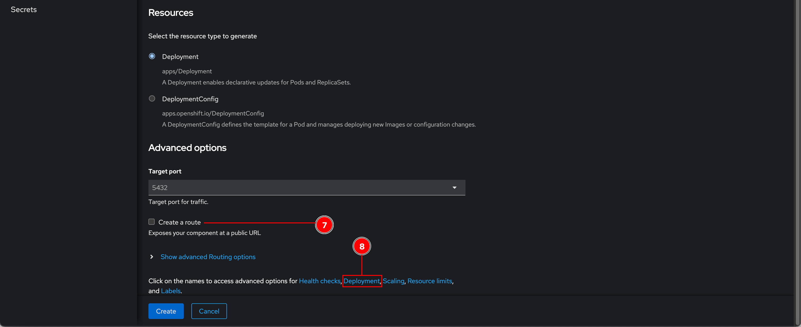
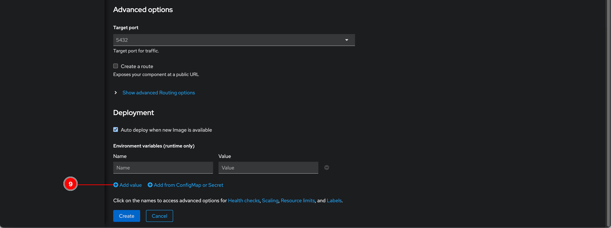
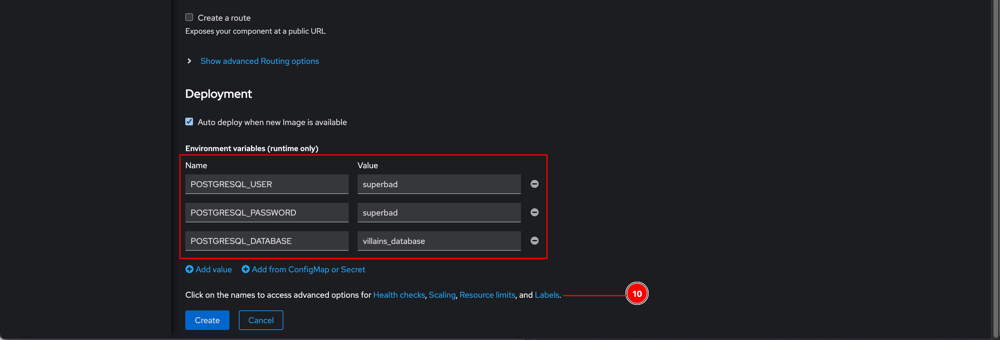
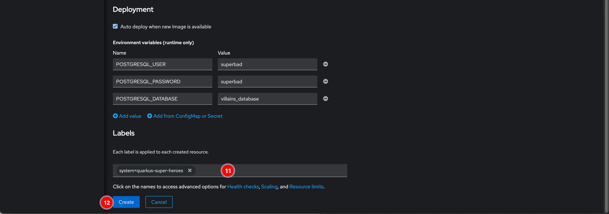
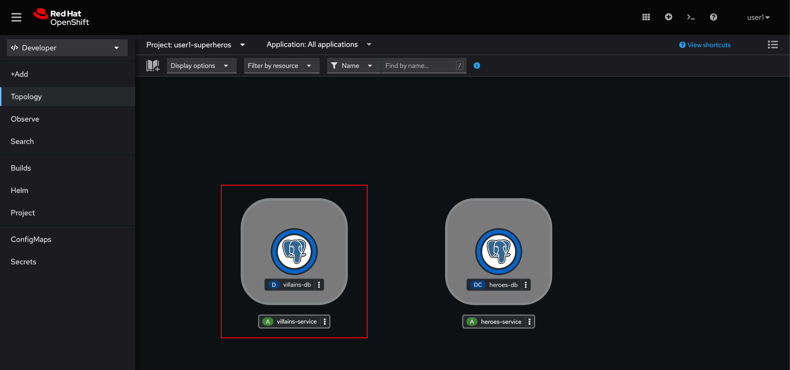
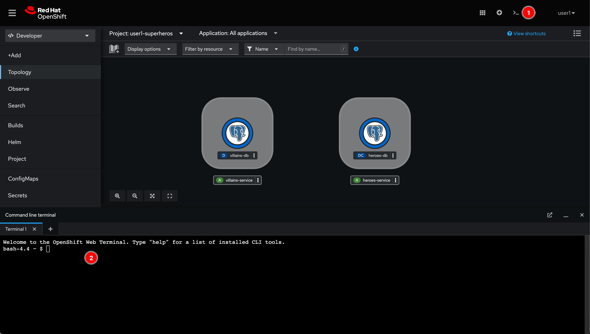

# Deploy Database For Villain Microservice

## Deploy database for Villain microservice from External Container Registry

1. Right click in view area then select **Container image** menu.

    

2. Enter following inputs as a screenshot below:

    - **Image name from external registry:** `registry.redhat.io/rhel9/postgresql-13`
    - **Runtime icon:** `postgresql`
    - **Application:** `Create application`
    - **Name:** `villains-db`

    

3. Scroll down to to bottom of the page, then **Uncheck "Create a route" checkbox**. And then click on **Deployment** link.

    

4. Click **Add value** link to add more input fields of environment variables

    

5. Enter following environment variables. Then click on **Labels** link.

    - **POSTGRESQL_USER:** `superbad`
    - **POSTGRESQL_PASSWORD:** `superbad`
    - **POSTGRESQL_DATABASE:** `villains_database`

    

6. Enter `system=quarkus-super-heroes` then click **Create** button.

    

7. A new `villains-db` PostgreSQL instance should be created. Wait for awhile unti it's up and running.

    

## Initial data to database

1. Click on the **Web Terminal** icon located on top right corner of web console. Wait for a few moment, you should see a terminal shows up.

    

2. Use `curl` command to download SQL script.

    ```sh
    curl https://raw.githubusercontent.com/rhthsa/developer-advocacy-2022/main/manifest/super-heroes/villains-db-init.sql -o villains-db-init.sql
    ```

    Sample output:

    ```txt
      % Total    % Received % Xferd  Average Speed   Time    Time     Time  Current
                                 Dload  Upload   Total   Spent    Left  Speed
    100  105k  100  105k    0     0   303k      0 --:--:-- --:--:-- --:--:--  303k
    ```

3. Use `psql` (PostgreSQL client) to connect to the `villains-db` PostgreSQL server. **The password is `superbad`**.

    ```sh
     psql postgresql://villains-db:5432/villains_database?user=superbad
    ```

    Sample output:

    ```txt
    bash-4.4 ~ $ psql postgresql://villains-db:5432/villains_database?user=superbad
    Password:
    psql (10.21, server 13.7)
    WARNING: psql major version 10, server major version 13.
            Some psql features might not work.
    Type "help" for help.

    villains_database=>
    ```

4. Execute the SQL script with this command:

    ```sh
     \i villains-db-init.sql
    ```

    Sample output:

    ```txt
    heroes_database=> \i villains-db-init.sql
    DROP TABLE
    DROP SEQUENCE
    CREATE SEQUENCE
    CREATE TABLE
    INSERT 0 1
    INSERT 0 1
    ....
    ....
    ....
    villains_database=>
    ```

5. Use `\dt` command to check if a new table gets created.

    ```sh
    \dt
    ```

    Sample output:

    ```sh
    villains_database=> \dt
          List of relations
    Schema |  Name   | Type  |  Owner
    --------+---------+-------+----------
    public | villain | table | superbad
    (1 row)
    ```

6. Query number of rows in the table.

    ```sh
    select count(*) from villain;
    ```

    Sample output:

    ```txt
    villains_database=> select count(*) from villain;
    count
    -------
    100
    (1 row)
    ```

7. Use `\q` command to disconnect from PostgreSQL server.

    ```sh
    \q
    ```

## What have you learnt?

How to deploy PostgreSQL database service container from external container registry (in this case, Red Hat Registry) with following settings:

- Application icon and name
- Environment variables for application container
- User-defined label
