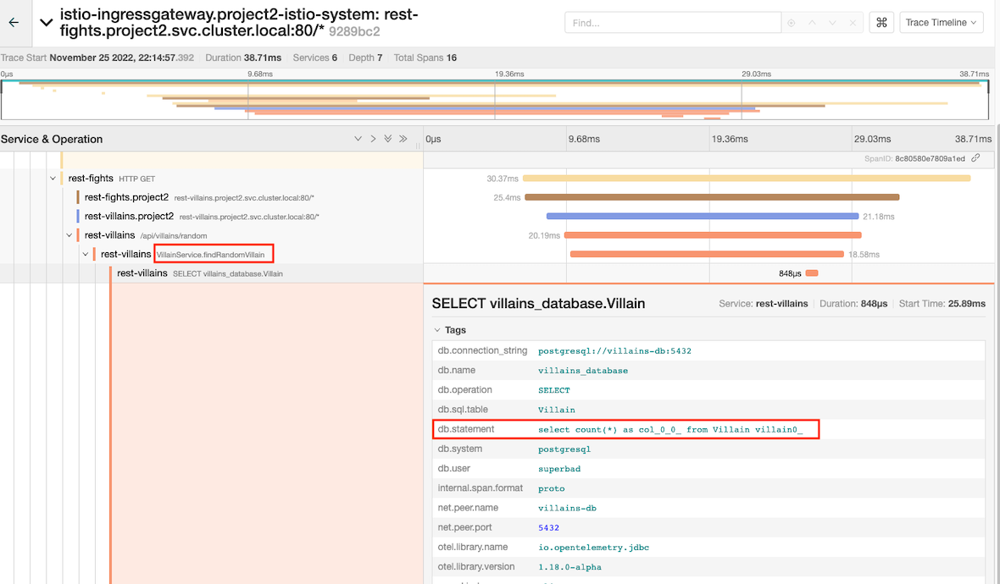

#OpenTelemetry

- Code snippet from *FightService* method *performFight*. Notice *@WithSpan* and *@SpanAttribute*
 
   ```java
	@WithSpan("FightService.performFight")
	
		public Uni<Fight> performFight(@SpanAttribute("arg.fighters") @NotNull @Valid Fighters fighters) {
		Log.debugf("Performing a fight with fighters: %s", fighters);
			return determineWinner(fighters)
				.chain(this::persistFight);
		}
	```

- Trace

  


- Code snippet from *VillainService* method *findRandomVillain*

  ```java
  @Transactional(SUPPORTS)
  @WithSpan("VillainService.findRandomVillain")
	public Optional<Villain> findRandomVillain() {
    Log.debug("Finding a random villain");
		return Villain.findRandom();
	}
  ```

- Trace

  
 